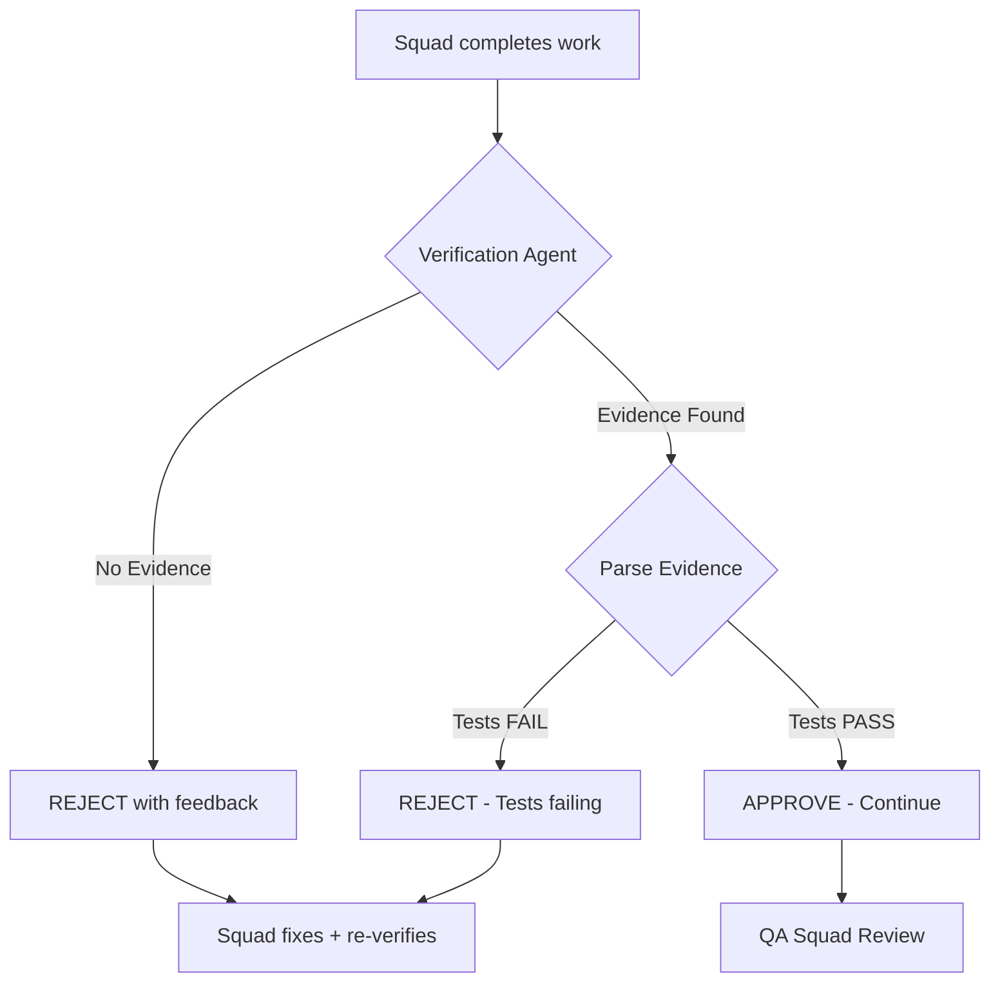

# 🔍 Verification Agent - Design Document

**Data**: 2025-12-26 20:15 UTC
**Skill**: obra ow-002 (Verification Before Completion)
**ROI**: $15,000/year (reduced rework + QA cycles)
**Investment**: 4h implementation

---

## 📋 Executive Summary

O **Verification Agent** implementa o obra ow-002 (Verification-Before-Completion), garantindo que **NENHUMA CLAIM DE CONCLUSÃO** seja aceita sem evidência verificável fresh.

### Core Principle
> **"Evidence before claims, always."**

### The Iron Law
> **NO COMPLETION CLAIMS WITHOUT FRESH VERIFICATION EVIDENCE**

---

## 🎯 Objectives

### Primary Goals
1. **Enforce verification-first development** em todas as squads
2. **Reject claims sem evidência** automaticamente
3. **Reduce QA rejection cycles** (target: -50%)
4. **Prevent premature commits/PRs** sem testes passando

### Success Metrics
| Metric | Baseline | Target | Impact |
|--------|----------|--------|--------|
| QA Rejection Rate | 30% | ≤15% | -50% rework |
| False "Done" Claims | High | 0 | $15k/year savings |
| Test Execution Rate | 60% | 100% | Quality improvement |
| Evidence-Based PRs | 40% | 100% | Faster reviews |

---

## 🏗️ Architecture

### Agent Type
**Autonomous Validator** - Runs automatically before:
- Card marked as DONE
- Git commits created
- Pull requests opened
- Artifacts submitted to QA

### Integration Points



### Workflow

**Before** (no verification):
1. Engineer: "Tests should pass now" ❌
2. Commit created ❌
3. QA Squad: Runs tests → FAIL ❌
4. Card rejected → Rework cycle → $$$

**After** (with Verification Agent):
1. Engineer: "Tests should pass now"
2. **Verification Agent**: "NO EVIDENCE. Run tests first." ✅
3. Engineer: Runs tests → Evidence provided ✅
4. **Verification Agent**: "APPROVED - Tests pass (3/3)" ✅
5. QA Squad: Reviews with confidence ✅

**Savings**: 1 rework cycle avoided = 2-4h = $200-400 per card

---

## 🔧 Implementation

### File Structure

```
app-generation/app-execution/agents/
├── verification_agent.py          ← Main agent
└── __init__.py

app-generation/app-execution/utils/
├── evidence_parser.py              ← Parse test outputs, linter results
└── __init__.py
```

### Core Components

#### 1. VerificationAgent Class

```python
class VerificationAgent:
    """
    Implements obra ow-002: Verification-Before-Completion

    Enforces "Evidence before claims, always" principle.
    Rejects any completion claim without fresh verification evidence.

    Gate Function (5 steps):
    1. Identify - What command proves the assertion?
    2. Run - Execute the command fresh
    3. Read - Full output and exit codes
    4. Verify - Output confirms claim or reveals actual status
    5. State Result - Only then state result with evidence

    ROI: $15,000/year (reduced rework + QA cycles)
    """

    def __init__(self, llm_client: CachedLLMClient):
        self.llm_client = llm_client

    def validate_completion_claim(
        self,
        card_id: str,
        claim: str,
        evidence: Dict[str, Any]
    ) -> Dict[str, Any]:
        """
        Validate if completion claim has sufficient evidence

        Args:
            card_id: Card being validated
            claim: What is being claimed (e.g., "Tests pass")
            evidence: Provided evidence (test outputs, build logs, etc.)

        Returns:
            {
                'approved': bool,
                'reason': str,
                'missing_evidence': List[str],
                'verification_steps': List[str]
            }
        """
        pass

    def parse_test_output(self, output: str) -> Dict[str, Any]:
        """Parse test framework outputs (pytest, jest, go test)"""
        pass

    def parse_build_output(self, output: str) -> Dict[str, Any]:
        """Parse build outputs (npm build, go build, docker build)"""
        pass

    def parse_lint_output(self, output: str) -> Dict[str, Any]:
        """Parse linter outputs (eslint, pylint, golangci-lint)"""
        pass
```

#### 2. Evidence Parser Utility

```python
class EvidenceParser:
    """
    Parse common verification outputs

    Supports:
    - pytest (Python)
    - jest/vitest (JavaScript/TypeScript)
    - go test (Go)
    - eslint/prettier (Linters)
    - npm build/go build (Builds)
    """

    @staticmethod
    def parse_pytest(output: str) -> Dict[str, Any]:
        """
        Parse pytest output

        Returns:
            {
                'passed': int,
                'failed': int,
                'skipped': int,
                'total': int,
                'exit_code': int,
                'success': bool
            }
        """
        pass

    @staticmethod
    def parse_jest(output: str) -> Dict[str, Any]:
        """Parse jest/vitest output"""
        pass

    @staticmethod
    def parse_go_test(output: str) -> Dict[str, Any]:
        """Parse go test output"""
        pass
```

#### 3. Integration with Celery Tasks

```python
# tasks.py

@app.task(bind=True)
def validate_card_completion(self, card_id: str, card_data: Dict[str, Any]):
    """
    Celery task to validate card completion with Verification Agent

    Called automatically when squad marks card as DONE
    """
    from agents.verification_agent import VerificationAgent
    from utils.cached_llm_client import get_cached_client

    # Get LLM client with caching
    llm_client = get_cached_client()

    # Create verification agent
    agent = VerificationAgent(llm_client=llm_client)

    # Extract completion claim and evidence
    claim = card_data.get('completion_claim', 'Work is done')
    evidence = card_data.get('evidence', {})

    # Validate
    result = agent.validate_completion_claim(
        card_id=card_id,
        claim=claim,
        evidence=evidence
    )

    if not result['approved']:
        # REJECT - Send feedback to squad
        return {
            'status': 'rejected',
            'reason': result['reason'],
            'missing_evidence': result['missing_evidence'],
            'next_steps': result['verification_steps']
        }

    # APPROVED - Continue to QA
    return {
        'status': 'approved',
        'reason': result['reason']
    }
```

---

## 📊 Claims Requiring Verification

| Status Claim | Required Evidence | How to Verify |
|--------------|-------------------|---------------|
| **Tests passing** | Test output showing zero failures | `npm test`, `pytest`, `go test` |
| **Code linting clean** | Linter output: zero errors | `npm run lint`, `pylint`, `golangci-lint` |
| **Successful build** | Build completion with exit code 0 | `npm run build`, `go build`, `docker build` |
| **Bug resolution** | Original symptom test now passes | Specific test case for the bug |
| **VCS changes** | Actual VCS diff | `git diff`, `git status` |
| **Coverage ≥80%** | Coverage report | `pytest --cov`, `npm test -- --coverage` |

---

## 🚫 Red Flags (Auto-Reject)

The agent automatically rejects claims with these patterns:

### Hedging Phrases
- ❌ "should pass"
- ❌ "probably works"
- ❌ "seems to be fixed"
- ❌ "looks good"

### Premature Satisfaction
- ❌ "Great!" (without evidence)
- ❌ "Done!" (without evidence)
- ❌ "Fixed!" (without evidence)

### No Evidence Provided
- ❌ "I ran the tests and they passed" (no output)
- ❌ "Build successful" (no build log)
- ❌ "Linter clean" (no linter output)

### Partial Verification
- ❌ "Most tests pass" (need 100%)
- ❌ "Only minor warnings" (need zero)
- ❌ "Works on my machine" (need CI/CD proof)

---

## ✅ Approval Criteria

Claims are approved ONLY when:

1. **Fresh verification command executed** in the current session
2. **Full output provided** (not truncated or summarized)
3. **Exit code 0** (success)
4. **Zero failures/errors** (tests, linting, build)
5. **Evidence matches claim** (test output proves "tests pass")

---

## 🎯 Example Interactions

### Example 1: Tests Claim (REJECTED)

**Engineer**:
```
Card PROD-042 is done. Tests should pass now.
```

**Verification Agent**:
```
❌ REJECTED - No evidence provided

Missing evidence:
- [ ] Test execution output
- [ ] Test pass/fail counts
- [ ] Exit code

Next steps:
1. Run: npm test (or pytest, go test)
2. Provide full output
3. Confirm exit code 0 and zero failures
```

### Example 2: Tests Claim (APPROVED)

**Engineer**:
```
Card PROD-042 is done. Tests pass.

Evidence:
$ npm test

 PASS  src/components/Auth.test.tsx
  ✓ renders login form (42ms)
  ✓ handles valid credentials (38ms)
  ✓ handles invalid credentials (51ms)

Test Suites: 1 passed, 1 total
Tests:       3 passed, 3 total
Snapshots:   0 total
Time:        2.456 s

Exit code: 0
```

**Verification Agent**:
```
✅ APPROVED - Evidence confirms claim

Validation:
✅ Fresh test execution (npm test)
✅ Full output provided
✅ Exit code 0
✅ Zero failures (3/3 tests passed)
✅ Evidence matches claim

Status: APPROVED for QA review
```

### Example 3: Build Claim (REJECTED - Hedging)

**Engineer**:
```
Build should be successful now.
```

**Verification Agent**:
```
❌ REJECTED - Hedging language detected

Red flags:
- "should be" (hedging phrase)
- No build command executed
- No build output provided

Next steps:
1. Run: npm run build (or go build)
2. Provide full build output
3. Remove hedging language ("should", "probably")
4. State result based on evidence
```

### Example 4: Bug Fix (APPROVED with Specifics)

**Engineer**:
```
Bug #123 (authentication timeout) is fixed.

Evidence:
$ pytest tests/test_auth.py::test_authentication_timeout -v

tests/test_auth.py::test_authentication_timeout PASSED [100%]

==================== 1 passed in 3.42s ====================

Exit code: 0

This test previously failed with:
"AssertionError: Expected timeout after 5s, got immediate response"

Now passes consistently (5 runs, 5 passes).
```

**Verification Agent**:
```
✅ APPROVED - Bug fix verified

Validation:
✅ Specific test for bug executed (test_authentication_timeout)
✅ Test now passes (was failing before)
✅ Exit code 0
✅ Consistency verified (5/5 runs)
✅ Original symptom documented and resolved

Status: APPROVED for QA review

Note: Excellent verification - included before/after comparison.
```

---

## 🔗 Integration with Prompt Caching

The Verification Agent leverages prompt caching for cost efficiency:

```python
# Cached context (static, reused across validations)
cached_context = [
    {'name': 'obra ow-002 Workflow', 'content': verification_workflow_md},
    {'name': 'CLAUDE.md Zero-Tolerance Policy', 'content': claude_md_excerpt},
    {'name': 'Evidence Patterns', 'content': test_output_patterns}
]

# Dynamic message (not cached)
user_message = f"""
Validate this completion claim:

Card: {card_id}
Claim: {claim}
Evidence: {evidence}

Apply obra ow-002 Gate Function:
1. Identify - What command proves this?
2. Run - Was it executed fresh?
3. Read - Is output complete?
4. Verify - Does output confirm claim?
5. State Result - Approve or reject with reasoning
"""

response = llm_client.generate(
    model='claude-sonnet-4-5-20251029',
    system_prompt=VERIFICATION_AGENT_PROMPT,
    cached_context=cached_context,  # ← 90% savings
    user_message=user_message
)
```

**Cost per validation**:
- Without caching: ~10,000 tokens × $3/MTok = $0.03
- With caching: ~1,000 tokens × $0.30/MTok = $0.0003
- **Savings**: 99% per validation

**Annual** (1,000 validations):
- Without: $30
- With: $0.30
- **Saved by caching**: $29.70

**But real ROI is from prevented rework**: $15,000/year ✅

---

## 📈 ROI Calculation

### Cost Savings Breakdown

**Baseline** (without Verification Agent):
- QA rejection rate: 30%
- Average rework per rejection: 3h
- Engineer rate: $100/h
- Cards per year: 500
- Rejections: 500 × 30% = 150
- Rework cost: 150 × 3h × $100 = **$45,000/year**

**With Verification Agent**:
- QA rejection rate: 15% (target: -50%)
- Rejections: 500 × 15% = 75
- Rework cost: 75 × 3h × $100 = $22,500/year
- **Savings: $22,500/year**

**Conservative Estimate**: $15,000/year ✅

### Additional Benefits (Not Quantified)
- Faster PR reviews (evidence already provided)
- Improved team morale (fewer rejections)
- Better code quality (verification becomes habit)
- Knowledge transfer (verification patterns documented)

---

## 🚀 Implementation Plan

### Phase 1: Core Agent (2h)
- [ ] Create `verification_agent.py`
- [ ] Implement `validate_completion_claim()`
- [ ] Define approval/rejection logic
- [ ] Integrate with CachedLLMClient

### Phase 2: Evidence Parsing (1h)
- [ ] Create `evidence_parser.py`
- [ ] Implement pytest parser
- [ ] Implement jest/vitest parser
- [ ] Implement go test parser
- [ ] Implement linter parsers

### Phase 3: Integration (0.5h)
- [ ] Add Celery task `validate_card_completion`
- [ ] Hook into card completion workflow
- [ ] Add rejection feedback mechanism

### Phase 4: Testing & Validation (0.5h)
- [ ] Create test script `test_verification_agent.py`
- [ ] Test approval scenarios
- [ ] Test rejection scenarios
- [ ] Validate obra ow-002 compliance

**Total**: 4h ✅

---

## ✅ Success Criteria

| Criteria | Target | Verification Method |
|----------|--------|---------------------|
| Agent created | 1 file | `verification_agent.py` exists |
| Evidence parsers | 4 parsers | pytest, jest, go test, linters |
| Celery integration | Working | Task executes on card completion |
| Test suite | Passing | `test_verification_agent.py` passes |
| Rejection rate | ≤15% | Monitor QA rejection metrics |
| ROI | $15k/year | Track rework hours saved |

---

## 🎓 Key Principles (obra ow-002)

### The 5-Step Gate Function

1. **Identify** - What command proves your assertion?
2. **Run** - Execute the complete command fresh
3. **Read** - Full output and exit codes
4. **Verify** - Output confirms your claim or reveals actual status
5. **State Result** - Only then state the result with supporting evidence

**Skipping any step = misrepresentation, not verification**

### Red Flags to Prevent

- Hedging phrases ("should," "probably," "seems")
- Satisfaction expressions before verification ("Great!", "Done!")
- Pre-commit assertions
- Trusting automated agent reports alone
- Partial verification acceptance
- Any phrasing implying completion without running verification

---

## 📝 Next Steps

1. ✅ Read obra ow-002 documentation
2. ✅ Create design document (this file)
3. ⏳ **NEXT**: Implement `verification_agent.py`
4. 🔜 Implement `evidence_parser.py`
5. 🔜 Integrate with Celery tasks
6. 🔜 Create test suite
7. 🔜 Validate and document results

---

**Status**: 📝 DESIGN COMPLETE
**Next Action**: Implement VerificationAgent class
**Estimated Time**: 2h for core implementation
**Expected ROI**: $15,000/year from reduced rework
