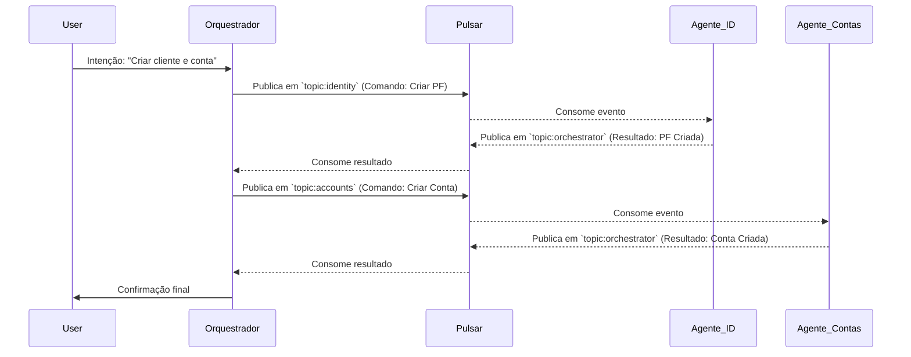

# Visão Completa: O Core Banking Inteligente como um Ecossistema de Agentes de IA
**Versão**: 1.0 (Conceitual)
**Data**: 09 de Dezembro de 2025


---

## 1. A Verdadeira Visão: Além do RAG, um Ecossistema de Agentes

A arquitetura do "Organismo Digital" é a base, mas a verdadeira inteligência e autonomia emergem de um conceito mais profundo: o sistema não é uma aplicação monolítica com uma IA acoplada, mas sim um **ecossistema de Agentes de IA especializados**, cada um responsável por um domínio de negócio específico, orquestrados por um Cérebro central.

O RAG (Retrieval-Augmented Generation) não é o fim, mas o **meio**. É a "biblioteca" que todos os agentes consultam para obter conhecimento. A ação, a decisão e a especialização vêm dos agentes.

Este modelo atinge o objetivo final: **maximizar funcionalidades e minimizar a dependência de técnicos de tecnologia**, caminhando em direção a um paradigma de **NoOps (No Operations)**.

---

## 2. A Hierarquia dos Agentes: Cérebro e Especialistas

### 2.1. O Agente Orquestrador (O Cérebro)

-   **Responsabilidade**: Não executa tarefas de negócio diretamente. Sua única função é **orquestrar** os outros agentes. Ele recebe um estímulo, entende a intenção e **delega a tarefa ao agente especialista apropriado**.
-   **Como funciona**: 
    1.  Recebe um evento do "Estômago" (ex: webhook de PIX recebido).
    2.  Consulta o RAG para entender o contexto geral.
    3.  Identifica a intenção: "*Isto é uma transação financeira que precisa ser processada*."
    4.  Ativa o agente especialista: "*Agente de Transações, sua vez. Processe este PIX.*"

### 2.2. Agentes Especialistas (Os Órgãos)

Cada agente é um "órgão" autônomo com uma função hiper-especializada. Eles são os verdadeiros executores da lógica de negócio.

| Agente Especialista | Domínio de Negócio | Exemplo de Tarefas |
| :--- | :--- | :--- |
| **Agente de Identidade** | Gestão de Cadastros (PF, PJ) | Criar, validar e gerenciar o ciclo de vida de entidades. Validar documentos, verificar duplicidade. |
| **Agente de Contas** | Gestão de Contas de Pagamento | Abrir, configurar, bloquear e encerrar contas. Gerenciar limites e condições. |
| **Agente de Transações** | Processamento de Pagamentos | Orquestrar o fluxo de uma transação (PIX, TED), interagir com os "Braços" (Ledger, BACEN). |
| **Agente de Conformidade** | Regras e Políticas | Monitorar transações em tempo real, detectar atividades suspeitas, aplicar regras do BACEN. |
| **Agente de Relacionamentos** | Vínculos entre Entidades | Gerenciar o grafo de relacionamentos: vincular um sócio a uma empresa, um cliente a uma conta. |
| **Agente de UI** | Geração de Interfaces | Gera o JSON descritivo para as interfaces do usuário, adaptando-se ao contexto e ao agente que o invocou. |
| **Agente de NoOps** | Gestão da Infraestrutura | Monitora a saúde do sistema, escala componentes (via Kubernetes API) e tenta se auto-reparar. |

### Diagrama de Interação de Agentes

```mermaid
graph TD
    subgraph Cérebro
        Orquestrador(Agente Orquestrador)
    end

    subgraph Agentes Especialistas
        Agente_ID(Agente de Identidade)
        Agente_Contas(Agente de Contas)
        Agente_TX(Agente de Transações)
        Agente_Compliance(Agente de Conformidade)
        Agente_UI(Agente de UI)
        Agente_NoOps(Agente de NoOps)
    end

    subgraph Memória e Ferramentas
        RAG[(RAG: SQL, Grafo, Vetor)]
        Bracos[(Braços: Ledger, BACEN)]
    end

    Orquestrador -->|Delega| Agente_ID
    Orquestrador -->|Delega| Agente_Contas
    Orquestrador -->|Delega| Agente_TX
    Orquestrador -->|Delega| Agente_Compliance

    Agente_ID <-->|Consulta| RAG
    Agente_Contas <-->|Consulta| RAG
    Agente_TX <-->|Consulta| RAG
    Agente_TX -->|Executa| Bracos
    Agente_Compliance <-->|Monitora| Agente_TX

    Agente_ID -->|Requisita UI| Agente_UI
    Agente_Contas -->|Requisita UI| Agente_UI

    Agente_NoOps --o|Monitora| Orquestrador
    Agente_NoOps --o|Monitora| Agentes Especialistas
```

---

## 3. Detalhando um Fluxo: Criação de um Novo Cliente e sua Conta

Este fluxo demonstra como os agentes colaboram, minimizando a necessidade de código técnico.

**Intenção do Usuário (via Front-end)**: "*Quero cadastrar o cliente João Silva, CPF 123.456.789-00, e abrir uma conta de pagamento para ele.*"

1.  **Orquestrador (Cérebro)**: Recebe a intenção. Identifica duas tarefas principais: criar uma entidade e depois criar uma conta.
    -   **Ação**: Ativa o **Agente de Identidade**. "*Crie uma nova Pessoa Física com estes dados: {nome: 'João Silva', cpf: '123...'}*"

2.  **Agente de Identidade**: 
    -   **Recebe a tarefa**. Seu único foco é "identidade".
    -   **Consulta o RAG**: "*Já existe alguém com este CPF?*" (Query no PostgreSQL).
    -   **Valida Dados**: "*O formato do CPF é válido?*" (Usa uma ferramenta interna de validação).
    -   **Cria a Instância**: Se tudo estiver OK, cria a instância do objeto "Pessoa Física" no estado "CRIADO".
    -   **Informa o Orquestrador**: "*Tarefa concluída. A nova Pessoa Física tem o ID 'pf_uuid_001'.*"

3.  **Orquestrador (Cérebro)**: Recebe a confirmação.
    -   **Ação**: Ativa o **Agente de Contas**. "*Crie uma nova Conta de Pagamento e vincule-a à Pessoa Física 'pf_uuid_001'.*"

4.  **Agente de Contas**:
    -   **Recebe a tarefa**. Seu único foco é "contas".
    -   **Consulta o RAG**: "*Quais são as políticas para abrir uma conta? A PF 'pf_uuid_001' está em um estado válido?*" (Query no Grafo e no Vetor para políticas).
    -   **Cria a Instância**: Se as políticas permitirem, cria a instância do objeto "Conta de Pagamento".
    -   **Ativa o Agente de Relacionamentos**: "*Crie um vínculo de 'possui' entre a PF 'pf_uuid_001' and a Conta 'conta_uuid_123'.*"
    -   **Informa o Orquestrador**: "*Tarefa concluída. A conta 'conta_uuid_123' foi criada e vinculada.*"

5.  **Orquestrador (Cérebro)**: Recebe a confirmação final.
    -   **Ação**: Ativa o **Agente de UI**. "*Informe ao usuário que o cliente e a conta foram criados com sucesso e mostre o dashboard da nova conta.*"

Neste fluxo, **nenhum desenvolvedor escreveu código de negócio**. A lógica foi executada pelos agentes, que foram parametrizados por definições em linguagem natural.

---

## 4. A Arquitetura de Comunicação: O "Event Bus" Inteligente

Os agentes não se comunicam diretamente. Eles se comunicam através de um **barramento de eventos (Event Bus)**, que é o **Apache Pulsar**. Mas não é um simples pub/sub.

-   **Tópicos por Domínio**: Cada agente ouve em um tópico específico (ex: `topic:identity`, `topic:accounts`).
-   **Eventos Estruturados**: Os eventos são mensagens estruturadas que contêm a **intenção** e os **dados necessários**.
-   **Orquestração via Eventos**: O Orquestrador publica um evento de "comando" em um tópico, e o agente especialista consome, executa e publica um evento de "resultado" em outro tópico, que o Orquestrador ouve.



---

## 5. O Caminho para o NoOps: O Agente que Gerencia a Si Mesmo

O objetivo de "depender o mínimo de técnicos" é alcançado através do **Agente de NoOps**. Este é o agente mais avançado e a meta final do sistema.

-   **Responsabilidade**: Monitorar a saúde de todo o ecossistema de agentes e da infraestrutura subjacente, e tomar ações corretivas.
-   **Como funciona**:
    1.  **Monitoramento**: Consome dados da plataforma de **Observabilidade (Grafana Stack)**. "*A latência do Agente de Contas aumentou 30% na última hora.*"
    2.  **Análise**: Consulta o RAG para entender o que isso significa. "*Um aumento de latência neste agente geralmente está ligado a um gargalo no banco de dados de grafos.*"
    3.  **Decisão**: Decide uma ação. "*Preciso escalar o número de réplicas do Agente de Contas para distribuir a carga.*"
    4.  **Ação**: Interage com a API do **Kubernetes**. "*`kubectl scale deployment/agente-contas --replicas=5`*"
    5.  **Verificação**: Continua monitorando para ver se a ação resolveu o problema.

Inicialmente, este agente pode apenas **criar alertas** para a equipe de operações. Com o tempo, ele ganha confiança para **executar ações automaticamente**, alcançando um estado de **NoOps**, onde o sistema se gerencia e se repara sozinho.

---

## 6. Visão Completa: O Ciclo Virtuoso

1.  **Especialistas de Negócio** definem a lógica em **linguagem natural** (objetos, políticas).
2.  O **Cérebro** traduz isso em conhecimento estruturado no **RAG**.
3.  **Agentes Especialistas** usam o RAG para executar tarefas de negócio de forma autônoma.
4.  O **Agente de NoOps** monitora tudo, garantindo que o sistema funcione de forma otimizada.
5.  A **dependência de equipes de tecnologia** para codificar a lógica de negócio e operar a infraestrutura é **drasticamente reduzida**.

Esta é a visão completa de um Core Banking verdadeiramente Inteligente. Não é apenas um sistema com IA, é um **sistema que *é* uma IA** – um ecossistema de agentes colaborativos e autônomos.
