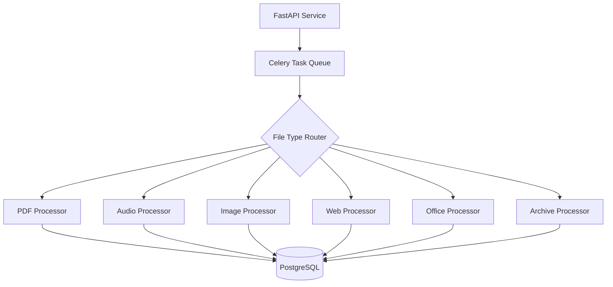

# RF002 - Architecture Documentation

## System Architecture

## Components

### API Layer
- FastAPI 0.109+ with async/await
- Pydantic v2 for validation
- JWT authentication via API Gateway
- Rate limiting per Oracle

### Processing Layer
- Celery 5.3+ with Redis broker
- 6 specialized processors (PDF, Audio, Image, Web, Office, Archive)
- Async task execution
- Retry logic with exponential backoff

### Data Layer
- PostgreSQL 16 with asyncpg
- 3 tables: documents, processed_content, upload_sessions
- JSONB for flexible metadata
- Full-text search indexes

### Storage Layer
- Local filesystem (development)
- S3-compatible object storage (production)
- Chunked uploads for large files

## Database Schema

### documents table
- id (uuid, PK)
- oracle_id (uuid, FK, indexed)
- session_id (uuid, FK, nullable)
- filename, mime_type, file_size
- status (pending, processing, completed, failed)
- error_message (nullable)
- metadata (jsonb)
- created_at, updated_at

### processed_content table
- id (uuid, PK)
- document_id (uuid, FK)
- content_type (text, metadata, ocr_text, transcript)
- content_text (text)
- confidence_score (float, 0-1)
- language (varchar, ISO 639-1)
- metadata (jsonb)
- created_at

### upload_sessions table
- id (uuid, PK)
- oracle_id (uuid, FK)
- total_files, completed_files, failed_files
- status (active, completed, failed)
- expires_at
- created_at, updated_at

## Security Measures

1. **Input Validation**
   - MIME type verification (magic numbers)
   - File size limits (configurable per Oracle)
   - Filename sanitization
   - Archive bomb protection (depth + size limits)

2. **Virus Scanning**
   - ClamAV integration (optional)
   - Scan before processing

3. **Rate Limiting**
   - Per-Oracle quotas
   - Token bucket algorithm
   - Redis-based distributed limiting

4. **Authentication**
   - JWT validation (API Gateway integration)
   - Oracle-based access control
   - Audit logging

## Error Handling

All processors implement:
- Try-catch blocks with specific exceptions
- Retry logic (max 3 attempts)
- Graceful degradation
- Detailed error messages stored in DB
- Structured logging with trace IDs

## Observability

### Logging
- Structured JSON logs
- Correlation IDs for request tracing
- Log levels: DEBUG, INFO, WARNING, ERROR, CRITICAL

### Metrics
- documents_uploaded_total (counter)
- documents_processed_total (counter by status)
- processing_duration_seconds (histogram by processor)
- active_tasks (gauge)
- queue_depth (gauge)

### Tracing
- OpenTelemetry integration
- Span per processor
- Distributed context propagation

## Performance

### Throughput Targets
- PDF (text): 4 MB/s
- PDF (OCR): 0.2 MB/s
- Image (OCR): 0.25 MB/s
- Audio: 0.4 MB/s
- Video: 0.5 MB/s

### Scalability
- Horizontal: Add Celery workers
- Vertical: Increase worker concurrency
- Database: Connection pooling (10-50 connections)
- Redis: Cluster mode for high availability

## Technology Stack

- Python 3.11+
- FastAPI 0.109+
- Celery 5.3+
- PostgreSQL 16
- Redis 7
- Tesseract OCR 5.x
- OpenAI Whisper
- Playwright
- PyPDF2, python-docx, openpyxl
