# 🎯 Como Funcionam as Cards no SuperCore v2.0

**Data**: 2024-12-22
**Versão**: 1.0.0

---

## 📊 RESPOSTA À SUA PERGUNTA

### Modelo Atual: **Pipeline Único com Transições Automáticas**

Atualmente, o sistema funciona com **UM ÚNICO PIPELINE UNIFICADO** onde:

1. ✅ **Uma card nasce em uma squad** (ex: `PROD-001` nasce na squad Produto)
2. ✅ **A mesma card PERMANECE durante todo o ciclo de vida** (não cria novas cards)
3. ✅ **A card TRANSITA entre squads** automaticamente quando completa
4. ✅ **Cada squad pode CRIAR NOVAS CARDS** derivadas (breakdown tasks)

---

## 🔄 Fluxo Atual de uma Card

```mermaid
graph LR
    A[PROD-001<br/>squad: produto<br/>status: TODO] -->|Executa + Completa| B[PROD-001<br/>squad: produto<br/>status: DONE]

    B -->|Trigger: deps_on completo| C[ARCH-001<br/>squad: arquitetura<br/>status: TODO<br/>depends_on: PROD-001]

    C -->|Executa + Completa| D[ARCH-001<br/>squad: arquitetura<br/>status: DONE]

    D -->|Trigger: deps_on completo| E[ENG-001<br/>squad: engenharia<br/>status: TODO<br/>depends_on: ARCH-001]

    E -->|Executa + Completa| F[ENG-001<br/>squad: engenharia<br/>status: DONE]

    F -->|Trigger: deps_on completo| G[QA-001<br/>squad: qa<br/>status: TODO<br/>depends_on: ENG-001]

    G -->|❌ Rejeita| E
    G -->|✅ Aprova| H[DEPLOY-001]
```



---

## 🎭 Comportamento por Squad

### 1. Squad Produto (`produto`)

**Permissões**:
- ✅ `can_create_cards: true`
- ✅ `inputs_from: null` (squad inicial)
- ✅ `outputs_to: "arquitetura"`

**Comportamento**:
- Cria cards iniciais: `PROD-001`, `PROD-002`, `PROD-003`, etc.
- Cada card tem `squad: "produto"` e `status: "TODO"`
- Quando executa, lê documentação e cria deliverables em `/artefactos_implementacao/produto/`
- Ao completar, marca `status: "DONE"`

**Exemplo de Card Criada**:
```json
{
  "card_id": "PROD-001",
  "title": "Define MVP Features from Requirements",
  "squad": "produto",
  "status": "TODO",
  "depends_on": ["EPIC-001"],
  "phase": 1
}
```

---

### 2. Squad Arquitetura (`arquitetura`)

**Permissões**:
- ✅ `can_create_cards: true`
- ✅ `inputs_from: "produto"`
- ✅ `outputs_to: "engenharia"`

**Comportamento**:
- **Recebe cards de Produto** via `depends_on` dependencies
- Quando `PROD-*` cards estão `DONE`, cria suas próprias cards: `ARCH-001`, `ARCH-002`, etc.
- Cada card arquitetura tem `depends_on: ["PROD-001", ...]`
- Quando executa, lê outputs de Produto (`/artefactos_implementacao/produto/`)
- Cria designs técnicos em `/artefactos_implementacao/arquitetura/`
- Ao completar, marca `status: "DONE"`

**Exemplo de Card Criada**:
```json
{
  "card_id": "ARCH-001",
  "title": "Design Database Schema",
  "squad": "arquitetura",
  "status": "TODO",
  "depends_on": ["EPIC-002", "PROD-001"],
  "phase": 2
}
```

**Trigger de Criação**:
```python
# autonomous_meta_orchestrator.py (linha 710-719)
prod_cards = [c for c in self.backlog["cards"] if c["card_id"].startswith("PROD-")]
prod_done = all(c["status"] == "DONE" for c in prod_cards)

if prod_done and not arch_cards:
    logger.info("🎯 Phase 1 Complete! Creating Phase 2 (Architecture) cards...")
    await self.create_architecture_cards()
```

---

### 3. Squad Engenharia (`engenharia`)

**Permissões**:
- ✅ `can_create_cards: true` (manager e sub-squads)
- ✅ `inputs_from: "arquitetura"`
- ✅ `outputs_to: "qa"`

**Sub-squads**:
- `frontend`: React, TypeScript, Tailwind
- `backend`: Go, PostgreSQL, APIs
- `data`: RAG, Vector DB, Graph DB
- `fullstack`: Integração end-to-end

**Comportamento**:
- Quando `ARCH-*` cards estão `DONE`, cria cards de implementação
- Cards podem ser atribuídas a sub-squads específicas
- Scrum Master coordena e pode criar breakdown tasks
- Executa implementação (código real)
- Ao completar, marca `status: "DONE"`

**Exemplo de Card Criada**:
```json
{
  "card_id": "ENG-BACKEND-001",
  "title": "Implement PostgreSQL Schema + Migrations",
  "squad": "engenharia",
  "sub_squad": "backend",
  "status": "TODO",
  "depends_on": ["ARCH-001"],
  "phase": 3
}
```

---

### 4. Squad QA (`qa`)

**Permissões**:
- ✅ `can_create_cards: true`
- ✅ `can_approve_cards: true`
- ✅ `can_reject_cards: true`
- ✅ `can_create_correction_cards: true`
- ✅ `inputs_from: "engenharia"`
- ✅ `feedback_to: "engenharia"` ⚠️ **CRÍTICO**
- ✅ `outputs_to: "deploy"`

**Comportamento Especial - Ciclo de Feedback**:

```python
# Quando QA rejeita uma card:
if test_failed or zero_tolerance_violation:
    # 1. Marcar card original como BLOCKED
    card["status"] = "BLOCKED"

    # 2. Criar correction card para Engenharia
    correction_card = {
        "card_id": "ENG-BACKEND-001-FIX-1",
        "title": f"Fix issues in {original_card_id}",
        "squad": "engenharia",
        "status": "TODO",
        "depends_on": [original_card_id],
        "phase": 3,
        "correction_for": original_card_id,
        "issues_found": [...]
    }

    # 3. Incrementar retry_count
    card["qa_retry_count"] = card.get("qa_retry_count", 0) + 1

    # 4. Após 3 tentativas → Escalação Tech Lead
    if card["qa_retry_count"] >= 3:
        escalate_to_tech_lead(card)
```

**Exemplo de Fluxo com Rejeição**:

```
ENG-001 (status: DONE)
    ↓
QA-001 executa testes
    ↓
❌ Cobertura < 80%
    ↓
Criar correction card: ENG-001-FIX-1
    ↓
ENG-001-FIX-1 (status: TODO, squad: engenharia)
    ↓
Engenharia corrige
    ↓
ENG-001-FIX-1 (status: DONE)
    ↓
QA-001 re-executa
    ↓
✅ Passa → QA-001 (status: DONE)
```

---

### 5. Squad Deploy (`deploy`)

**Permissões**:
- ✅ `can_create_cards: true`
- ✅ `inputs_from: "qa"`
- ✅ `outputs_to: null` (squad final)
- ⚠️ `requires_human_approval: true`

**Comportamento**:
- Quando `QA-*` cards estão `DONE`, cria cards de deploy
- Deploy para QA: Automático
- Deploy para Staging: Requer aprovação Tech Lead
- Deploy para Production: Requer aprovação PO + Tech Lead

---

## 🔗 Dependências e Triggers

### Lógica de Execução (linha 586-604):

```python
async def execute_ready_cards(self):
    """Execute cards that are ready (TODO status, dependencies met)"""
    ready_cards = []

    for card in self.backlog["cards"]:
        if card["status"] != "TODO":
            continue

        # Check dependencies
        deps_met = True
        for dep_id in card.get("depends_on", []):
            dep_card = next((c for c in self.backlog["cards"] if c["card_id"] == dep_id), None)
            if not dep_card or dep_card["status"] != "DONE":
                deps_met = False
                break

        if deps_met:
            ready_cards.append(card)

    # Execute ready cards via Celery
    for card in ready_cards[:1]:
        result = execute_card_task.delay(card["card_id"])
```

### Exemplo de Cadeia de Dependências:

```
EPIC-001 (squad: produto, status: DONE)
    ↓
PROD-001 (depends_on: [EPIC-001], status: DONE)
    ↓
ARCH-001 (depends_on: [EPIC-002, PROD-001], status: TODO) ← Espera ambos
    ↓
ENG-BACKEND-001 (depends_on: [ARCH-001], status: TODO)
```

---

## 🆕 Criação de Novas Cards por Squads

### Quando uma Squad pode criar cards?

Cada squad pode criar cards **derivadas** para breakdown de trabalho:

#### Squad Produto:
```python
# Criar épicos e user stories
self.create_card(card_id="EPIC-001", ...)
self.create_card(card_id="PROD-001", depends_on=["EPIC-001"], ...)
self.create_card(card_id="PROD-002", depends_on=["PROD-001"], ...)
```

#### Squad Arquitetura:
```python
# Quando Produto completa, criar cards de arquitetura
if prod_done:
    self.create_card(card_id="ARCH-001", depends_on=["PROD-001"], ...)
    self.create_card(card_id="ARCH-002", depends_on=["ARCH-001"], ...)
```

#### Squad Engenharia (Scrum Master):
```python
# Breakdown técnico em sub-tasks
self.create_card(card_id="ENG-BACKEND-001", depends_on=["ARCH-001"], ...)
self.create_card(card_id="ENG-BACKEND-002", depends_on=["ENG-BACKEND-001"], ...)
self.create_card(card_id="ENG-FRONTEND-001", depends_on=["ARCH-002"], ...)
```

#### Squad QA:
```python
# Criar correction cards quando rejeita
self.create_card(
    card_id="ENG-001-FIX-1",
    squad="engenharia",
    correction_for="ENG-001",
    depends_on=["ENG-001"],
    ...
)
```

---

## 📊 Visualização Completa

```
┌─────────────────────────────────────────────────────────────┐
│                    PIPELINE UNIFICADO                        │
└─────────────────────────────────────────────────────────────┘

Phase 1: PRODUTO
  EPIC-001 ────────┐
                   ├──▶ PROD-001 ─┐
                   │               ├──▶ PROD-002 ─┐
                   │               │               ├──▶ PROD-003
                   │               │               │
                   │               │               │
                   ▼               ▼               ▼
                 (ALL DONE) ──▶ Trigger Phase 2

Phase 2: ARQUITETURA
  EPIC-002 ────────┐
                   ├──▶ ARCH-001 ─┐
                   │    (deps: PROD-001)
                   │               ├──▶ ARCH-002 ─┐
                   │               │    (deps: ARCH-001)
                   │               │               │
                   ▼               ▼               ▼
                 (ALL DONE) ──▶ Trigger Phase 3

Phase 3: ENGENHARIA
  Sub-squads trabalham em paralelo:

  ENG-BACKEND-001 ──▶ ENG-BACKEND-002
  (deps: ARCH-001)     (deps: ENG-BACKEND-001)

  ENG-FRONTEND-001 ──▶ ENG-FRONTEND-002
  (deps: ARCH-002)      (deps: ENG-FRONTEND-001)

  ENG-DATA-001 ──▶ ENG-DATA-002
  (deps: ARCH-001)  (deps: ENG-DATA-001)

                   ▼
                 (ALL DONE) ──▶ Trigger Phase 4

Phase 4: QA
  QA-001 ──▶ ❌ Rejeita? ──▶ ENG-XXX-FIX-1 ──▶ Re-test
             ✅ Aprova? ──▶ DEPLOY-001

Phase 5: DEPLOY
  DEPLOY-QA-001 (auto) ──▶ DEPLOY-STAGING-001 (aprovação) ──▶ DEPLOY-PROD-001 (aprovação)
```

---

## ✅ RESUMO DA RESPOSTA

### Pergunta 1: **Como funciona a Card?**

**Resposta**: **Pipeline Único com Criação de Cards Derivadas**

- Uma card nasce em uma squad (ex: `PROD-001` em Produto)
- A mesma card **NÃO transita entre squads** (mantém `squad: "produto"` sempre)
- Quando completa (`status: DONE`), **DESBLOQUEIA** cards de outras squads que dependem dela
- Cada squad **CRIA NOVAS CARDS** que dependem das anteriores (`depends_on`)
- Sistema verifica dependencies e executa cards quando deps estão `DONE`

### Exemplo Prático:

```json
// Card criada por Produto
{"card_id": "PROD-001", "squad": "produto", "status": "DONE"}

// Isso DESBLOQUEIA esta card (criada por Arquitetura)
{"card_id": "ARCH-001", "squad": "arquitetura", "depends_on": ["PROD-001"], "status": "TODO"}

// Que por sua vez DESBLOQUEIA esta (criada por Engenharia)
{"card_id": "ENG-001", "squad": "engenharia", "depends_on": ["ARCH-001"], "status": "TODO"}
```

### Pergunta 2: **Cada squad tem seu pipeline de cards?**

**Resposta**: **Sim, mas INTER-CONECTADOS**

- Produto cria `PROD-*` cards
- Arquitetura cria `ARCH-*` cards (quando Produto completa)
- Engenharia cria `ENG-*` cards (quando Arquitetura completa)
- QA cria `QA-*` cards (quando Engenharia completa)
- Deploy cria `DEPLOY-*` cards (quando QA aprova)

**MAS**: Todos vivem no **MESMO BACKLOG** (`backlog_master.json`) e são orquestrados pelo **MESMO ORCHESTRATOR**.

---

## 🔄 Próxima Seção: Lifecycle Management

Ver [PROJECT_LIFECYCLE_MANAGEMENT.md](PROJECT_LIFECYCLE_MANAGEMENT.md) para:
- Como limpar e recomeçar do zero
- Como pausar e retomar projeto
- Como fazer backup de estado
- Como recuperar de falhas
