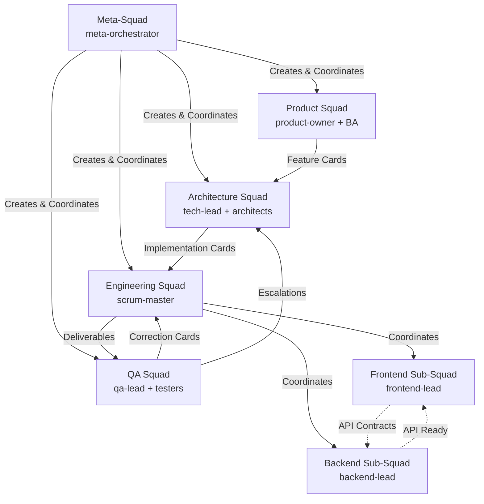
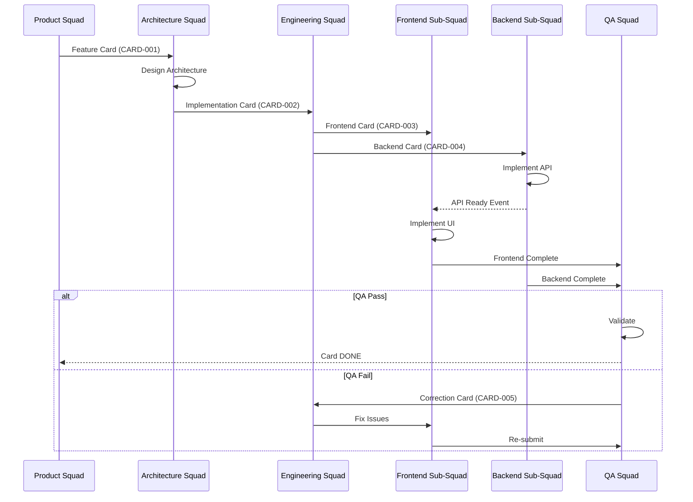

# Hierarchical Squad Orchestrator v2.0 - Architecture Documentation

## Overview

The Hierarchical Squad Orchestrator v2.0 is an evolution of the original squad orchestration system, introducing **multi-level hierarchical architecture** with a **meta-squad coordinator**, **digital card system**, and **automated QA feedback loops**.

### Key Enhancements

1. **Meta-Squad Bootstrap**: Dynamic squad creation based on project needs
2. **Hierarchical Organization**: Parent-child squad relationships with clear flows
3. **Card System**: Kanban-style digital cards that flow between squads
4. **QA Feedback Loop**: Automated quality validation with correction cycles
5. **Multi-Level Communication**: Hierarchical event bus for squad coordination
6. **Sub-Squad Support**: Nested squads (e.g., Frontend + Backend under Engineering)

## Architecture Diagram



## Card Flow



## System Components

### 1. Core Utilities (utils/)

#### card-system.sh
Digital card management system implementing Kanban workflow.

**Features:**
- Card CRUD operations (create, read, update, delete)
- Status management (TODO, IN_PROGRESS, IN_REVIEW, DONE, BLOCKED)
- Dependency tracking (parent-child, dependencies, blockers)
- Acceptance criteria validation
- QA cycle tracking
- Card archival

**Card Structure:**
```json
{
  "id": "CARD-0042",
  "title": "Implement JWT Authentication",
  "type": "feature",
  "priority": "HIGH",
  "status": "IN_PROGRESS",
  "created_by_squad": "squad-arquitetura",
  "assigned_to_squad": "squad-backend",
  "assigned_to_agent": "golang-developer",
  "parent_card": "CARD-0040",
  "children_cards": ["CARD-0043", "CARD-0044"],
  "dependencies": ["CARD-0041"],
  "acceptance_criteria": [
    "JWT tokens generated on login",
    "Tokens validated on protected endpoints",
    "Refresh token rotation implemented"
  ],
  "technical_spec": {
    "component": "Auth Service",
    "language": "Go",
    "endpoints": ["/auth/login", "/auth/refresh"],
    "performance_target": "< 100ms latency"
  },
  "qa_checklist": [
    "Unit tests > 90% coverage",
    "Integration tests pass",
    "Security scan clean"
  ],
  "history": [],
  "metrics": {
    "qa_cycles": 0,
    "cycle_time": 0
  }
}
```

#### squad-communication.sh
Hierarchical communication system for inter-squad messaging.

**Features:**
- Event publishing and subscription
- Direct messaging between squads
- Broadcast to multiple squads
- Escalation channels
- Parent-child communication
- Sibling coordination (Frontend ↔ Backend)

**Communication Channels:**
- `parent_child`: Parent squad → Child squad
- `child_parent`: Child squad → Parent squad
- `sibling`: Peer-to-peer (e.g., Frontend ↔ Backend)
- `escalation`: Any squad → Meta-squad or parent
- `broadcast`: One-to-many announcements

#### qa-feedback-loop.sh
Automated QA validation and correction workflow.

**Features:**
- Card validation against acceptance criteria
- Pass/Fail decision making
- Automatic correction card creation
- QA cycle tracking (max 3 cycles)
- Escalation on repeated failures
- QA metrics and reports

**Workflow:**
```
Engineering → QA Submit Card
               ↓
          QA Validates
               ↓
         ┌─────┴─────┐
         ↓           ↓
    PASS (DONE)   FAIL
                     ↓
               Create Correction Card
                     ↓
               Route to Engineering
                     ↓
               Increment QA Cycle
                     ↓
            ┌────────┴────────┐
            ↓                 ↓
       Cycle ≤ 3         Cycle > 3
            ↓                 ↓
    Re-submit to QA    Escalate to Tech Lead
```

### 2. Management Agents

#### meta-orchestrator.md
Supreme coordinator that bootstraps and manages the entire system.

**Responsibilities:**
- Parse project specifications
- Create squads dynamically
- Monitor squad health
- Handle escalations
- Optimize workflow
- Strategic decision making

#### product-owner.md
Business value guardian defining features and priorities.

**Responsibilities:**
- Define product vision
- Prioritize backlog
- Write user stories
- Create feature cards for Architecture
- Validate deliverables

#### tech-lead.md
Technical authority making architecture decisions.

**Responsibilities:**
- Design system architecture
- Break down features into technical cards
- Make technology decisions
- Review architectural compliance
- Create implementation cards for Engineering

#### scrum-master.md
Process facilitator for Engineering squad.

**Responsibilities:**
- Sprint planning and execution
- Remove blockers
- Coordinate Frontend and Backend sub-squads
- Daily standups
- Sprint metrics

#### frontend-lead.md
Frontend sub-squad leader.

**Responsibilities:**
- Lead React/TypeScript development
- Implement UI components
- Collaborate with Backend on API contracts
- Ensure accessibility and performance
- Write frontend tests

#### backend-lead.md
Backend sub-squad leader.

**Responsibilities:**
- Lead Go/Python development
- Implement APIs and services
- Design data access layer
- Ensure security and scalability
- Write backend tests

#### qa-lead.md
Quality guardian with final approval authority.

**Responsibilities:**
- Validate acceptance criteria
- Execute test plans
- Approve or reject deliverables
- Create correction cards
- Track quality metrics

### 3. Bootstrap System

#### meta-squad-bootstrap.sh
Initializes the complete hierarchical system from configuration.

**Process:**
1. Read `meta-squad-config.json`
2. Validate configuration
3. Initialize card system
4. Initialize communication system
5. Create squad hierarchy:
   - Meta-squad
   - Product squad
   - Architecture squad
   - Engineering squad (+ sub-squads)
   - QA squad
6. Generate initial cards
7. Configure workflow
8. Generate bootstrap report

**Usage:**
```bash
./meta-squad-bootstrap.sh meta-squad-config.json
```

**Output:**
- Session directory with squad states
- Card system initialized
- Communication channels configured
- Bootstrap report (Markdown)

### 4. CLI Tools

#### card-manager.sh
Command-line interface for card management.

**Commands:**
```bash
# List cards
card-manager.sh list [--squad SQUAD] [--status STATUS]

# Show card details
card-manager.sh show CARD-ID

# Create card
card-manager.sh create --title "..." --type feature --priority HIGH

# Update card status
card-manager.sh move CARD-ID --to IN_PROGRESS

# Assign card
card-manager.sh assign CARD-ID --squad squad-backend --agent golang-developer

# Add comment
card-manager.sh comment CARD-ID "Implementation completed"

# Show card dependencies
card-manager.sh deps CARD-ID

# Show card history
card-manager.sh history CARD-ID
```

#### squad-cli.sh
Command-line interface for squad interaction.

**Commands:**
```bash
# List squads
squad-cli.sh list [--status active]

# Show squad details
squad-cli.sh show SQUAD-NAME

# Send message to squad
squad-cli.sh message SQUAD-NAME "Message content"

# Escalate issue
squad-cli.sh escalate --from squad-backend --issue "API timeout" --severity high

# Broadcast
squad-cli.sh broadcast --from meta-squad "Sprint 1 starts tomorrow"

# Show squad metrics
squad-cli.sh metrics SQUAD-NAME
```

### 5. Launcher and Monitor

#### launch-hierarchical-squads.sh
Launches all squads in hierarchical mode.

**Features:**
- Reads session from bootstrap
- Launches squads in dependency order
- Starts Claude Code agents
- Monitors health
- Handles failures

**Usage:**
```bash
./launch-hierarchical-squads.sh SESSION-ID
```

#### monitor-hierarchical.sh
Real-time hierarchical dashboard.

**Features:**
- Hierarchical squad tree view
- Card flow visualization
- Real-time status updates
- Blocker highlighting
- Performance metrics

**Display:**
```
╔═══════════════════════════════════════════════════════════════╗
║           META-SQUAD ORCHESTRATOR - HIERARCHICAL              ║
╠═══════════════════════════════════════════════════════════════╣

📋 PRODUTO SQUAD          [running]  3/5 cards created
    └─> Squad Arquitetura: Aguardando CARD-003

🏗️  ARQUITETURA SQUAD     [running]  2/3 cards in progress
    └─> Squad Engenharia: 5 cards prontos

👨‍💻 ENGENHARIA SQUAD      [running]  Sprint 1 - Day 3/10
    ├─> Frontend Sub-Squad  [active]  CARD-008 in progress
    └─> Backend Sub-Squad   [active]  CARD-007 in progress

✅ QA SQUAD               [waiting]  0 cards to review

Overall: 15 cards | 3 done | 5 in progress | 7 todo
Sprint Burndown: 45% complete | On track ✓
```

## Configuration

### meta-squad-config.json

Complete configuration file defining:

1. **Project Information**
   - Name, type, description
   - Technology stack

2. **Specifications**
   - Architecture documents
   - Functional specifications
   - Backlog references

3. **Squad Definitions**
   - Agent assignments
   - Permissions
   - Communication flows
   - Sub-squad structure

4. **Workflow Configuration**
   - Sprint duration
   - QA retry limits
   - Quality gates
   - Automation rules

5. **Initial Cards**
   - Bootstrap cards
   - Starting features

See `meta-squad-config.json` for complete example.

## Communication Patterns

### 1. Vertical Communication (Parent → Child)

```bash
# Meta-squad creates Product squad
comm_register_squad "squad-produto" "meta-squad"

# Meta-squad sends card to Product
comm_send_message "meta-squad" "squad-produto" "card_created" \
  '{"card_id": "CARD-001"}'
```

### 2. Horizontal Communication (Sibling)

```bash
# Backend notifies Frontend that API is ready
comm_send_message "squad-backend" "squad-frontend" "api_ready" \
  '{"endpoint": "/api/auth/login", "spec": "openapi.yaml"}'
```

### 3. Escalation (Any → Meta)

```bash
# Engineering escalates blocker
comm_escalate "squad-engenharia" "blocked_dependency" \
  "Waiting for AWS credentials for 24h" "high" "CARD-042"
```

### 4. Broadcast

```bash
# Meta-squad announces sprint start
comm_broadcast "meta-squad" "sprint_start" \
  '{"sprint": 1, "goal": "MVP Authentication"}' "all"
```

## Quality Gates

### Code Quality
- Test coverage > 80%
- Linting passes
- No critical security vulnerabilities
- Type safety (TypeScript/Go)

### Performance
- API response < 100ms (p95)
- Frontend First Contentful Paint < 1s
- Bundle size < 200KB

### Security
- OWASP Top 10 compliance
- Authentication/authorization implemented
- Input validation
- SQL injection prevention

### Accessibility
- WCAG 2.1 AA compliance
- Keyboard navigation
- Screen reader support

## Metrics and Reporting

### Squad Metrics
- Cards completed per sprint
- Velocity trend
- Blocker count and duration
- Cycle time (card creation → done)

### Quality Metrics
- First-time QA pass rate
- QA cycles per card
- Defect density
- Escaped defects

### Performance Metrics
- Sprint goal success rate
- Burndown accuracy
- Card throughput
- Squad utilization

## Error Handling and Recovery

### Card Blocked
1. Identify blocker type (technical, dependency, resource)
2. Attempt auto-resolution
3. If unresolved > 4h, escalate to parent squad
4. Track blocker in card history

### QA Failure
1. Create correction card with detailed issues
2. Route to original developer
3. Increment QA cycle counter
4. If cycle > 3, escalate to Tech Lead

### Squad Failure
1. Meta-orchestrator detects unhealthy squad
2. Analyze failure reason
3. Attempt restart
4. If critical, escalate to human

## Migration from v1.0 to v2.0

### Compatibility
- v2.0 is **opt-in** via `--hierarchical` flag
- v1.0 scripts still work unchanged
- Gradual migration supported

### Migration Steps
1. Review existing `squad-definitions.json`
2. Create equivalent `meta-squad-config.json`
3. Test with `--dry-run`
4. Bootstrap hierarchical system
5. Compare results
6. Switch when confident

### Breaking Changes
- State directory structure changed
- Event format evolved
- New communication patterns
- Additional permissions needed

## Best Practices

### Squad Design
- Keep squads focused (single responsibility)
- Clear input/output contracts
- Minimize cross-squad dependencies
- Prefer async communication

### Card Management
- Write clear acceptance criteria
- Break down large cards (< 5 days work)
- Link related cards (parent/child)
- Track dependencies explicitly

### Communication
- Use events for state changes
- Use messages for requests
- Use broadcasts sparingly
- Escalate early on blockers

### Quality
- Automate QA where possible
- Document test cases
- Track quality metrics
- Learn from QA failures

## Troubleshooting

### Cards Not Flowing
**Symptom:** Cards stuck in one squad

**Diagnosis:**
```bash
card-manager.sh show CARD-ID
card-manager.sh deps CARD-ID
```

**Solutions:**
- Check dependencies are met
- Verify squad is active
- Look for blockers
- Check communication events

### Squad Not Responding
**Symptom:** Squad shows no activity

**Diagnosis:**
```bash
squad-cli.sh show SQUAD-NAME
tail -f logs/SESSION-ID/SQUAD-NAME.log
```

**Solutions:**
- Check if agent exists
- Verify permissions
- Check for errors in logs
- Restart squad

### QA Loop Infinite
**Symptom:** Card keeps failing QA

**Diagnosis:**
```bash
card-manager.sh history CARD-ID
grep "qa_" logs/SESSION-ID/squad-qa.log
```

**Solutions:**
- Review QA failure reports
- Check if acceptance criteria are realistic
- Escalate to Tech Lead if > 3 cycles
- Pair dev with QA to resolve

## Extensibility

### Adding New Squad Types
1. Create agent definition in `.claude/agents/management/`
2. Add to `meta-squad-config.json`
3. Define communication flows
4. Test in isolation
5. Integrate into hierarchy

### Custom Card Types
1. Extend card-system.sh with new type
2. Add validation logic
3. Update dashboard to display
4. Document workflow

### Custom Quality Gates
1. Add gate to workflow configuration
2. Implement validation in qa-feedback-loop.sh
3. Add to QA checklist
4. Track metrics

## Performance Tuning

### Large Projects (>100 cards)
- Enable card archival
- Increase session cleanup frequency
- Optimize database queries
- Use card indexing

### High Concurrency (>10 squads)
- Increase event polling interval
- Batch communication events
- Use message queues
- Load balance sub-squads

## Security Considerations

### Permissions
- Least privilege per squad
- Path restrictions enforced
- Command whitelisting
- No secret access

### Secrets Management
- Never store secrets in cards
- Use environment variables
- Integrate with vault systems
- Audit secret access

### Audit Trail
- All card changes logged
- Communication events tracked
- Escalations recorded
- Quality decisions documented

## Conclusion

The Hierarchical Squad Orchestrator v2.0 provides a robust, scalable framework for managing complex software development projects with multiple specialized teams. By combining hierarchical organization, automated card flow, and quality feedback loops, it enables efficient coordination while maintaining clear responsibilities and accountability.

For questions or issues, please refer to the main README.md or create an issue in the project repository.

---

**Version:** 2.0.0
**Last Updated:** 2025-01-20
**Maintained by:** SuperCore Team
