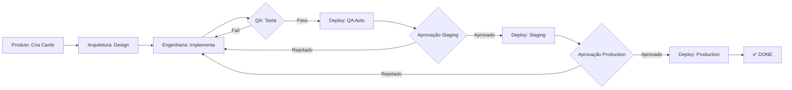

# ✅ Sistema SuperCore v2.0 - PRONTO PARA USO

**Data**: 2024-12-21
**Status**: Sistema totalmente configurado e operacional
**Ambiente**: Monitoramento em http://localhost:3001

---

## 🎯 Status Geral

| Componente | Status | Porta/Localização |
|------------|--------|-------------------|
| Backend API | ✅ Running | http://localhost:3000 |
| Frontend Dashboard | ✅ Running | http://localhost:3001 |
| Metrics Collector | ✅ Running | Background |
| Bootstrap Script | ✅ Ready | `meta-squad-bootstrap.sh` |
| Configuração | ✅ Validated | `meta-squad-config.json` |
| Documentação Master | ✅ Created | `CLAUDE.md` |
| Estrutura de Diretórios | ✅ Created | `artefactos_implementacao/` |

---

## 📂 Estrutura de Diretórios Configurada

```
SuperCore/
├── CLAUDE.md                           ← MASTER REFERENCE (raiz)
│
├── Supercore_v2.0/
│   └── DOCUMENTACAO_BASE/              ← READ-ONLY (documentação base)
│       ├── requisitos_funcionais_v2.0.md
│       ├── arquitetura_supercore_v2.0.md
│       └── stack_supercore_v2.0.md
│
├── artefactos_implementacao/           ← OUTPUTS DAS SQUADS
│   ├── produto/                        ← Squad Produto (cards, stories)
│   ├── arquitetura/                    ← Squad Arquitetura (designs, ADRs)
│   ├── engenharia/
│   │   ├── frontend/                   ← Frontend docs
│   │   └── backend/                    ← Backend docs
│   ├── qa/                             ← QA (test plans, reports)
│   └── deploy/                         ← Deploy (runbooks, infra docs)
│
├── .claude/                            ← SKILLS E AGENTES
│   └── agents/
│       └── management/
│           ├── product-owner.md
│           ├── tech-lead.md
│           ├── frontend-lead.md
│           ├── backend-lead.md
│           ├── qa-lead.md
│           └── deploy-lead.md          ← NEW: IAOps squad
│
└── infrastructure/                     ← TERRAFORM (AWS)
    └── terraform/
        ├── modules/vpc/                ← VPC module
        └── environments/
            ├── qa/                     ← Auto-deploy
            ├── staging/                ← Manual (Tech Lead)
            └── production/             ← Manual (PO + Tech Lead)
```

---

## 🚀 Como Usar o Sistema

### 1️⃣ Abrir Portal de Monitoramento

```bash
# Já está rodando em:
open http://localhost:3001
```

### 2️⃣ Iniciar Implementação em Background

No portal:
1. Clique no botão **"Iniciar Projeto em Background"**
2. Insira o nome do projeto (ex: "SuperCore MVP")
3. (Opcional) Faça upload de configuração customizada
4. Clique em **"Iniciar Bootstrap"**

### 3️⃣ Monitorar Progresso

O portal mostrará em tempo real:
- **Barras de Progresso** por squad
- **Cards gerados** pela Squad Produto
- **Passagem de cards** entre squads:
  - Produto → Arquitetura → Engenharia → QA → Deploy
- **Percentuais de conclusão**
- **Eventos em tempo real**

### 4️⃣ Aprovações de Deploy

Quando a Squad Deploy estiver pronta para deploy:

**QA Environment**:
- ✅ **Auto-deploy** (sem aprovação necessária)
- Trigger: Todos os testes passaram

**Staging Environment**:
- ⏸️ **Manual** (modal de aprovação aparecerá)
- Aprovador: Tech Lead
- Portal exibirá checklist e botões Aprovar/Rejeitar

**Production Environment**:
- ⏸️ **Manual com Change Window** (modal de aprovação)
- Aprovadores: Product Owner + Tech Lead
- Requer janela de mudança agendada

---

## 🔧 Squads Configuradas

### 1. Squad Produto
**Agentes**: product-owner, business-analyst
**Outputs**: `artefactos_implementacao/produto/`
- Cards de features (CARD-001-xxx.md)
- User stories (US-001-xxx.md)
- Backlog priorizado

### 2. Squad Arquitetura
**Agentes**: tech-lead, solution-architect, security-architect
**Outputs**: `artefactos_implementacao/arquitetura/` + **CLAUDE.md**
- Designs técnicos
- ADRs (Architecture Decision Records)
- Diagramas (Mermaid)
- API specs (OpenAPI)

### 3. Squad Engenharia
**Manager**: scrum-master
**Sub-squads**:
- **Frontend**: frontend-lead, react-developer, ui-ux-designer
  - Output: `artefactos_implementacao/engenharia/frontend/`
  - Código: `/frontend/`
- **Backend**: backend-lead, golang-developer, python-developer, database-specialist
  - Output: `artefactos_implementacao/engenharia/backend/`
  - Código: `/backend/`

### 4. Squad QA
**Agentes**: qa-lead, test-engineer, security-auditor
**Outputs**: `artefactos_implementacao/qa/`
- Test plans
- Test cases
- Bug reports
- Security scans
- Coverage reports

**Pode Aprovar/Rejeitar**: ✅ Sim
**Max Retry Cycles**: 3

### 5. Squad Deploy (NEW! 🆕)
**Agentes**: deploy-lead
**Outputs**: `artefactos_implementacao/deploy/` + `/infrastructure/`
- Runbooks operacionais
- Terraform IaC
- GitHub Actions CI/CD
- Monitoring setup

**Deployment Targets**:
- ✅ QA (auto)
- ⏸️ Staging (manual - Tech Lead)
- ⏸️ Production (manual - PO + Tech Lead + change window)

---

## 🔐 Zero-Tolerance Policy

### ❌ PROIBIDO
- Mock implementations
- Placeholder comments (TODO, FIXME)
- Hardcoded credentials
- Simplified logic
- Fake data
- Missing error handling
- Incomplete tests (<80% coverage)

### ✅ OBRIGATÓRIO
- Real database integration
- Comprehensive error handling
- Production-grade security
- Complete testing (≥80% coverage)
- Full documentation
- Observability (logs, metrics, traces)

**Enforcement**:
- QA auto-rejects violations
- Tech Lead final approval
- No temporary workarounds allowed

---

## 📊 Workflow de Cards



---

## 🌐 AWS Infrastructure (Deploy Squad)

### Recursos Provisionados

**VPC Module**:
- VPC com CIDR /16
- 3 Subnets Públicas (1 por AZ)
- 3 Subnets Privadas (1 por AZ)
- Internet Gateway
- 3 NAT Gateways (alta disponibilidade)
- VPC Flow Logs

**Compute**:
- ECS Cluster (Fargate)
- Auto-scaling (CPU/memória)
- Container Insights
- CloudWatch Logs

**Database**:
- RDS PostgreSQL Multi-AZ
- Automated backups (7 dias)
- Encryption at rest
- Performance Insights

**Caching**:
- ElastiCache Redis (cluster mode)
- Multi-AZ replication

**Networking**:
- Application Load Balancer (ALB)
- HTTPS (ACM certificates)
- Security Groups por camada
- WAF

**Storage**:
- S3 buckets (encrypted)
- CloudFront CDN
- Versionamento

**Monitoring**:
- CloudWatch Dashboards
- CloudWatch Alarms
- X-Ray tracing
- SNS notifications

---

## 🔍 API Endpoints Disponíveis

### Bootstrap Control
```bash
# GET - Status atual do bootstrap
curl http://localhost:3000/api/bootstrap/status

# POST - Iniciar bootstrap
curl -X POST http://localhost:3000/api/bootstrap/start \
  -H "Content-Type: application/json" \
  -d '{"project_name": "SuperCore MVP", "config_file": "meta-squad-config.json"}'

# POST - Parar bootstrap
curl -X POST http://localhost:3000/api/bootstrap/stop

# POST - Aprovar deployment
curl -X POST http://localhost:3000/api/bootstrap/approve \
  -H "Content-Type: application/json" \
  -d '{"session_id": "session_xxx", "approval_type": "staging", "approved": true}'
```

### Monitoring
```bash
# GET - Health check
curl http://localhost:3000/health

# GET - Status geral
curl http://localhost:3000/api/status

# GET - Squads
curl http://localhost:3000/api/squads

# GET - Cards
curl http://localhost:3000/api/cards

# GET - Events
curl http://localhost:3000/api/events?limit=20

# WebSocket - Real-time updates
ws://localhost:3000/ws
```

---

## 📝 Próximos Passos

### Para Iniciar Desenvolvimento Autônomo:

1. **Abrir Portal**: http://localhost:3001
2. **Clicar em "Iniciar Projeto em Background"**
3. **Inserir nome do projeto**
4. **Aguardar execução automática das squads**
5. **Aprovar deploys quando solicitado**

### O que vai acontecer:

1. **Squad Produto** irá:
   - Analisar `Supercore_v2.0/DOCUMENTACAO_BASE/requisitos_funcionais_v2.0.md`
   - Criar cards de features (CARD-001, CARD-002, etc.)
   - Criar user stories (US-001, US-002, etc.)
   - Salvar em `artefactos_implementacao/produto/`

2. **Squad Arquitetura** irá:
   - Ler cards da Squad Produto
   - Criar designs técnicos
   - Criar ADRs para decisões importantes
   - Criar diagramas (Mermaid)
   - Criar API specs (OpenAPI)
   - **Atualizar CLAUDE.md** com decisões arquiteturais
   - Salvar em `artefactos_implementacao/arquitetura/`

3. **Squad Engenharia** irá:
   - **Frontend**: Implementar componentes React, páginas, formulários
   - **Backend**: Implementar APIs Go/Python, migrations, integrações
   - Escrever testes (coverage ≥80%)
   - Salvar docs em `artefactos_implementacao/engenharia/{frontend,backend}/`
   - Salvar código em `/frontend/` e `/backend/`

4. **Squad QA** irá:
   - Criar test plans
   - Criar test cases
   - Executar testes (unit, integration, E2E)
   - Scans de segurança (Trivy, Checkov)
   - Performance tests
   - **Aprovar ou Rejeitar** (máx 3 ciclos)
   - Salvar reports em `artefactos_implementacao/qa/`

5. **Squad Deploy** irá:
   - Criar Terraform para AWS (VPC, ECS, RDS, etc.)
   - Criar GitHub Actions CI/CD
   - **Deploy QA**: Automático após testes passarem
   - **Deploy Staging**: Aguarda aprovação Tech Lead (modal no portal)
   - **Deploy Production**: Aguarda aprovação PO + Tech Lead (modal no portal)
   - Salvar runbooks em `artefactos_implementacao/deploy/`

---

## ✅ Validações Realizadas

- ✅ `meta-squad-config.json` é JSON válido
- ✅ Diretório `artefactos_implementacao/` criado com todas as subpastas
- ✅ Diretório `.claude/agents/` com todos os agentes
- ✅ `CLAUDE.md` na raiz do projeto
- ✅ Documentação base em `Supercore_v2.0/DOCUMENTACAO_BASE/`
- ✅ Backend API respondendo em http://localhost:3000
- ✅ Frontend dashboard respondendo em http://localhost:3001
- ✅ Bootstrap script executável
- ✅ Terraform modules criados
- ✅ GitHub Actions workflows criados
- ✅ Todos os componentes React integrados (BootstrapControl, ProgressFlow, ApprovalDialog)

---

## 🆘 Troubleshooting

### Porta 3000 ou 3001 ocupada
```bash
# Parar monitoring
./stop-monitoring.sh

# Matar processos nas portas
lsof -ti :3000 | xargs kill -9
lsof -ti :3001 | xargs kill -9

# Reiniciar
./start-monitoring.sh
```

### Bootstrap travado
```bash
# Ver status
curl http://localhost:3000/api/bootstrap/status

# Parar bootstrap
curl -X POST http://localhost:3000/api/bootstrap/stop

# Ver logs
tail -f logs/bootstrap.log
```

### Validar configuração
```bash
python3 -m json.tool scripts/squad-orchestrator/meta-squad-config.json
```

---

## 📞 Documentação Completa

- **CLAUDE.md** (raiz) - Documento mestre para agentes
- **artefactos_implementacao/README.md** - Guide de artefatos
- **infrastructure/README.md** - Guia de infraestrutura AWS
- **CONFIGURACAO_COMPLETA.md** - Detalhes da configuração

---

**Sistema Pronto para Uso!** 🚀
Acesse http://localhost:3001 e clique em "Iniciar Projeto em Background" para começar.

---

**Mantido por**: Meta Orchestrator
**Versão**: 2.0.0
**Última Verificação**: 2024-12-21
