# Sprint 4: Architecture Diagrams

## Entity Relationship Diagram

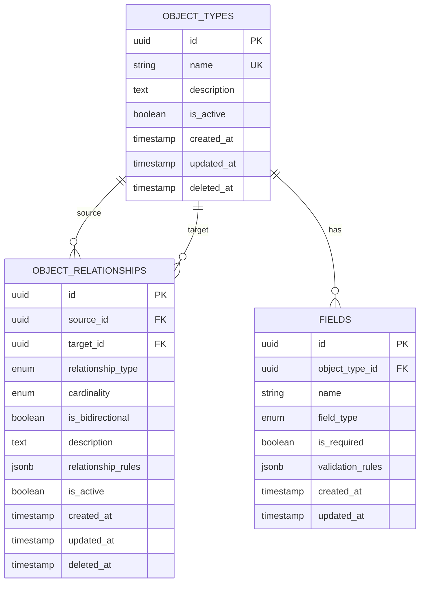

## Module Architecture

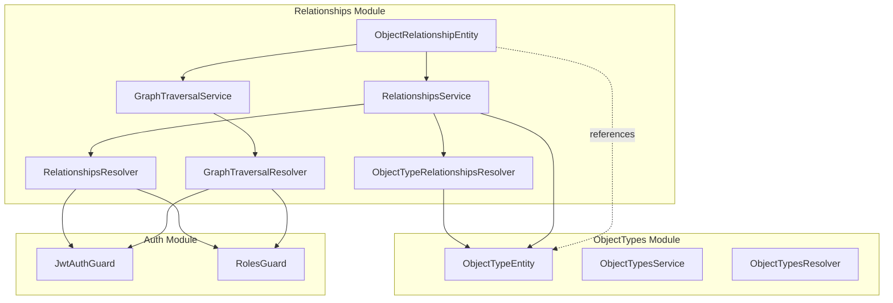

## Data Flow: Create Relationship

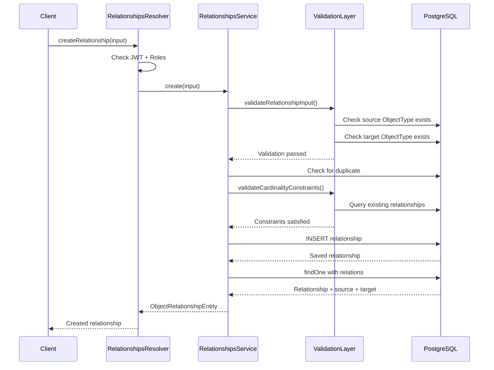

## Graph Traversal: BFS Algorithm

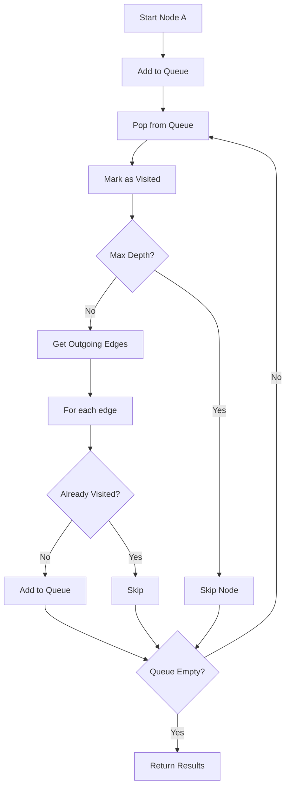

## Validation Flow

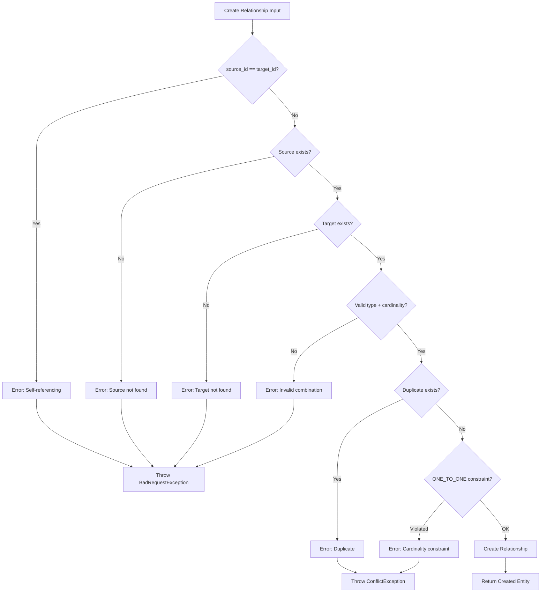

## GraphQL Schema Structure

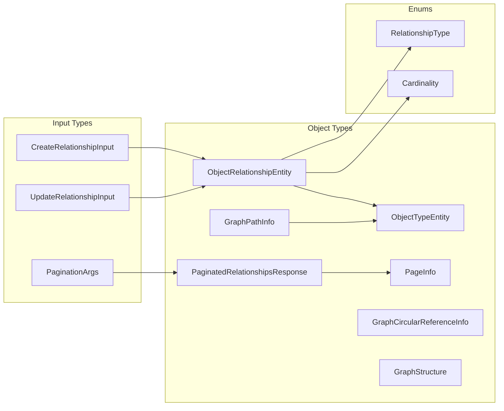

## Circular Reference Detection Algorithm

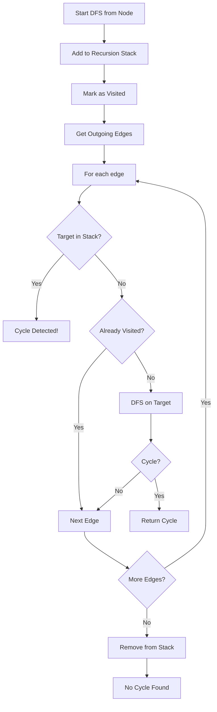

## Service Layer Dependencies

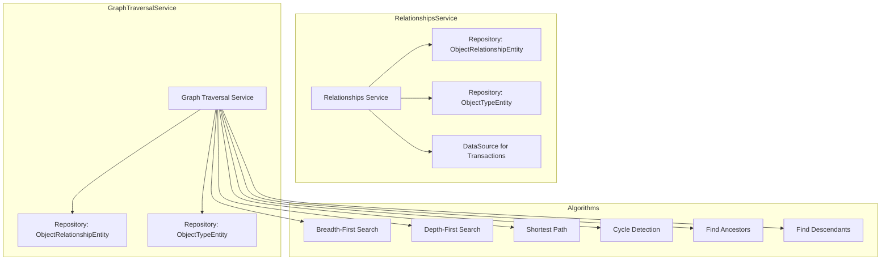

## Request/Response Flow with Authentication

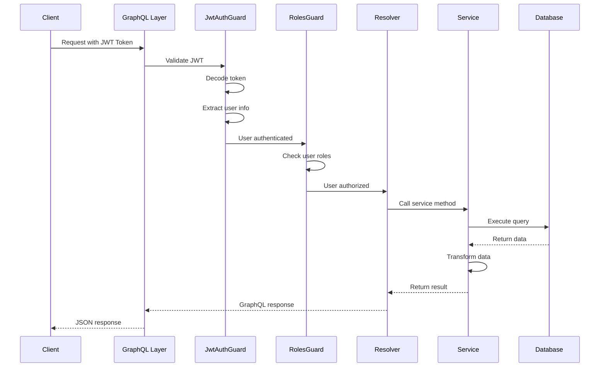

## Relationship Type State Machine

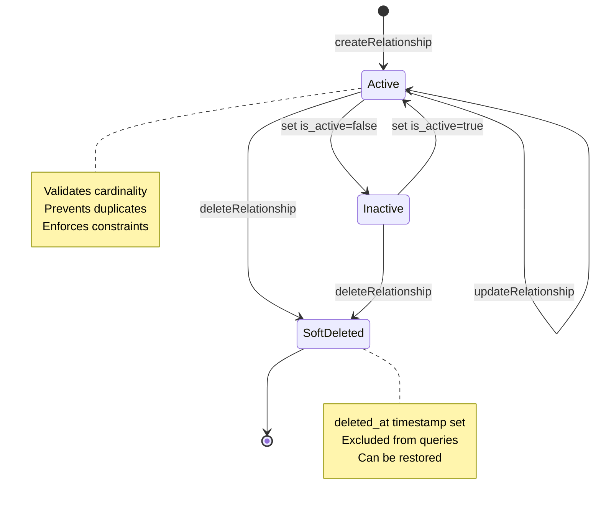

## Index Usage for Query Performance

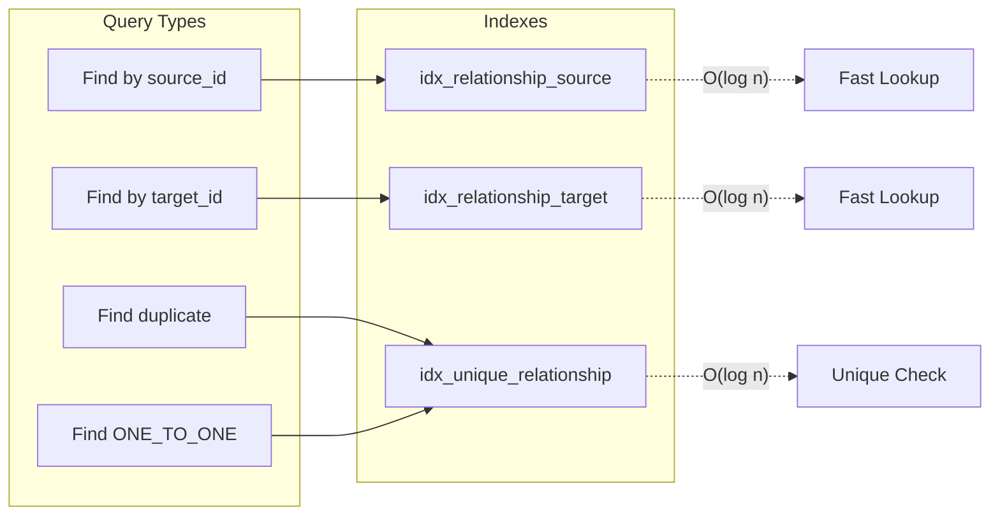

## Test Coverage Map

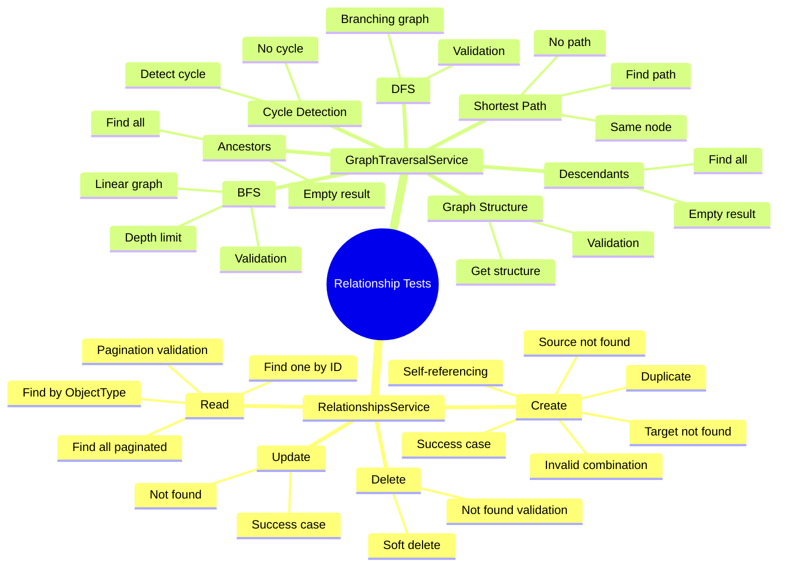

## Deployment Architecture

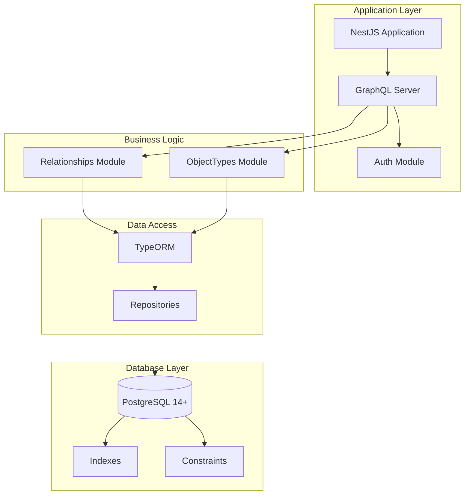

## Performance Characteristics

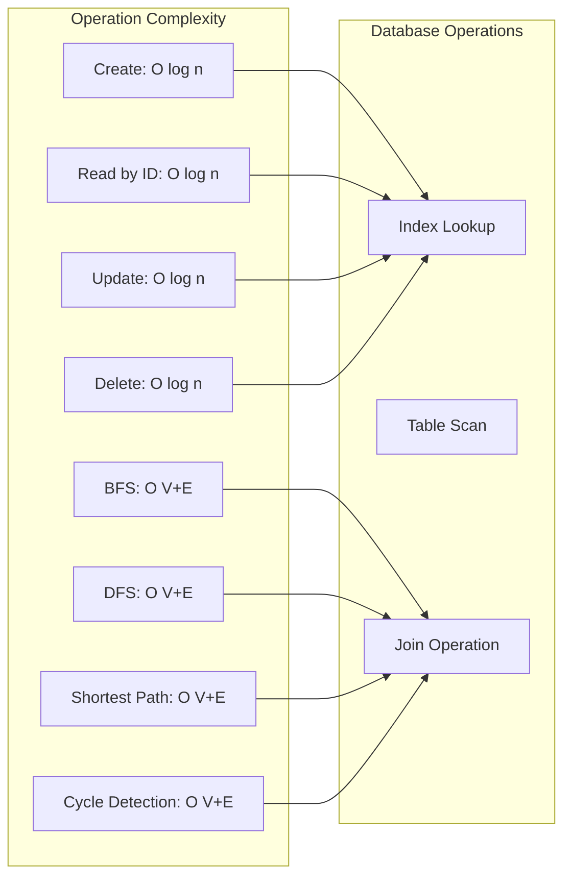

---

## Key Takeaways

1. **Clean Architecture:** Clear separation between layers (Entity, DTO, Service, Resolver)
2. **Type Safety:** TypeScript + PostgreSQL enums ensure type safety at all levels
3. **Performance:** Strategic indexing enables O(log n) lookups
4. **Security:** Multi-layer authentication and authorization
5. **Testability:** 100% service coverage with comprehensive test suite
6. **Scalability:** Graph algorithms optimized with depth limits
7. **Maintainability:** Well-documented code with clear patterns

---

**Diagrams Generated:** December 3, 2025
**Tools Used:** Mermaid, Markdown
**Coverage:** Complete architecture visualization
