# SuperCore v2.0 - Entity Relationship Diagram

## Overview

This document presents the complete Entity Relationship Diagram for SuperCore v2.0's database architecture. The schema implements a multi-tenant Solution Layer architecture with Row-Level Security (RLS) for complete data isolation.

## Version Information

- **Version**: 1.0.0
- **Database**: PostgreSQL 16+
- **Author**: Backend Architect (Database Specialist)
- **Date**: 2025-12-30
- **Tables**: 7 core tables
- **Relationships**: 10 foreign key relationships

---

## Complete ERD Diagram

```mermaid
erDiagram
    %% ============================================================================
    %% SOLUTIONS - Foundation Layer (Top-Level Organizational Unit)
    %% ============================================================================
    SOLUTIONS {
        uuid id PK "Primary Key (UUID v4)"
        varchar slug UK "URL-friendly identifier (unique)"
        varchar name "Display name"
        varchar description "Optional description"
        enum industry "fintech|healthcare|ecommerce|other"
        enum status "draft|active|suspended|archived"
        jsonb config "Extensible configuration"
        uuid rag_global_oracle_id FK "Auto-created RAG Global Oracle"
        timestamptz created_at "Creation timestamp"
        timestamptz updated_at "Last update timestamp"
        timestamptz deleted_at "Soft delete timestamp"
    }

    %% ============================================================================
    %% ORACLES - Knowledge Domains within Solutions
    %% ============================================================================
    ORACLES {
        uuid id PK "Primary Key (UUID v4)"
        uuid solution_id FK "Parent solution (required)"
        varchar oracle_name "Name within solution"
        enum oracle_type "rag_global|domain|specialized|hybrid"
        boolean is_system "System oracle flag"
        enum status "draft|active|inactive|archived"
        text system_prompt "LLM system prompt"
        enum llm_provider "openai|anthropic|google|azure|local"
        varchar llm_model "Model identifier"
        decimal temperature "LLM temperature (0.0-2.0)"
        integer max_tokens "Max response tokens"
        varchar embedding_model "Embedding model name"
        integer embedding_dimensions "Vector dimensions"
        varchar vector_collection_name "Qdrant collection name"
        integer chunk_size "Document chunk size"
        integer chunk_overlap "Chunk overlap size"
        integer top_k "RAG retrieval count"
        decimal similarity_threshold "Min similarity score"
        jsonb config "Extended configuration"
        jsonb stats "Cached statistics"
        timestamptz created_at "Creation timestamp"
        timestamptz updated_at "Last update timestamp"
        timestamptz deleted_at "Soft delete timestamp"
    }

    %% ============================================================================
    %% DOCUMENTS - Source Files for RAG Processing
    %% ============================================================================
    DOCUMENTS {
        uuid id PK "Primary Key (UUID v4)"
        uuid oracle_id FK "Parent oracle (required)"
        uuid solution_id FK "Parent solution (denormalized)"
        varchar filename "Original filename"
        enum file_type "pdf|docx|txt|md|html|csv|json|xml"
        bigint file_size_bytes "File size in bytes"
        varchar mime_type "MIME type"
        varchar storage_path "Storage location path"
        varchar file_hash "SHA-256 hash for dedup"
        enum status "pending|processing|completed|failed|retrying"
        integer processing_attempts "Retry count"
        text processing_error "Last error message"
        timestamptz processing_started_at "Processing start time"
        timestamptz processing_completed_at "Processing end time"
        integer chunk_count "Number of chunks created"
        integer embedding_count "Number of embeddings"
        integer total_tokens "Total tokens in document"
        jsonb metadata "Extended metadata"
        timestamptz created_at "Creation timestamp"
        timestamptz updated_at "Last update timestamp"
        timestamptz deleted_at "Soft delete timestamp"
    }

    %% ============================================================================
    %% DOCUMENT_CHUNKS - Segmented Document Pieces for RAG
    %% ============================================================================
    DOCUMENT_CHUNKS {
        uuid id PK "Primary Key (UUID v4)"
        uuid document_id FK "Parent document (required)"
        uuid oracle_id FK "Parent oracle (denormalized)"
        uuid solution_id FK "Parent solution (denormalized)"
        integer chunk_index "Sequential index (0-based)"
        text chunk_text "Chunk content"
        integer char_count "Character count"
        integer token_count "Token count"
        varchar embedding_id "Qdrant point ID"
        integer retrieval_count "Times retrieved"
        timestamptz last_retrieved_at "Last retrieval time"
        decimal relevance_score_avg "Average relevance score"
        jsonb metadata "Chunk metadata (page, section)"
        timestamptz created_at "Creation timestamp"
        timestamptz updated_at "Last update timestamp"
    }

    %% ============================================================================
    %% CONVERSATIONS - Chat Sessions with Oracles
    %% ============================================================================
    CONVERSATIONS {
        uuid id PK "Primary Key (UUID v4)"
        uuid oracle_id FK "Parent oracle (required)"
        uuid solution_id FK "Parent solution (denormalized)"
        varchar session_id "External session identifier"
        uuid user_id "Optional user reference"
        varchar user_identifier "User display name"
        varchar title "Conversation title"
        enum status "active|archived|deleted"
        integer message_count "Total messages"
        integer user_message_count "User messages"
        integer assistant_message_count "Assistant messages"
        integer total_tokens_used "Total tokens consumed"
        integer input_tokens_used "Input tokens consumed"
        integer output_tokens_used "Output tokens consumed"
        timestamptz first_message_at "First message time"
        timestamptz last_message_at "Last message time"
        integer duration_seconds "Session duration"
        integer user_rating "User rating (1-5)"
        text user_feedback "User feedback text"
        jsonb session_metadata "Session metadata"
        timestamptz created_at "Creation timestamp"
        timestamptz updated_at "Last update timestamp"
        timestamptz deleted_at "Soft delete timestamp"
    }

    %% ============================================================================
    %% MESSAGES - Individual Chat Messages
    %% ============================================================================
    MESSAGES {
        uuid id PK "Primary Key (UUID v4)"
        uuid conversation_id FK "Parent conversation (required)"
        uuid oracle_id FK "Parent oracle (denormalized)"
        uuid solution_id FK "Parent solution (denormalized)"
        enum role "user|assistant|system|tool|error"
        text content "Message content"
        varchar content_format "text|markdown|html"
        enum status "pending|streaming|completed|failed|cancelled"
        integer sequence_number "Order in conversation"
        integer input_tokens "Input tokens used"
        integer output_tokens "Output tokens used"
        integer total_tokens "Total tokens used"
        integer latency_ms "Time to first token"
        integer total_time_ms "Total response time"
        varchar model_used "Actual LLM model"
        jsonb sources "RAG source citations"
        jsonb tool_calls "Tool/function calls"
        jsonb metadata "Extended metadata"
        enum feedback "positive|negative|neutral"
        text feedback_text "Feedback details"
        timestamptz feedback_at "Feedback timestamp"
        timestamptz created_at "Creation timestamp"
        timestamptz updated_at "Last update timestamp"
    }

    %% ============================================================================
    %% TEMPORAL_WORKFLOWS - Temporal.io Workflow Tracking
    %% ============================================================================
    TEMPORAL_WORKFLOWS {
        uuid id PK "Primary Key (UUID v4)"
        varchar workflow_id UK "Temporal workflow ID (unique)"
        varchar run_id "Temporal run ID"
        varchar task_queue "Temporal task queue"
        enum workflow_type "CreateSolutionSAGA|ProcessDocumentWorkflow|..."
        varchar workflow_type_name "Custom workflow name"
        uuid solution_id FK "Related solution (optional)"
        uuid oracle_id FK "Related oracle (optional)"
        uuid document_id FK "Related document (optional)"
        enum status "pending|running|completed|failed|cancelled|..."
        jsonb input_data "Workflow input parameters"
        jsonb output_data "Workflow output results"
        text error_message "Error message if failed"
        varchar error_code "Error code"
        jsonb error_details "Detailed error info"
        boolean is_saga "SAGA workflow flag"
        varchar compensation_status "SAGA compensation status"
        jsonb compensation_steps "SAGA compensation steps"
        varchar current_step "Current step name"
        integer total_steps "Total steps count"
        integer completed_steps "Completed steps count"
        integer progress_percentage "Progress 0-100"
        jsonb progress_details "Detailed progress info"
        timestamptz scheduled_at "Scheduled start time"
        timestamptz started_at "Actual start time"
        timestamptz completed_at "Completion time"
        integer execution_duration_ms "Execution duration"
        integer retry_count "Current retry count"
        integer max_retries "Maximum retries"
        timestamptz next_retry_at "Next retry time"
        uuid initiated_by_user_id "User who initiated"
        varchar initiated_by_user_name "User display name"
        varchar temporal_ui_url "Link to Temporal UI"
        jsonb metadata "Extended metadata"
        timestamptz created_at "Creation timestamp"
        timestamptz updated_at "Last update timestamp"
    }

    %% ============================================================================
    %% RELATIONSHIPS
    %% ============================================================================

    %% Solutions <-> Oracles (Circular: Solutions has RAG Global Oracle)
    SOLUTIONS ||--o{ ORACLES : "contains"
    SOLUTIONS ||--o| ORACLES : "has_rag_global"

    %% Oracles -> Documents
    ORACLES ||--o{ DOCUMENTS : "stores"

    %% Documents -> Chunks
    DOCUMENTS ||--o{ DOCUMENT_CHUNKS : "split_into"

    %% Oracles -> Conversations
    ORACLES ||--o{ CONVERSATIONS : "hosts"

    %% Conversations -> Messages
    CONVERSATIONS ||--o{ MESSAGES : "contains"

    %% Workflows -> Solutions (optional)
    SOLUTIONS ||--o{ TEMPORAL_WORKFLOWS : "triggers"

    %% Workflows -> Oracles (optional)
    ORACLES ||--o{ TEMPORAL_WORKFLOWS : "triggers"

    %% Workflows -> Documents (optional)
    DOCUMENTS ||--o{ TEMPORAL_WORKFLOWS : "processes"
```

---

## Simplified Hierarchy Diagram

---

## Data Flow Diagram

---

## Multi-Tenancy Architecture

---

## Table Relationships Summary

| Parent Table | Child Table | Relationship | Foreign Key | On Delete |
|-------------|-------------|--------------|-------------|-----------|
| solutions | oracles | 1:N | solution_id | CASCADE |
| oracles | solutions | 1:1 | rag_global_oracle_id | SET NULL |
| oracles | documents | 1:N | oracle_id | CASCADE |
| solutions | documents | 1:N | solution_id | CASCADE |
| documents | document_chunks | 1:N | document_id | CASCADE |
| oracles | document_chunks | 1:N | oracle_id | CASCADE |
| solutions | document_chunks | 1:N | solution_id | CASCADE |
| oracles | conversations | 1:N | oracle_id | CASCADE |
| solutions | conversations | 1:N | solution_id | CASCADE |
| conversations | messages | 1:N | conversation_id | CASCADE |
| oracles | messages | 1:N | oracle_id | CASCADE |
| solutions | messages | 1:N | solution_id | CASCADE |
| solutions | temporal_workflows | 1:N | solution_id | SET NULL |
| oracles | temporal_workflows | 1:N | oracle_id | SET NULL |

---

## Index Strategy Overview

---

## Key Design Decisions

### 1. Solution Layer as Foundation
- Solutions are the top-level organizational unit
- All data is scoped to a solution
- Complete tenant isolation via RLS

### 2. Circular FK for RAG Global Oracle
- Each solution has exactly one RAG Global Oracle
- Created automatically when solution is created
- Stored as `rag_global_oracle_id` in solutions table

### 3. Denormalized solution_id
- Added to all child tables for efficient RLS filtering
- Avoids expensive JOINs in RLS policy checks
- Maintained via application logic

### 4. Soft Delete Pattern
- All tables have `deleted_at` TIMESTAMPTZ column
- Hard deletes are prevented by trigger
- Partial indexes exclude deleted records

### 5. JSONB for Flexibility
- `config`, `metadata`, `stats` fields use JSONB
- GIN indexes for efficient querying
- Schema evolution without migrations

### 6. Temporal Workflow Integration
- Replaces Celery for durable workflows
- SAGA pattern support with compensation
- Progress tracking for long-running operations

---

## Cardinality Summary

| Relationship | Type | Description |
|-------------|------|-------------|
| Solution : Oracle | 1:N | One solution has many oracles |
| Solution : RAG Global | 1:1 | One solution has one RAG Global Oracle |
| Oracle : Document | 1:N | One oracle stores many documents |
| Document : Chunk | 1:N | One document has many chunks |
| Oracle : Conversation | 1:N | One oracle hosts many conversations |
| Conversation : Message | 1:N | One conversation has many messages |
| Solution : Workflow | 1:N | One solution can trigger many workflows |
| Oracle : Workflow | 1:N | One oracle can trigger many workflows |
| Document : Workflow | 1:N | One document can have many workflows |

---

## Notes

1. **UUID Primary Keys**: All tables use UUID v4 for globally unique identifiers
2. **Timestamps**: All tables include `created_at` and `updated_at` with automatic updates
3. **Soft Deletes**: Most tables include `deleted_at` for recoverable deletes
4. **JSONB Fields**: Used for extensible data without schema changes
5. **Enum Types**: Used for status fields to ensure data integrity
6. **Constraints**: CHECK constraints enforce business rules at database level
