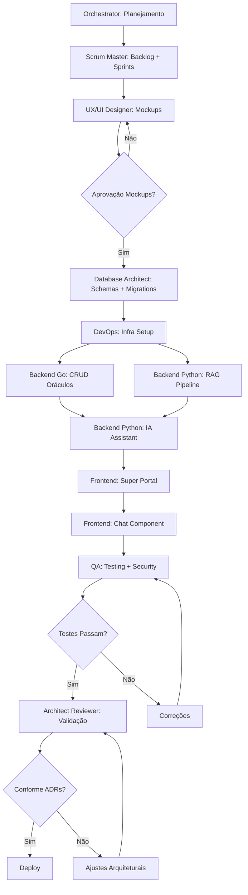

# 🎯 SQUAD FASE 1 - SuperCore v2.0

**Versão**: 1.0.0
**Data**: 2025-12-28
**Fase**: Fase 1 - Camada Oráculo - Knowledge Foundation + IA Assistant
**Duração**: 3-4 semanas
**Baseado em**: [PROPOSTA_FASES.md](../../../PROPOSTA_FASES.md), [CLAUDE.md](../../../CLAUDE.md), documentation-base/

---

## 📋 Visão Geral

Esta Squad é responsável pela implementação completa da **Fase 1** do SuperCore v2.0, que inclui:

- Sistema de Oráculos (CRUD + configuração)
- RAG Trimodal Pipeline (SQL + Graph + Vector)
- IA Assistant conversacional por Oráculo
- Super Portal (Next.js 14 + shadcn/ui)
- Infraestrutura base (PostgreSQL + pgvector, NebulaGraph, Redis)

**Entregáveis-Chave**:
- Backend Go (Gin): API REST CRUD Oráculos + Auth
- Backend Python (FastAPI): RAG Pipeline + IA Assistant Service
- Frontend Next.js: Super Portal + Chat Component
- Database: PostgreSQL schemas + migrations + pgvector
- Infraestrutura: Terraform + Kubernetes base

---

## 👥 Composição da Squad

### 🎭 Modelo de Agentes

**Regra Opus 4.5 vs Sonnet 4.5** (conforme PROPOSTA_FASES.md):
- **Opus 4.5**: Implementação de TODA infraestrutura e código
- **Sonnet 4.5**: Backlog, user stories, documentação técnica (ADRs, RFCs, runbooks)

---

## 1. 🎯 Orchestrator Agent (Opus 4.5)

**Agente**: `context-manager` (Claude Agent)
**Responsabilidade**: Orquestração geral da Squad, coordenação entre agentes, decisões estratégicas
**Modelo**: Claude Opus 4.5

### Habilidades Principais
- Gestão de contexto multi-agente (Context Engineering patterns)
- Coordenação de workflows complexos
- Tomada de decisões arquiteturais críticas
- Resolução de conflitos entre agentes
- Priorização dinâmica de tarefas

### Responsabilidades na Fase 1
- ✅ Coordenar sequência de implementação (infra → backend → frontend)
- ✅ Garantir integração entre Backend Go, Python e Frontend
- ✅ Validar conformidade com documentation-base/
- ✅ Gerenciar dependências entre tarefas
- ✅ Escalação de bloqueios e decisões críticas

### Skills Utilizadas (.claude/)
- `context-management/agents/context-manager.md`
- `agent-orchestration/commands/multi-agent-optimize.md`

### Outputs
- Plano de execução da Squad (ordem de tarefas)
- Relatórios de progresso semanais
- Decisões de desbloqueio
- Validação de integrações

---

## 2. 📝 Scrum Master (Sonnet 4.5)

**Agente**: Business Analyst + Technical Writer
**Responsabilidade**: Backlog, sprints, user stories, documentação técnica
**Modelo**: Claude Sonnet 4.5

### Habilidades Principais
- Gestão ágil de projetos
- Escrita de user stories com critérios de aceitação
- Documentação técnica (ADRs, RFCs, runbooks)
- Facilitação de cerimônias ágeis
- Rastreabilidade requisitos → entregas

### Responsabilidades na Fase 1
- ✅ Criar backlog exaustivo da Fase 1 (BACKLOG_FASE_1.md)
- ✅ Definir 6 sprints de 1 semana cada
- ✅ Escrever user stories para cada RF (RF001-RF006)
- ✅ Documentar ADRs de decisões arquiteturais
- ✅ Criar runbooks operacionais (troubleshooting, deployment)
- ✅ Validar entregas vs requisitos (verification-first - obra ow-002)
- ✅ Relatórios de sprint (burndown, velocity)

### Skills Utilizadas (.claude/)
- `business-analytics/agents/business-analyst.md`
- `code-documentation/agents/docs-architect.md`
- `code-documentation/agents/tutorial-engineer.md`

### Outputs
- `BACKLOG_FASE_1.md` (exaustivo, step-by-step)
- `SPRINTS_FASE_1.md` (6 sprints detalhados)
- User stories por RF (markdown files)
- ADRs (Architecture Decision Records)
- Runbooks operacionais (troubleshooting, deploy, monitoring)

---

## 3. 🏗️ Backend Go Developer (Opus 4.5)

**Agente**: `backend-architect` + `golang-pro`
**Responsabilidade**: API REST CRUD Oráculos, Auth JWT, PostgreSQL integration
**Modelo**: Claude Opus 4.5

### Habilidades Principais
- Go 1.21+ com Gin framework
- PostgreSQL com pgx driver
- JWT authentication (golang-jwt)
- Middleware development
- Unit + integration testing (testify)

### Responsabilidades na Fase 1
- ✅ API REST CRUD Oráculos (RF001):
  - `POST /api/v1/oracles` - Criar
  - `GET /api/v1/oracles` - Listar
  - `GET /api/v1/oracles/{id}` - Obter
  - `PUT /api/v1/oracles/{id}` - Atualizar
  - `DELETE /api/v1/oracles/{id}` - Deletar
  - `POST /api/v1/oracles/{id}/clone` - Clonar
- ✅ PostgreSQL schemas:
  - `oracles` table (id, name, type, domain, config, created_at, etc)
  - `chat_sessions` table (id, oracle_id, user_id, created_at)
  - `chat_messages` table (id, session_id, role, content, sources, created_at)
- ✅ Multi-tenancy via `oracle_id` (ADR-007)
- ✅ JWT authentication middleware
- ✅ Auditoria (created_by, updated_by, timestamps)
- ✅ Testes: unit + integration (≥80% coverage)
- ✅ OpenAPI/Swagger documentation

### Stack
- Go 1.21+
- Gin framework
- PostgreSQL 16+ (pgx driver)
- golang-jwt
- testify (testing)
- Swagger/OpenAPI

### Skills Utilizadas (.claude/)
- `backend-development/agents/backend-architect.md`
- `backend-development/skills/api-design-principles/SKILL.md`

### Outputs
- `/backend/go/` (código Go completo)
- `/backend/go/migrations/` (SQL migrations)
- `/backend/go/docs/swagger.yaml` (OpenAPI spec)
- `/backend/go/README.md` (setup + API docs)
- Testes: `/backend/go/tests/`

---

## 4. 🐍 Backend Python Developer - RAG Specialist (Opus 4.5)

**Agente**: `fastapi-pro` + `data-engineer` + `ai-engineer`
**Responsabilidade**: RAG Trimodal Pipeline + IA Assistant Service
**Modelo**: Claude Opus 4.5

### Habilidades Principais
- Python 3.11+ com FastAPI
- RAG architecture (LangChain, LlamaIndex)
- Vector databases (pgvector integration)
- Knowledge graphs (NebulaGraph)
- LLM orchestration (OpenAI, Claude)
- Async programming (asyncio, httpx)

### Responsabilidades na Fase 1

**A) RAG Trimodal Pipeline (RF002-RF005)**:
- ✅ **Ingestão Multimodal** (RF002):
  - PDFs (PyMuPDF + OCR pytesseract)
  - DOCX/XLSX (python-docx, openpyxl)
  - Áudio/Vídeo (Whisper transcrição)
  - HTML (BeautifulSoup scraping)
  - Imagens (OCR)
- ✅ **Processamento** (RF003):
  - Chunking semântico (LangChain RecursiveCharacterTextSplitter)
  - Embedding generation (OpenAI ada-002)
  - NLP entity extraction (spaCy)
- ✅ **Storage Trimodal**:
  - PostgreSQL: metadata + structured data
  - pgvector: embeddings (RF005 - cosine similarity)
  - NebulaGraph: knowledge graph (RF004 - nGQL queries)
- ✅ **Retrieval** (RF005):
  - SQL queries (PostgreSQL)
  - Graph traversal (NebulaGraph)
  - Semantic search (pgvector)
  - LLM synthesis (GPT-4 Turbo combina 3 modalidades)

**B) IA Assistant Service (NOVO - Fase 1)**:
- ✅ Endpoints conversacionais:
  - `POST /api/v1/oracles/{id}/chat` - Enviar mensagem
  - `GET /api/v1/oracles/{id}/chat/sessions` - Listar sessões
  - `GET /api/v1/oracles/{id}/chat/sessions/{sessionId}` - Histórico
- ✅ RAG conversational (GPT-4 Turbo ou Claude Opus 4.5)
- ✅ Source tracking (SQL + Graph + Vector sources)
- ✅ Streaming responses (SSE - Server-Sent Events)
- ✅ Histórico de conversas (PostgreSQL)
- ✅ Prompt engineering (system prompt por Oráculo)

**C) Background Jobs**:
- ✅ Celery workers para processamento assíncrono
- ✅ Redis como message broker

**D) Testes**:
- ✅ Unit tests (pytest + pytest-asyncio)
- ✅ Integration tests (RAG pipeline end-to-end)
- ✅ Coverage ≥80%

### Stack
- Python 3.11+
- FastAPI 0.100+
- LangChain (RAG orchestration)
- OpenAI SDK (GPT-4 Turbo, ada-002)
- pgvector (SQLAlchemy integration)
- NebulaGraph Python client (nebula3-python)
- Celery + Redis
- pytest + pytest-asyncio

### Skills Utilizadas (.claude/)
- `api-scaffolding/agents/fastapi-pro.md`
- `api-scaffolding/skills/fastapi-templates/SKILL.md`
- `data-engineering/agents/data-engineer.md`
- `application-performance/agents/ai-engineer.md` (LLM integration)
- `python-development/skills/async-python-patterns/SKILL.md`

### Outputs
- `/backend/python/` (código FastAPI completo)
- `/backend/python/rag/` (RAG pipeline modules)
- `/backend/python/assistant/` (IA Assistant service)
- `/backend/python/migrations/` (Alembic migrations)
- `/backend/python/docs/openapi.json` (OpenAPI spec)
- `/backend/python/README.md` (setup + API docs)
- Testes: `/backend/python/tests/`

---

## 5. 🎨 UX/UI Designer (Opus 4.5)

**Agente**: `ui-ux-designer` + `frontend-developer`
**Responsabilidade**: High-fidelity UI mockups usando shadcn/ui + Tailwind CSS
**Modelo**: Claude Opus 4.5

### Habilidades Principais
- UI/UX Design (Figma, Adobe XD)
- Design System creation
- shadcn/ui component library expertise
- Tailwind CSS advanced patterns
- Responsive design
- Accessibility (WCAG 2.1 AA)

### Responsabilidades na Fase 1
- ✅ **Criar mockups de alta fidelidade** para TODAS as telas:
  - `/oracles` - Listagem (tabela shadcn/ui)
  - `/oracles/new` - Criar Oráculo (form shadcn/ui)
  - `/oracles/{id}` - Detalhes (card layout)
  - `/oracles/{id}/edit` - Editar (form)
  - `/oracles/{id}/knowledge` - Upload documentos (drag-and-drop)
  - `/oracles/{id}/graph` - Visualização grafo (React Flow)
  - **`/oracles/{id}/chat`** - **Chat com IA Assistant** (CRÍTICO) 🔥
- ✅ **Design System**:
  - Color palette (theme tokens)
  - Typography scale
  - Spacing system
  - Component variants (shadcn/ui)
- ✅ **User Flows** (Mermaid diagrams):
  - Criar Oráculo → Upload Conhecimento → Chat com IA Assistant
  - Visualizar Grafo de Conhecimento
- ✅ **Accessibility**:
  - WCAG 2.1 AA compliance
  - Keyboard navigation
  - Screen reader support
  - Color contrast validation

### Skills Utilizadas (.claude/)
- `application-performance/agents/ui-ux-designer.md`
- `application-performance/agents/frontend-developer.md`

### Outputs
- `fases/fase-1/mocks/` (PNG/SVG mockups de alta fidelidade)
  - `01_oracles_listagem.png`
  - `02_oracles_criar.png`
  - `03_oracles_detalhes.png`
  - `04_oracles_editar.png`
  - `05_oracles_knowledge_upload.png`
  - `06_oracles_graph_visualizacao.png`
  - **`07_oracles_chat_ia_assistant.png`** (CRÍTICO)
- `fases/fase-1/mocks/DESIGN_SYSTEM.md` (tokens, components, patterns)
- `fases/fase-1/mocks/USER_FLOWS.md` (Mermaid diagrams)
- `fases/fase-1/mocks/ACCESSIBILITY_REPORT.md` (WCAG compliance)

**Aprovação**: Mockups devem ser aprovados pelo usuário ANTES de iniciar implementação frontend

---

## 6. ⚛️ Frontend Developer (Opus 4.5)

**Agente**: `frontend-developer` (Next.js specialist)
**Responsabilidade**: Super Portal (Next.js 14 App Router + shadcn/ui)
**Modelo**: Claude Opus 4.5

### Habilidades Principais
- Next.js 14+ (App Router)
- React 18+ (TypeScript)
- shadcn/ui component library
- Tailwind CSS
- React Flow (graph visualization)
- WebSocket/SSE (real-time)
- NextAuth.js (authentication)

### Responsabilidades na Fase 1
- ✅ **Implementar Super Portal** (ADR-009):
  - `/oracles` - Listagem com tabela shadcn/ui
  - `/oracles/new` - Formulário de criação
  - `/oracles/{id}` - Página de detalhes
  - `/oracles/{id}/edit` - Formulário de edição
  - `/oracles/{id}/knowledge` - Upload de documentos (drag-and-drop)
  - `/oracles/{id}/graph` - Visualização grafo (React Flow - ADR-010)
  - **`/oracles/{id}/chat`** - **Chat com IA Assistant** (CRÍTICO) 🔥
- ✅ **Chat Component** (shadcn/ui):
  - Interface conversacional (mensagens user/assistant)
  - Histórico de sessões (sidebar)
  - Fontes RAG exibidas (tooltips: SQL/Graph/Vector sources)
  - Streaming de respostas (SSE real-time typing)
  - Markdown rendering (code blocks, lists, tables)
- ✅ **Autenticação**:
  - NextAuth.js integration
  - JWT token handling
  - Protected routes
- ✅ **Testes**:
  - Jest + React Testing Library
  - Playwright (E2E)
  - Coverage ≥80%

### Stack
- Next.js 14+ (App Router)
- React 18+ (TypeScript)
- Tailwind CSS
- shadcn/ui
- React Flow (graph viz)
- NextAuth.js
- Jest + React Testing Library + Playwright

### Skills Utilizadas (.claude/)
- `application-performance/agents/frontend-developer.md`
- `javascript-typescript/skills/typescript-advanced-types/SKILL.md`
- `javascript-typescript/skills/modern-javascript-patterns/SKILL.md`

### Outputs
- `/frontend/` (código Next.js completo)
- `/frontend/app/` (App Router pages)
- `/frontend/components/` (shadcn/ui components)
- `/frontend/lib/` (utilities, API clients)
- `/frontend/README.md` (setup + component docs)
- Testes: `/frontend/tests/`

**Dependência**: Aguarda aprovação dos mockups do UX/UI Designer

---

## 7. 💾 Database Architect (Opus 4.5)

**Agente**: `database-architect` + `sql-pro`
**Responsabilidade**: PostgreSQL schemas, migrations, pgvector setup, NebulaGraph schemas
**Modelo**: Claude Opus 4.5

### Habilidades Principais
- PostgreSQL 16+ (advanced features)
- pgvector extension (vector embeddings)
- NebulaGraph 3.7+ (graph database)
- Database design (normalization, indexing)
- Migration tools (Goose, Alembic)
- Performance optimization (EXPLAIN ANALYZE)

### Responsabilidades na Fase 1
- ✅ **PostgreSQL Schemas**:
  - `oracles` table (id, name, type, domain, config, created_at, updated_at, created_by, updated_by)
  - `documents` table (id, oracle_id, filename, content_type, size, processed_at)
  - `chat_sessions` table (id, oracle_id, user_id, created_at)
  - `chat_messages` table (id, session_id, role, content, sources JSONB, created_at)
  - Multi-tenancy via `oracle_id` (ADR-007)
  - Indexes (performance optimization)
- ✅ **pgvector Extension**:
  - Setup pgvector 0.5.1+
  - Embeddings table (id, document_id, chunk_id, embedding vector(1536), metadata JSONB)
  - Cosine similarity indexes (HNSW)
- ✅ **NebulaGraph Schemas**:
  - Tags: Oracle, Document, Entity, Concept
  - Edges: contains, references, related_to
  - Indexes (vertex/edge optimization)
- ✅ **Migrations**:
  - `001_create_oracles.sql`
  - `002_create_documents.sql`
  - `003_create_knowledge_graph_sync.sql`
  - `004_create_chat_sessions.sql`
  - `005_create_chat_messages.sql`
  - `006_setup_pgvector.sql`
- ✅ **Performance**:
  - Query optimization (EXPLAIN ANALYZE)
  - Index strategies (B-tree, HNSW)
  - Connection pooling recommendations

### Stack
- PostgreSQL 16+
- pgvector 0.5.1+
- NebulaGraph 3.7+
- Goose (Go migrations)
- Alembic (Python migrations)

### Skills Utilizadas (.claude/)
- `database-design/agents/database-architect.md`
- `database-design/agents/sql-pro.md`
- `developer-essentials/skills/sql-optimization-patterns/SKILL.md`

### Outputs
- `/database/migrations/` (SQL migrations)
- `/database/schemas/` (ERD diagrams - Mermaid)
- `/database/README.md` (setup + schema docs)
- `/database/performance/` (query optimization reports)

---

## 8. ☁️ DevOps Engineer (Opus 4.5)

**Agente**: `kubernetes-architect` + `terraform-specialist` + `deployment-engineer`
**Responsabilidade**: Infraestrutura (Terraform), Kubernetes, CI/CD, Docker
**Modelo**: Claude Opus 4.5

### Habilidades Principais
- Terraform 1.6+ (IaC)
- Kubernetes 1.28+ (orchestration)
- Docker (containerization)
- GitHub Actions (CI/CD)
- Helm (K8s package manager)
- Monitoring (Prometheus, Grafana)

### Responsabilidades na Fase 1
- ✅ **Infraestrutura (Terraform)**:
  - PostgreSQL 16+ (AWS RDS ou local)
  - NebulaGraph 3.7+ (Kubernetes deployment)
  - Redis 7+ (cache layer)
  - Apache Pulsar (message broker - ADR-002)
  - Networking (VPC, subnets, security groups)
- ✅ **Kubernetes**:
  - Namespaces (dev, staging, prod)
  - Deployments (backend-go, backend-python, frontend)
  - Services (ClusterIP, LoadBalancer)
  - ConfigMaps + Secrets
  - Ingress (NGINX or Traefik)
  - RBAC (service accounts, roles)
- ✅ **Docker**:
  - Multi-stage builds (Go, Python, Next.js)
  - Otimização de imagens (tamanho, layers)
  - Docker Compose (local dev)
- ✅ **CI/CD (GitHub Actions)**:
  - Build + test + push Docker images
  - Deploy to Kubernetes (dev, staging, prod)
  - Security scans (Trivy, Snyk)
  - Automated migrations
- ✅ **Monitoring**:
  - Prometheus (metrics collection)
  - Grafana (dashboards)
  - Jaeger (distributed tracing - OpenTelemetry)
  - Logs (ELK stack ou Loki)

### Stack
- Terraform 1.6+
- Kubernetes 1.28+
- Docker
- Helm 3+
- GitHub Actions
- Prometheus + Grafana
- OpenTelemetry

### Skills Utilizadas (.claude/)
- `cicd-automation/agents/kubernetes-architect.md`
- `cicd-automation/agents/terraform-specialist.md`
- `cicd-automation/agents/deployment-engineer.md`
- `cicd-automation/skills/github-actions-templates/SKILL.md`
- `cloud-infrastructure/skills/terraform-module-library/SKILL.md`

### Outputs
- `/infrastructure/terraform/` (modules + environments)
- `/infrastructure/kubernetes/` (manifests + Helm charts)
- `/infrastructure/docker/` (Dockerfiles)
- `/.github/workflows/` (CI/CD pipelines)
- `/infrastructure/monitoring/` (Prometheus + Grafana configs)
- `/infrastructure/README.md` (setup + deploy docs)

---

## 9. 🧪 QA Engineer (Opus 4.5)

**Agente**: `test-automator` + `security-auditor`
**Responsabilidade**: Testing strategy, automation, security audits
**Modelo**: Claude Opus 4.5

### Habilidades Principais
- Test automation (pytest, Jest, Playwright)
- Integration testing
- E2E testing (Playwright, Cypress)
- Security testing (OWASP Top 10)
- Performance testing (Locust, k6)
- Coverage analysis

### Responsabilidades na Fase 1
- ✅ **Testing Strategy**:
  - Unit tests: backend Go, Python, frontend
  - Integration tests: API endpoints, database, RAG pipeline
  - E2E tests: Super Portal user flows
  - Contract tests: API contracts (OpenAPI)
- ✅ **Test Automation**:
  - Pytest (Python backend)
  - Testify (Go backend)
  - Jest + React Testing Library (frontend)
  - Playwright (E2E)
- ✅ **Coverage Requirements**:
  - Unit coverage ≥80%
  - Integration coverage ≥70%
  - Critical paths: 100% E2E coverage
- ✅ **Security Audits**:
  - OWASP Top 10 checks
  - SQL injection prevention
  - XSS prevention
  - CSRF protection
  - Dependency scanning (Snyk, Trivy)
- ✅ **Performance Testing**:
  - Load testing (Locust - 1000 concurrent users)
  - RAG pipeline latency (<500ms p95)
  - API response times (<200ms p95)

### Stack
- pytest + pytest-asyncio (Python)
- testify (Go)
- Jest + React Testing Library (frontend)
- Playwright (E2E)
- Locust (load testing)
- OWASP ZAP (security)

### Skills Utilizadas (.claude/)
- `codebase-cleanup/agents/test-automator.md`
- `comprehensive-review/agents/security-auditor.md`
- `developer-essentials/skills/e2e-testing-patterns/SKILL.md`

### Outputs
- `/tests/` (test suites organization)
- `/tests/coverage/` (coverage reports)
- `/tests/performance/` (load test results)
- `/tests/security/` (security audit reports)
- `/tests/README.md` (testing docs + how to run)

---

## 10. 📐 Architect Reviewer (Opus 4.5)

**Agente**: `architect-review`
**Responsabilidade**: Validação arquitetural, conformidade com documentation-base/, ADRs
**Modelo**: Claude Opus 4.5

### Habilidades Principais
- Architecture patterns (Clean, Hexagonal, DDD)
- Microservices architecture
- ADR (Architecture Decision Records)
- Code review (architectural perspective)
- Conformidade com stack tecnológica

### Responsabilidades na Fase 1
- ✅ **Validação Arquitetural**:
  - Conformidade com ADR-002 (Apache Pulsar)
  - Conformidade com ADR-003 (PostgreSQL + NebulaGraph + pgvector)
  - Conformidade com ADR-005 (Next.js 14 App Router)
  - Conformidade com ADR-006 (Go para Backend Core)
  - Conformidade com ADR-007 (Multi-Tenancy via oracle_id)
  - Conformidade com ADR-009 (Super Portal)
  - Conformidade com ADR-010 (React Flow para grafo)
- ✅ **Code Review**:
  - Layering correto (6 camadas SuperCore)
  - Separation of concerns
  - Dependency injection
  - Interface segregation
- ✅ **Documentation Review**:
  - ADRs bem escritos (problema, decisão, consequências)
  - Diagramas arquiteturais (Mermaid)
  - API contracts (OpenAPI/GraphQL)
- ✅ **Rejections**:
  - Violações de ADRs
  - Stack não conforme (ex: usar Qdrant em vez de pgvector)
  - Acoplamento excessivo
  - Ausência de testes arquiteturais

### Skills Utilizadas (.claude/)
- `code-review-ai/agents/architect-review.md`
- `backend-development/skills/architecture-patterns/SKILL.md`

### Outputs
- `fases/fase-1/artefatos/ARCHITECTURE_REVIEW.md` (validações)
- `fases/fase-1/artefatos/ADR_CONFORMANCE_REPORT.md`
- Aprovação/Rejeição de pull requests (arquitetura)

---

## 🔄 Workflow da Squad

### Sequência de Trabalho

```mermaid
graph TD
    A[Orchestrator: Planejamento] --> B[Scrum Master: Backlog + Sprints]
    B --> C[UX/UI Designer: Mockups]
    C --> D{Aprovação Mockups?}
    D -->|Sim| E[Database Architect: Schemas + Migrations]
    D -->|Não| C
    E --> F[DevOps: Infra Setup]
    F --> G[Backend Go: CRUD Oráculos]
    F --> H[Backend Python: RAG Pipeline]
    G --> I[Backend Python: IA Assistant]
    H --> I
    I --> J[Frontend: Super Portal]
    J --> K[Frontend: Chat Component]
    K --> L[QA: Testing + Security]
    L --> M{Testes Passam?}
    M -->|Sim| N[Architect Reviewer: Validação]
    M -->|Não| O[Correções]
    O --> L
    N --> P{Conforme ADRs?}
    P -->|Sim| Q[Deploy]
    P -->|Não| R[Ajustes Arquiteturais]
    R --> N
```

### Fases de Implementação

**Semana 1 (Sprint 1): Fundação**
- Scrum Master: Backlog + Sprint planning
- UX/UI Designer: Mockups de alta fidelidade (TODAS as telas)
- Database Architect: Schemas PostgreSQL + pgvector + NebulaGraph
- DevOps: Terraform + Kubernetes setup
- **GATE**: Aprovação de mockups pelo usuário

**Semana 2 (Sprint 2): Backend Go**
- Backend Go: API REST CRUD Oráculos
- Backend Go: JWT authentication
- Database Architect: Migrations
- QA: Unit tests backend Go

**Semana 3 (Sprint 3): Backend Python - RAG**
- Backend Python: RAG Trimodal Pipeline (ingest + process + storage)
- Backend Python: PostgreSQL + pgvector + NebulaGraph integration
- QA: Integration tests RAG pipeline

**Semana 4 (Sprint 4): Backend Python - IA Assistant**
- Backend Python: IA Assistant Service (chat endpoints)
- Backend Python: Streaming responses (SSE)
- Backend Python: Celery background jobs
- QA: Unit + integration tests IA Assistant

**Semana 5 (Sprint 5): Frontend**
- Frontend: Super Portal (todas as páginas)
- Frontend: Chat Component (shadcn/ui)
- Frontend: React Flow (graph visualization)
- QA: Jest + React Testing Library + Playwright

**Semana 6 (Sprint 6): Integração + Deploy**
- Integração completa: Backend Go + Python + Frontend
- QA: E2E tests, security audits, load testing
- Architect Reviewer: Validação conformidade ADRs
- DevOps: Deploy para staging
- **GATE**: Validação final + deploy production

---

## 📊 Métricas de Sucesso

### Coverage
- Unit tests: ≥80%
- Integration tests: ≥70%
- E2E critical paths: 100%

### Performance
- API response time (p95): <200ms
- RAG pipeline latency (p95): <500ms
- Chat streaming: real-time (<100ms first token)

### Security
- OWASP Top 10: 0 vulnerabilidades HIGH/CRITICAL
- Dependency scanning: 0 vulnerabilidades CRITICAL

### Conformidade
- ADRs: 100% conformidade
- Stack: 100% conforme documentation-base/
- Testes: 100% passando

### Documentação
- Backlog: 100% rastreável (RF → user story → task → código)
- ADRs: Decisões críticas documentadas
- Runbooks: Troubleshooting + deploy + monitoring

---

## 🚀 Entregas Finais da Squad

### 1. Código-Fonte
- `/backend/go/` - API REST CRUD Oráculos
- `/backend/python/` - RAG Pipeline + IA Assistant
- `/frontend/` - Super Portal (Next.js 14)
- `/database/` - Schemas + migrations
- `/infrastructure/` - Terraform + Kubernetes

### 2. Testes
- `/tests/` - Unit + integration + E2E
- Coverage reports ≥80%

### 3. Documentação
- `fases/fase-1/backlog/BACKLOG_FASE_1.md`
- `fases/fase-1/sprints/SPRINTS_FASE_1.md`
- `fases/fase-1/mocks/` - Mockups + Design System
- ADRs (Architecture Decision Records)
- Runbooks (troubleshooting, deploy, monitoring)

### 4. Infraestrutura
- Terraform modules (PostgreSQL, NebulaGraph, Redis, Pulsar)
- Kubernetes manifests + Helm charts
- CI/CD pipelines (GitHub Actions)
- Monitoring (Prometheus + Grafana)

### 5. Validação
- Architect Review Report (conformidade ADRs)
- QA Test Report (coverage + security + performance)
- Deploy: staging + production

---

## 📝 Próximos Passos

1. ✅ **Scrum Master**: Criar `BACKLOG_FASE_1.md` exaustivo
2. ✅ **Scrum Master**: Criar `SPRINTS_FASE_1.md` (6 sprints detalhados)
3. ✅ **UX/UI Designer**: Criar mockups de alta fidelidade (7 telas)
4. 🚧 **Aguardar aprovação mockups pelo usuário**
5. 🚧 **Iniciar Sprint 1**: Fundação (database + infra)

---

**Última Atualização**: 2025-12-28
**Próxima Revisão**: Após Sprint 1 (1 semana)
**Squad Lead**: Orchestrator Agent (context-manager)
