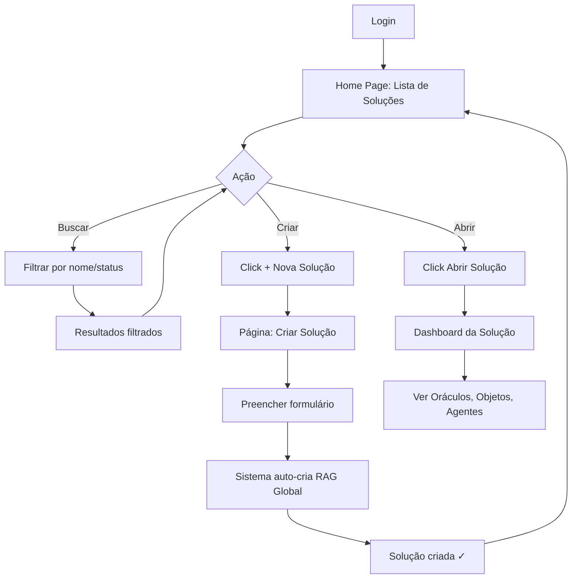
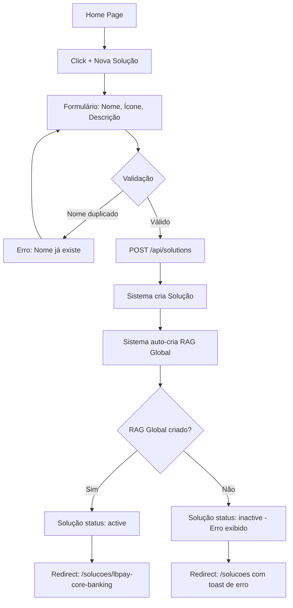

# 00 - Listagem de Soluções (Home Page)

**Página**: `/` (home) ou `/solucoes`
**Componentes**: Card Grid, Stats, Search, Filter
**Responsiva**: Desktop (primário), Tablet, Mobile
**Acesso**: Página inicial após login

---

## 📐 Layout ASCII

```
┌─────────────────────────────────────────────────────────────────────────┐
│ ┌───────────────────────────────────────────────────────────────────┐   │
│ │ HEADER                                                            │   │
│ │ [🏢 SuperCore v2.0]                    [🔔] [👤 Admin] [⚙️ Config] │   │
│ └───────────────────────────────────────────────────────────────────┘   │
│                                                                           │
│ ┌─────────────────────────────────────────────────────────────────────┐ │
│ │ 🏢 Suas Soluções                              [+ Nova Solução]      │ │
│ │                                                                       │ │
│ │ ┌──────────────────────────────────────────────────────────────────┐│ │
│ │ │ [🔍 Buscar soluções...]                    [Filtros ▾]          ││ │
│ │ └──────────────────────────────────────────────────────────────────┘│ │
│ │                                                                       │ │
│ │ ╔════════════════════════════════════════════════════════════════╗  │ │
│ │ ║ Métricas Gerais                                                ║  │ │
│ │ ╚════════════════════════════════════════════════════════════════╝  │ │
│ │                                                                       │ │
│ │ ┌──────────────┐ ┌──────────────┐ ┌──────────────┐ ┌─────────────┐ │ │
│ │ │ 12 Soluções  │ │ 45 Oráculos  │ │ 1.2k Objetos │ │ 89 Agentes  │ │ │
│ │ │   Ativas     │ │   Ativos     │ │   Criados    │ │   Ativos    │ │ │
│ │ └──────────────┘ └──────────────┘ └──────────────┘ └─────────────┘ │ │
│ │                                                                       │ │
│ │ ╔════════════════════════════════════════════════════════════════╗  │ │
│ │ ║ Soluções (Cards Grid)                                          ║  │ │
│ │ ╚════════════════════════════════════════════════════════════════╝  │ │
│ │                                                                       │ │
│ │ ┌──────────────────────┐ ┌──────────────────────┐ ┌───────────────┐ │ │
│ │ │ 🏦 LBPAY Core        │ │ 🛒 SuperCommerce     │ │ 🏥 HealthTech │ │ │
│ │ │    Banking           │ │    Retail            │ │    Hospital   │ │ │
│ │ │                      │ │                      │ │               │ │ │
│ │ │ 8 Oráculos           │ │ 3 Oráculos           │ │ 5 Oráculos    │ │ │
│ │ │ 342 Objetos          │ │ 89 Objetos           │ │ 156 Objetos   │ │ │
│ │ │ 24 Agentes           │ │ 12 Agentes           │ │ 18 Agentes    │ │ │
│ │ │                      │ │                      │ │               │ │ │
│ │ │ RAG Global: ✅       │ │ RAG Global: ✅       │ │ RAG Global: ✅│ │ │
│ │ │ Status: ● Ativa      │ │ Status: ● Ativa      │ │ Status: ● Ativa│││
│ │ │                      │ │                      │ │               │ │ │
│ │ │ [Abrir Solução]      │ │ [Abrir Solução]      │ │ [Abrir Solução]│││
│ │ └──────────────────────┘ └──────────────────────┘ └───────────────┘ │ │
│ │                                                                       │ │
│ │ ┌──────────────────────┐ ┌──────────────────────┐                   │ │
│ │ │ 💼 CRM Sales         │ │ 📊 Analytics         │                   │ │
│ │ │    Automation        │ │    Platform          │                   │ │
│ │ │                      │ │                      │                   │ │
│ │ │ 2 Oráculos           │ │ 4 Oráculos           │                   │ │
│ │ │ 45 Objetos           │ │ 128 Objetos          │                   │ │
│ │ │ 8 Agentes            │ │ 15 Agentes           │                   │ │
│ │ │                      │ │                      │                   │ │
│ │ │ RAG Global: ✅       │ │ RAG Global: ✅       │                   │ │
│ │ │ Status: ⚪ Teste     │ │ Status: ● Ativa      │                   │ │
│ │ │                      │ │                      │                   │ │
│ │ │ [Abrir Solução]      │ │ [Abrir Solução]      │                   │ │
│ │ └──────────────────────┘ └──────────────────────┘                   │ │
│ │                                                                       │ │
│ └─────────────────────────────────────────────────────────────────────┘ │
│                                                                           │
│ ┌─────────────────────────────────────────────────────────────────────┐ │
│ │ FOOTER                                                                │ │
│ │ SuperCore v2.0 - Meta-Plataforma de Geração de Software              │ │
│ └─────────────────────────────────────────────────────────────────────┘ │
└─────────────────────────────────────────────────────────────────────────┘
```

---

## 🎨 Componentes da Interface

### 1. Header
**Componente**: Sticky header global

```typescript
interface HeaderProps {
  appName: string; // "SuperCore v2.0"
  icon: string; // "🏢"
  notifications: Notification[];
  user: User;
  showConfigButton: boolean; // true (acesso à página de configurações globais)
}
```

**Ações**:
- 🔔 Notificações (dropdown)
- 👤 Perfil do usuário (dropdown: Perfil, Logout)
- ⚙️ Configurações Globais (link para `/configuracoes`)

---

### 2. Page Title + CTA
**Layout**: Flexbox (space-between)

```typescript
interface PageTitleProps {
  title: string; // "🏢 Suas Soluções"
  ctaLabel: string; // "+ Nova Solução"
  onCtaClick: () => void; // Navega para /solucoes/new
}
```

---

### 3. Search + Filters
**Componentes**: `<Input>` + `<Select>`

```typescript
interface SearchFilterProps {
  searchPlaceholder: string; // "🔍 Buscar soluções..."
  onSearch: (query: string) => void;
  filters: {
    status: Array<'active' | 'testing' | 'inactive'>;
    sortBy: 'name' | 'oracles_count' | 'created_at' | 'updated_at';
    sortOrder: 'asc' | 'desc';
  };
  onFilterChange: (filters: Partial<typeof filters>) => void;
}
```

**Filtros Disponíveis**:
- **Status**: Todas, Ativas, Em Teste, Inativas
- **Ordenação**: Nome (A-Z), Oráculos (Mais/Menos), Data Criação (Recente/Antiga)

---

### 4. Metrics Cards
**Componente**: Grid de 4 cards (responsivo)

```typescript
interface MetricCardProps {
  icon: string; // 🏢, 🔮, 📦, 🤖
  label: string; // "Soluções Ativas"
  value: number; // 12
  trend?: {
    value: number; // +3
    direction: 'up' | 'down' | 'neutral';
    period: string; // "vs. mês anterior"
  };
}

const METRICS = [
  { icon: '🏢', label: 'Soluções Ativas', value: 12, trend: { value: 3, direction: 'up', period: 'vs. mês anterior' } },
  { icon: '🔮', label: 'Oráculos Ativos', value: 45, trend: { value: 8, direction: 'up', period: 'vs. mês anterior' } },
  { icon: '📦', label: 'Objetos Criados', value: 1234, trend: { value: 156, direction: 'up', period: 'vs. mês anterior' } },
  { icon: '🤖', label: 'Agentes Ativos', value: 89, trend: { value: 12, direction: 'up', period: 'vs. mês anterior' } },
];
```

**Layout**:
- Desktop: 4 colunas (grid-cols-4)
- Tablet: 2 colunas (grid-cols-2)
- Mobile: 1 coluna (grid-cols-1)

---

### 5. Solution Cards Grid
**Componente**: Responsive grid de cards

```typescript
interface Solution {
  id: string;
  name: string; // "LBPAY Core Banking"
  slug: string; // "lbpay-core-banking"
  icon: string; // "🏦" (emoji representativo)
  description: string;
  status: 'active' | 'testing' | 'inactive';

  // Auto-criado ao criar solução
  globalRagOracle: {
    id: string;
    name: string; // "RAG Global - LBPAY Core Banking"
    status: 'active' | 'inactive';
  };

  // Métricas agregadas
  metrics: {
    oraclesCount: number; // 8 (incluindo RAG Global)
    objectsCount: number; // 342
    agentsCount: number; // 24
    mcpServersCount?: number; // 5 (opcional, Fase 2+)
  };

  createdAt: Date;
  updatedAt: Date;
}
```

**Card Layout**:
```tsx
<Card className="hover:shadow-lg transition-shadow">
  <CardHeader>
    <div className="flex items-center gap-3">
      <span className="text-4xl">{solution.icon}</span>
      <div>
        <CardTitle>{solution.name}</CardTitle>
        <Badge variant={solution.status === 'active' ? 'success' : 'secondary'}>
          {solution.status === 'active' ? '● Ativa' : '⚪ Teste'}
        </Badge>
      </div>
    </div>
  </CardHeader>

  <CardContent>
    <div className="space-y-2 text-sm text-neutral-600">
      <div className="flex justify-between">
        <span>Oráculos:</span>
        <span className="font-semibold">{solution.metrics.oraclesCount}</span>
      </div>
      <div className="flex justify-between">
        <span>Objetos:</span>
        <span className="font-semibold">{solution.metrics.objectsCount.toLocaleString()}</span>
      </div>
      <div className="flex justify-between">
        <span>Agentes:</span>
        <span className="font-semibold">{solution.metrics.agentsCount}</span>
      </div>

      <Separator className="my-3" />

      <div className="flex items-center gap-2">
        <span>RAG Global:</span>
        {solution.globalRagOracle.status === 'active' ? (
          <Badge variant="success" className="text-xs">✅ Ativo</Badge>
        ) : (
          <Badge variant="destructive" className="text-xs">❌ Inativo</Badge>
        )}
      </div>
    </div>
  </CardContent>

  <CardFooter>
    <Button
      className="w-full"
      onClick={() => navigate(`/solucoes/${solution.slug}`)}
    >
      Abrir Solução
    </Button>
  </CardFooter>
</Card>
```

**Grid Layout**:
- Desktop: 3 colunas (grid-cols-3, gap-6)
- Tablet: 2 colunas (grid-cols-2, gap-4)
- Mobile: 1 coluna (grid-cols-1, gap-4)

---

## 🔄 User Flows

### Flow 1: Visualizar Soluções



### Flow 2: Criar Nova Solução



---

## 🎯 Estados da Interface

### Estado: Empty (Nenhuma Solução)

```
┌─────────────────────────────────────────────────────────────┐
│                                                             │
│                       🏢                                    │
│                                                             │
│            Nenhuma Solução Cadastrada                       │
│                                                             │
│  Crie sua primeira solução para começar a gerar software    │
│  automaticamente usando Oráculos, Objetos e Agentes IA.     │
│                                                             │
│              [+ Criar Primeira Solução]                     │
│                                                             │
└─────────────────────────────────────────────────────────────┘
```

**Implementação**:
```tsx
{solutions.length === 0 && (
  <EmptyState
    icon="🏢"
    title="Nenhuma Solução Cadastrada"
    description="Crie sua primeira solução para começar a gerar software automaticamente usando Oráculos, Objetos e Agentes IA."
    action={{
      label: "+ Criar Primeira Solução",
      onClick: () => navigate('/solucoes/new')
    }}
  />
)}
```

---

### Estado: Loading

```tsx
<div className="grid grid-cols-3 gap-6">
  {[1, 2, 3, 4, 5, 6].map(i => (
    <Skeleton key={i} className="h-64 w-full rounded-lg" />
  ))}
</div>
```

---

### Estado: Error

```tsx
<Alert variant="destructive">
  <AlertCircle className="h-4 w-4" />
  <AlertTitle>Erro ao carregar soluções</AlertTitle>
  <AlertDescription>
    Não foi possível carregar a lista de soluções. Tente novamente.
    <Button variant="link" onClick={refetch}>Recarregar</Button>
  </AlertDescription>
</Alert>
```

---

## 🔐 Validações e Regras de Negócio

### Busca
- **Debounce**: 300ms após parar de digitar
- **Campos pesquisados**: `name`, `description`
- **Case-insensitive**

### Filtros
- **Status**: Multi-select (Ativa, Teste, Inativa)
- **Ordenação padrão**: Nome (A-Z)
- **Persistência**: Filtros salvos em `localStorage` (UX)

### Métricas
- **Atualização**: Real-time via WebSocket ou polling (5s)
- **Cálculo**: Agregação de todas as soluções
- **Trend**: Comparação com período anterior (30 dias)

### Cards
- **Hover**: Elevação de sombra (shadow-lg)
- **Click**: Navega para `/solucoes/{slug}`
- **Status Badge**:
  - ● Ativa (verde): Todos os oráculos funcionais
  - ⚪ Teste (amarelo): Alguns oráculos em teste
  - ⚪ Inativa (cinza): Solução desabilitada

### RAG Global Indicator
- ✅ **Ativo**: RAG Global operacional
- ❌ **Inativo**: RAG Global com erro (exibe tooltip com erro)

---

## 📱 Responsividade

### Desktop (≥1024px)
- Metrics: 4 colunas
- Cards Grid: 3 colunas
- Gap: 6 (1.5rem)

### Tablet (768px - 1023px)
- Metrics: 2 colunas
- Cards Grid: 2 colunas
- Gap: 4 (1rem)

### Mobile (≤767px)
- Metrics: 1 coluna (scroll horizontal alternativo)
- Cards Grid: 1 coluna
- Gap: 4 (1rem)
- Button "Abrir Solução": Full width

---

## 🧪 Casos de Teste

### Teste 1: Criar Primeira Solução (Empty State)
**Dado**: Nenhuma solução cadastrada
**Quando**: Usuário faz login
**Então**: Empty state é exibido
**E**: Botão "+ Criar Primeira Solução" visível

### Teste 2: Buscar Solução por Nome
**Dado**: 12 soluções cadastradas
**Quando**: Usuário digita "LBPAY" na busca
**Então**: Apenas soluções com "LBPAY" no nome são exibidas
**E**: Outros cards são ocultados

### Teste 3: Filtrar por Status "Ativa"
**Dado**: 5 soluções ativas, 2 em teste
**Quando**: Usuário seleciona filtro "Status: Ativa"
**Então**: Apenas 5 cards são exibidos
**E**: Contador "12 Soluções" atualizado para "5 Soluções"

### Teste 4: RAG Global Inativo
**Dado**: Solução "LBPAY Core Banking" tem RAG Global inativo
**Quando**: Card é exibido
**Então**: Badge "❌ Inativo" visível
**E**: Tooltip explica erro ao hover

### Teste 5: Abrir Solução
**Dado**: Usuário na home page
**Quando**: Click em "Abrir Solução" no card "LBPAY Core Banking"
**Então**: Navega para `/solucoes/lbpay-core-banking`
**E**: Dashboard da solução é carregado

---

## 🔗 Integração com Backend

### API Endpoints

**Listar Soluções**:
```http
GET /api/solutions?status=active&search=lbpay&sortBy=name&sortOrder=asc
```

**Response**:
```json
{
  "solutions": [
    {
      "id": "uuid-1",
      "name": "LBPAY Core Banking",
      "slug": "lbpay-core-banking",
      "icon": "🏦",
      "description": "Plataforma completa de core banking para fintechs",
      "status": "active",
      "globalRagOracle": {
        "id": "uuid-rag-1",
        "name": "RAG Global - LBPAY Core Banking",
        "status": "active"
      },
      "metrics": {
        "oraclesCount": 8,
        "objectsCount": 342,
        "agentsCount": 24
      },
      "createdAt": "2025-01-15T10:00:00Z",
      "updatedAt": "2025-01-20T14:30:00Z"
    }
  ],
  "total": 12,
  "page": 1,
  "pageSize": 20
}
```

**Métricas Agregadas**:
```http
GET /api/solutions/metrics
```

**Response**:
```json
{
  "solutionsCount": 12,
  "oraclesCount": 45,
  "objectsCount": 1234,
  "agentsCount": 89,
  "trends": {
    "solutions": { "value": 3, "direction": "up" },
    "oracles": { "value": 8, "direction": "up" },
    "objects": { "value": 156, "direction": "up" },
    "agents": { "value": 12, "direction": "up" }
  }
}
```

---

## ✅ Critérios de Aceitação

### Listagem
- [ ] Exibir todas as soluções cadastradas em grid responsivo
- [ ] Mostrar métricas agregadas (Soluções, Oráculos, Objetos, Agentes)
- [ ] Exibir trend de crescimento nas métricas
- [ ] Busca por nome com debounce 300ms
- [ ] Filtro por status (Ativa, Teste, Inativa)
- [ ] Ordenação por nome, contagem de oráculos, data criação

### Cards
- [ ] Exibir ícone, nome, status da solução
- [ ] Mostrar métricas: oráculos, objetos, agentes
- [ ] Indicador de RAG Global (✅ Ativo / ❌ Inativo)
- [ ] Botão "Abrir Solução" navega para dashboard
- [ ] Hover: elevação de sombra

### Empty State
- [ ] Exibir quando nenhuma solução cadastrada
- [ ] Botão "+ Criar Primeira Solução" visível
- [ ] Texto explicativo sobre soluções

### Responsividade
- [ ] Desktop: 3 colunas de cards, 4 métricas
- [ ] Tablet: 2 colunas de cards, 2 métricas
- [ ] Mobile: 1 coluna de cards, 1 métrica (scroll horizontal)

### Performance
- [ ] Loading state durante fetch
- [ ] Error state se API falhar
- [ ] Debounce na busca (evitar requests excessivos)

---

## 🎨 Design Tokens

**Cores**:
- Status Ativa: `bg-green-500`
- Status Teste: `bg-yellow-500`
- Status Inativa: `bg-gray-400`
- RAG Global Ativo: `text-green-600`
- RAG Global Inativo: `text-red-600`

**Tipografia**:
- Page Title: `text-3xl font-bold`
- Card Title: `text-xl font-semibold`
- Metrics: `text-2xl font-bold`
- Labels: `text-sm text-neutral-600`

**Espaçamento**:
- Grid gap (desktop): `gap-6` (1.5rem)
- Grid gap (mobile): `gap-4` (1rem)
- Card padding: `p-6`

---

## 🚀 Prioridade

**P0 (Fase 1 - Crítico)**:
- ✅ Listagem de soluções
- ✅ Cards com métricas
- ✅ Busca e filtros
- ✅ Empty state
- ✅ Navegação para dashboard da solução

**P1 (Fase 2)**:
- Métricas com trend (gráfico de crescimento)
- WebSocket para atualização real-time
- Filtros avançados (data criação, autor)

**P2 (Fase 3)**:
- Dashboard executivo com gráficos
- Comparação entre soluções
- Export de métricas (CSV, PDF)

---

**Status**: 🎨 Design Pronto
**Criado**: 2025-12-29
**Atualizado**: 2025-12-29
**Aprovação**: ⏳ Aguardando validação
