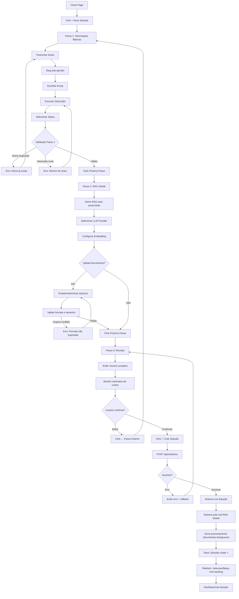

# 00 - Criar Nova Solução (Wizard)

**Página**: `/solucoes/new`
**Componentes**: Multi-step Form, Wizard Progress, Validation
**Responsiva**: Desktop (primário), Tablet, Mobile
**Acesso**: Botão "+ Nova Solução" da home page

---

## 📐 Layout ASCII

```
┌─────────────────────────────────────────────────────────────────────────┐
│ ┌───────────────────────────────────────────────────────────────────┐   │
│ │ HEADER                                                            │   │
│ │ [🏢 SuperCore v2.0] > [Soluções] > [Nova Solução]                 │   │
│ └───────────────────────────────────────────────────────────────────┘   │
│                                                                           │
│ ┌─────────────────────────────────────────────────────────────────────┐ │
│ │ 🏢 Criar Nova Solução                                               │ │
│ │                                                                       │ │
│ │ ╔════════════════════════════════════════════════════════════════╗  │ │
│ │ ║ Wizard Progress                                                ║  │ │
│ │ ╚════════════════════════════════════════════════════════════════╝  │ │
│ │                                                                       │ │
│ │ ┌────────────────────────────────────────────────────────────────┐  │ │
│ │ │ ● Informações Básicas  →  ⚪ RAG Global  →  ⚪ Revisão         │  │ │
│ │ └────────────────────────────────────────────────────────────────┘  │ │
│ │                                                                       │ │
│ │ ╔════════════════════════════════════════════════════════════════╗  │ │
│ │ ║ Passo 1/3: Informações Básicas                                 ║  │ │
│ │ ╚════════════════════════════════════════════════════════════════╝  │ │
│ │                                                                       │ │
│ │ Nome da Solução *                                                    │ │
│ │ ┌──────────────────────────────────────────────────────────────────┐│ │
│ │ │ LBPAY Core Banking                                               ││ │
│ │ └──────────────────────────────────────────────────────────────────┘│ │
│ │ ℹ️ Nome único e descritivo (ex: LBPAY Core Banking, SuperCommerce) │ │
│ │                                                                       │ │
│ │ Slug (gerado automaticamente)                                        │ │
│ │ ┌──────────────────────────────────────────────────────────────────┐│ │
│ │ │ lbpay-core-banking                                     [Editar] ││ │
│ │ └──────────────────────────────────────────────────────────────────┘│ │
│ │ ℹ️ URL amigável (lowercase, hífens, sem espaços)                    │ │
│ │                                                                       │ │
│ │ Ícone (Emoji) *                                                      │ │
│ │ ┌──────────────────────────────────────────────────────────────────┐│ │
│ │ │ 🏦                                               [Escolher Emoji]││ │
│ │ └──────────────────────────────────────────────────────────────────┘│ │
│ │ ℹ️ Emoji representativo da solução (ex: 🏦 Banking, 🛒 E-commerce) │ │
│ │                                                                       │ │
│ │ Descrição *                                                           │ │
│ │ ┌──────────────────────────────────────────────────────────────────┐│ │
│ │ │ Plataforma completa de core banking para fintechs, incluindo    ││ │
│ │ │ gestão de contas, transações, compliance e relatórios            ││ │
│ │ │ financeiros automatizados via Oráculos e Agentes IA.             ││ │
│ │ │                                                                   ││ │
│ │ └──────────────────────────────────────────────────────────────────┘│ │
│ │ 187/500 caracteres                                                   │ │
│ │                                                                       │ │
│ │ Status Inicial                                                        │ │
│ │ ┌──────────────────────────────────────────────────────────────────┐│ │
│ │ │ ⦿ Ativa          ○ Teste          ○ Inativa                     ││ │
│ │ └──────────────────────────────────────────────────────────────────┘│ │
│ │ ℹ️ Solução ativa fica disponível imediatamente                      │ │
│ │                                                                       │ │
│ │ ┌─────────────────────────────────────────────────────────────────┐ │ │
│ │ │               [Cancelar]                  [Próximo Passo →]     │ │ │
│ │ └─────────────────────────────────────────────────────────────────┘ │ │
│ └─────────────────────────────────────────────────────────────────────┘ │
└─────────────────────────────────────────────────────────────────────────┘
```

---

## 🧩 Passo 2: Configuração do RAG Global

```
┌─────────────────────────────────────────────────────────────────────────┐
│ ╔════════════════════════════════════════════════════════════════╗      │
│ ║ Passo 2/3: Configuração do RAG Global                         ║      │
│ ╚════════════════════════════════════════════════════════════════╝      │
│                                                                           │
│ ℹ️ Todo solução precisa de um Oráculo RAG Global para compartilhar      │
│    conhecimento entre os demais oráculos.                                │
│                                                                           │
│ Nome do RAG Global (auto-preenchido)                                     │
│ ┌──────────────────────────────────────────────────────────────────────┐│
│ │ RAG Global - LBPAY Core Banking                                      ││
│ └──────────────────────────────────────────────────────────────────────┘│
│ ℹ️ Nome gerado automaticamente: "RAG Global - {Nome da Solução}"        │
│                                                                           │
│ Provedor de LLM *                                                         │
│ ┌──────────────────────────────────────────────────────────────────────┐│
│ │ [OpenAI - GPT-4 Turbo                                             ▾]││
│ └──────────────────────────────────────────────────────────────────────┘│
│ Opções: OpenAI (GPT-4 Turbo, GPT-4, GPT-3.5), Anthropic (Claude 3), etc │
│                                                                           │
│ Configurações de Embedding                                               │
│ ┌──────────────────────────────────────────────────────────────────────┐│
│ │ Modelo de Embedding: [text-embedding-3-large                     ▾]││
│ │ Dimensões: [1536                                                 ▾]││
│ │ Chunk Size: [1000] caracteres                                       ││
│ │ Chunk Overlap: [200] caracteres                                     ││
│ └──────────────────────────────────────────────────────────────────────┘│
│                                                                           │
│ Upload Inicial de Documentos (opcional)                                  │
│ ┌──────────────────────────────────────────────────────────────────────┐│
│ │ ┌────────────────────────────────────────────────────────────────┐ ││
│ │ │ 📄 Arraste arquivos aqui ou clique para selecionar             │ ││
│ │ │                                                                  │ ││
│ │ │ Formatos suportados: PDF, DOCX, TXT, MD, HTML, CSV             │ ││
│ │ │ Tamanho máximo: 50 MB por arquivo                              │ ││
│ │ └────────────────────────────────────────────────────────────────┘ ││
│ │                                                                       ││
│ │ Arquivos selecionados:                                               ││
│ │ ✅ regulacoes-bacen.pdf (2.3 MB)                           [Remover] ││
│ │ ✅ politicas-lgpd.docx (450 KB)                            [Remover] ││
│ │ ✅ normas-corporativas.md (120 KB)                         [Remover] ││
│ └──────────────────────────────────────────────────────────────────────┘│
│ ℹ️ Documentos serão processados após criação da solução                 │
│                                                                           │
│ ☑ Ativar RAG Global imediatamente                                       │
│ ☑ Processar documentos em background                                    │
│                                                                           │
│ ┌─────────────────────────────────────────────────────────────────────┐ │
│ │               [← Passo Anterior]          [Próximo Passo →]         │ │
│ └─────────────────────────────────────────────────────────────────────┘ │
└─────────────────────────────────────────────────────────────────────────┘
```

---

## 🧩 Passo 3: Revisão e Confirmação

```
┌─────────────────────────────────────────────────────────────────────────┐
│ ╔════════════════════════════════════════════════════════════════╗      │
│ ║ Passo 3/3: Revisão e Confirmação                              ║      │
│ ╚════════════════════════════════════════════════════════════════╝      │
│                                                                           │
│ ╔════════════════════════════════════════════════════════════════╗      │
│ ║ Informações da Solução                                         ║      │
│ ╚════════════════════════════════════════════════════════════════╝      │
│                                                                           │
│ ┌──────────────────────────────────────────────────────────────────────┐│
│ │ Nome:        🏦 LBPAY Core Banking                          [Editar] ││
│ │ Slug:        lbpay-core-banking                                      ││
│ │ Descrição:   Plataforma completa de core banking para fintechs...   ││
│ │ Status:      ● Ativa                                                 ││
│ └──────────────────────────────────────────────────────────────────────┘│
│                                                                           │
│ ╔════════════════════════════════════════════════════════════════╗      │
│ ║ RAG Global - Configuração                                      ║      │
│ ╚════════════════════════════════════════════════════════════════╝      │
│                                                                           │
│ ┌──────────────────────────────────────────────────────────────────────┐│
│ │ Nome:            RAG Global - LBPAY Core Banking            [Editar] ││
│ │ Provedor LLM:    OpenAI - GPT-4 Turbo                               ││
│ │ Embedding:       text-embedding-3-large (1536 dims)                 ││
│ │ Chunk Size:      1000 caracteres (overlap: 200)                     ││
│ │ Documentos:      3 arquivos (2.87 MB total)                         ││
│ │ Status:          ✅ Ativo                                            ││
│ └──────────────────────────────────────────────────────────────────────┘│
│                                                                           │
│ ╔════════════════════════════════════════════════════════════════╗      │
│ ║ Resumo de Custos Estimados                                     ║      │
│ ╚════════════════════════════════════════════════════════════════╝      │
│                                                                           │
│ ┌──────────────────────────────────────────────────────────────────────┐│
│ │ Processamento inicial (embedding):        ~$0.15 USD                ││
│ │ Armazenamento mensal (Qdrant):            ~$2.00 USD/mês            ││
│ │ Queries estimadas (1000/mês):             ~$5.00 USD/mês            ││
│ │ ────────────────────────────────────────────────────────────────    ││
│ │ Total estimado (primeiro mês):            ~$7.15 USD                ││
│ └──────────────────────────────────────────────────────────────────────┘│
│ ℹ️ Custos variam conforme uso real. Valores apenas estimativas.         │
│                                                                           │
│ ⚠️ Ao confirmar, o sistema irá:                                          │
│    1. Criar a solução "LBPAY Core Banking"                               │
│    2. Criar automaticamente o Oráculo RAG Global                         │
│    3. Processar 3 documentos em background (~5-10 min)                   │
│    4. Enviar notificação quando processamento concluir                   │
│                                                                           │
│ ┌─────────────────────────────────────────────────────────────────────┐ │
│ │               [← Passo Anterior]          [🚀 Criar Solução]        │ │
│ └─────────────────────────────────────────────────────────────────────┘ │
└─────────────────────────────────────────────────────────────────────────┘
```

---

## 🎨 Componentes da Interface

### 1. Wizard Progress Bar
**Componente**: Custom stepper

```typescript
interface WizardStep {
  id: number;
  label: string;
  status: 'completed' | 'active' | 'pending';
  icon?: string;
}

const WIZARD_STEPS: WizardStep[] = [
  { id: 1, label: 'Informações Básicas', status: 'active', icon: '📝' },
  { id: 2, label: 'RAG Global', status: 'pending', icon: '🌍' },
  { id: 3, label: 'Revisão', status: 'pending', icon: '✅' },
];
```

**Layout**:
```tsx
<div className="flex items-center justify-between mb-8">
  {WIZARD_STEPS.map((step, idx) => (
    <React.Fragment key={step.id}>
      <div className={`flex items-center gap-2 ${
        step.status === 'active' ? 'text-primary-600' :
        step.status === 'completed' ? 'text-green-600' :
        'text-neutral-400'
      }`}>
        <div className={`w-8 h-8 rounded-full flex items-center justify-center ${
          step.status === 'active' ? 'bg-primary-500 text-white' :
          step.status === 'completed' ? 'bg-green-500 text-white' :
          'bg-neutral-200'
        }`}>
          {step.status === 'completed' ? '✓' : step.id}
        </div>
        <span className="font-medium">{step.label}</span>
      </div>

      {idx < WIZARD_STEPS.length - 1 && (
        <div className={`flex-1 h-0.5 mx-4 ${
          step.status === 'completed' ? 'bg-green-500' : 'bg-neutral-200'
        }`} />
      )}
    </React.Fragment>
  ))}
</div>
```

---

### 2. Form Fields (Passo 1)

```typescript
interface SolutionFormData {
  // Passo 1: Informações Básicas
  name: string; // LBPAY Core Banking
  slug: string; // lbpay-core-banking (auto-generated, editável)
  icon: string; // 🏦
  description: string; // min: 50 chars, max: 500 chars
  status: 'active' | 'testing' | 'inactive';

  // Passo 2: RAG Global
  ragGlobal: {
    name: string; // "RAG Global - {solution.name}"
    llmProviderId: string; // UUID do provedor
    embeddingModel: string; // "text-embedding-3-large"
    dimensions: number; // 1536
    chunkSize: number; // 1000
    chunkOverlap: number; // 200
    documents: File[]; // Upload inicial (opcional)
    autoActivate: boolean; // true
    processInBackground: boolean; // true
  };
}
```

**Validações (Passo 1)**:
```typescript
const validationSchema = {
  name: yup.string()
    .required('Nome obrigatório')
    .min(3, 'Mínimo 3 caracteres')
    .max(100, 'Máximo 100 caracteres')
    .test('unique', 'Nome já existe', async (value) => {
      const exists = await checkSolutionNameExists(value);
      return !exists;
    }),

  slug: yup.string()
    .required('Slug obrigatório')
    .matches(/^[a-z0-9-]+$/, 'Apenas letras minúsculas, números e hífens')
    .test('unique', 'Slug já existe', async (value) => {
      const exists = await checkSolutionSlugExists(value);
      return !exists;
    }),

  icon: yup.string()
    .required('Ícone obrigatório')
    .matches(/^[\p{Emoji}]$/u, 'Deve ser um emoji válido'),

  description: yup.string()
    .required('Descrição obrigatória')
    .min(50, 'Mínimo 50 caracteres')
    .max(500, 'Máximo 500 caracteres'),

  status: yup.string()
    .oneOf(['active', 'testing', 'inactive'])
    .default('active'),
};
```

---

### 3. Slug Auto-Generation

```typescript
function generateSlug(name: string): string {
  return name
    .toLowerCase()
    .normalize('NFD') // Remove acentos
    .replace(/[\u0300-\u036f]/g, '')
    .replace(/[^a-z0-9\s-]/g, '') // Remove caracteres especiais
    .replace(/\s+/g, '-') // Espaços → hífens
    .replace(/-+/g, '-') // Múltiplos hífens → único
    .replace(/^-|-$/g, ''); // Remove hífens do início/fim
}

// Exemplo:
// "LBPAY Core Banking" → "lbpay-core-banking"
// "SuperCommerce Retail!" → "supercommerce-retail"
```

**UX**:
- Auto-gerado enquanto usuário digita `name`
- Campo editável (botão [Editar] desbloqueia)
- Re-validação em tempo real (verificar se slug já existe)

---

### 4. Emoji Picker (Passo 1)

```tsx
import EmojiPicker from 'emoji-picker-react';

const [showEmojiPicker, setShowEmojiPicker] = useState(false);

<Popover open={showEmojiPicker} onOpenChange={setShowEmojiPicker}>
  <PopoverTrigger asChild>
    <Button variant="outline">
      {formData.icon || '🏢'} Escolher Emoji
    </Button>
  </PopoverTrigger>
  <PopoverContent>
    <EmojiPicker onEmojiClick={(emoji) => {
      setFormData({ ...formData, icon: emoji.emoji });
      setShowEmojiPicker(false);
    }} />
  </PopoverContent>
</Popover>
```

---

### 5. File Upload (Passo 2)

```tsx
import { useDropzone } from 'react-dropzone';

const { getRootProps, getInputProps, isDragActive } = useDropzone({
  accept: {
    'application/pdf': ['.pdf'],
    'application/vnd.openxmlformats-officedocument.wordprocessingml.document': ['.docx'],
    'text/plain': ['.txt'],
    'text/markdown': ['.md'],
    'text/html': ['.html'],
    'text/csv': ['.csv'],
  },
  maxSize: 50 * 1024 * 1024, // 50 MB
  onDrop: (acceptedFiles) => {
    setFormData({
      ...formData,
      ragGlobal: {
        ...formData.ragGlobal,
        documents: [...formData.ragGlobal.documents, ...acceptedFiles],
      },
    });
  },
});

<div
  {...getRootProps()}
  className={`border-2 border-dashed rounded-lg p-8 text-center cursor-pointer ${
    isDragActive ? 'border-primary-500 bg-primary-50' : 'border-neutral-300'
  }`}
>
  <input {...getInputProps()} />
  <FileText className="mx-auto h-12 w-12 text-neutral-400 mb-2" />
  <p className="text-sm text-neutral-600">
    {isDragActive
      ? 'Solte os arquivos aqui'
      : '📄 Arraste arquivos aqui ou clique para selecionar'}
  </p>
  <p className="text-xs text-neutral-500 mt-2">
    Formatos: PDF, DOCX, TXT, MD, HTML, CSV | Max: 50 MB
  </p>
</div>

{/* Lista de arquivos selecionados */}
{formData.ragGlobal.documents.map((file, idx) => (
  <div key={idx} className="flex items-center justify-between p-2 bg-neutral-50 rounded">
    <div className="flex items-center gap-2">
      <CheckCircle className="h-4 w-4 text-green-500" />
      <span className="text-sm">{file.name}</span>
      <span className="text-xs text-neutral-500">
        ({(file.size / 1024 / 1024).toFixed(2)} MB)
      </span>
    </div>
    <Button
      variant="ghost"
      size="sm"
      onClick={() => {
        const newDocs = formData.ragGlobal.documents.filter((_, i) => i !== idx);
        setFormData({
          ...formData,
          ragGlobal: { ...formData.ragGlobal, documents: newDocs },
        });
      }}
    >
      Remover
    </Button>
  </div>
))}
```

---

### 6. Cost Estimator (Passo 3)

```typescript
interface CostEstimate {
  embeddingCost: number; // Custo de processar documentos iniciais
  storageCost: number; // Armazenamento mensal (Qdrant)
  queryCost: number; // Queries estimadas (baseado em média)
  totalFirstMonth: number;
}

function estimateCosts(formData: SolutionFormData): CostEstimate {
  const totalChars = formData.ragGlobal.documents.reduce((sum, file) => {
    // Estimativa: 1 MB ≈ 1 milhão de caracteres
    return sum + (file.size / 1024 / 1024) * 1_000_000;
  }, 0);

  const chunks = Math.ceil(totalChars / formData.ragGlobal.chunkSize);
  const tokens = chunks * (formData.ragGlobal.chunkSize / 4); // Approx 4 chars/token

  // OpenAI text-embedding-3-large: $0.00013 / 1K tokens
  const embeddingCost = (tokens / 1000) * 0.00013;

  // Qdrant Cloud: ~$2/mês para 1GB vetores
  const storageCost = 2.0;

  // Queries estimadas: 1000/mês @ $0.005 per query
  const queryCost = 1000 * 0.005;

  return {
    embeddingCost,
    storageCost,
    queryCost,
    totalFirstMonth: embeddingCost + storageCost + queryCost,
  };
}
```

---

## 🔄 User Flows

### Flow Completo: Criar Solução



---

## 🔐 Validações e Regras de Negócio

### Passo 1: Informações Básicas

**Nome**:
- ✅ Obrigatório
- ✅ Único (case-insensitive)
- ✅ 3-100 caracteres
- ❌ Não permitir nomes reservados: "admin", "api", "config", "settings"

**Slug**:
- ✅ Obrigatório
- ✅ Único
- ✅ Formato: `^[a-z0-9-]+$`
- ✅ Auto-gerado, editável pelo usuário

**Ícone**:
- ✅ Obrigatório
- ✅ Deve ser emoji válido (Unicode)

**Descrição**:
- ✅ Obrigatória
- ✅ 50-500 caracteres
- ✅ Suporta texto plano (Markdown futuro)

**Status**:
- ✅ Padrão: `active`
- ℹ️ Se `testing` → solução visível apenas para admins

---

### Passo 2: RAG Global

**Nome RAG Global**:
- Auto-gerado: `"RAG Global - {solution.name}"`
- Não editável pelo usuário

**LLM Provider**:
- ✅ Obrigatório
- ✅ Deve estar ativo (status: `active`)
- ✅ Apenas provedores online (OpenAI, Anthropic, etc.)

**Embedding Model**:
- ✅ Obrigatório
- ✅ Dimensões suportadas: 768, 1024, 1536, 3072
- ✅ Padrão: `text-embedding-3-large` (1536 dims)

**Chunk Size/Overlap**:
- ✅ Chunk Size: 500-4000 caracteres (padrão: 1000)
- ✅ Overlap: 0-50% do chunk size (padrão: 200)

**Upload de Documentos**:
- ⚠️ Opcional (pode adicionar depois)
- ✅ Formatos: PDF, DOCX, TXT, MD, HTML, CSV
- ✅ Max 50 MB por arquivo
- ✅ Max 20 arquivos no upload inicial

---

### Passo 3: Revisão

**Confirmação**:
- Exibir todos os dados dos passos 1 e 2
- Permitir editar (botão [Editar] navega para passo anterior)
- Exibir estimativa de custos (API calls + storage)

**Criação Transacional**:
```sql
BEGIN TRANSACTION;

-- 1. Criar Solução
INSERT INTO solutions (name, slug, icon, description, status)
VALUES ('LBPAY Core Banking', 'lbpay-core-banking', '🏦', '...', 'active');

-- 2. Criar RAG Global Oracle
INSERT INTO oracles (name, type_id, solution_id, is_global, llm_provider_id, status)
VALUES (
  'RAG Global - LBPAY Core Banking',
  (SELECT id FROM oracle_types WHERE slug = 'rag-global'),
  <solution_id>,
  TRUE,
  <llm_provider_id>,
  'active'
);

-- 3. Atualizar solution.global_rag_oracle_id
UPDATE solutions
SET global_rag_oracle_id = <rag_oracle_id>
WHERE id = <solution_id>;

-- 4. Criar jobs de processamento de documentos
INSERT INTO background_jobs (type, oracle_id, payload, status)
VALUES ('process_documents', <rag_oracle_id>, <files_metadata>, 'pending');

COMMIT;
```

**Rollback em Caso de Erro**:
- Se falhar criação do RAG Global → rollback da solução
- Se falhar upload de docs → solução criada, RAG sem docs (usuário pode adicionar depois)

---

## 📱 Responsividade

### Desktop (≥1024px)
- Wizard progress: Horizontal
- Form: 2 colunas (quando aplicável)
- Buttons: Direita (Cancelar/Próximo)

### Tablet (768px - 1023px)
- Wizard progress: Horizontal (labels abreviados)
- Form: 1 coluna
- Buttons: Full width

### Mobile (≤767px)
- Wizard progress: Vertical com números apenas
- Form: 1 coluna
- File upload: Touch-friendly
- Buttons: Stacked verticalmente

---

## 🧪 Cenários de Teste

### Teste 1: Nome Duplicado
**Dado**: Solução "LBPAY Core Banking" já existe
**Quando**: Usuário tenta criar com mesmo nome
**Então**: Erro "Nome já existe" exibido
**E**: Form não prossegue para Passo 2

### Teste 2: Slug Editado Inválido
**Dado**: Nome = "LBPAY Core Banking", Slug auto = "lbpay-core-banking"
**Quando**: Usuário edita slug para "LBPAY Core Banking!" (caracteres inválidos)
**Então**: Erro "Apenas letras minúsculas, números e hífens"
**E**: Campo slug fica em vermelho

### Teste 3: Upload Arquivo Inválido
**Dado**: Usuário no Passo 2
**Quando**: Tenta fazer upload de arquivo .exe (70 MB)
**Então**: Erro "Formato não suportado" + "Tamanho máximo 50 MB"
**E**: Arquivo não é adicionado à lista

### Teste 4: Criação Bem-Sucedida
**Dado**: Todos os campos válidos, 3 docs uploaded
**Quando**: Usuário clica "🚀 Criar Solução"
**Então**: POST /api/solutions retorna 201
**E**: RAG Global criado automaticamente
**E**: Redirect para `/solucoes/lbpay-core-banking`
**E**: Toast "Solução criada com sucesso. Documentos sendo processados..."

### Teste 5: Navegação entre Passos
**Dado**: Usuário no Passo 2
**Quando**: Clica "← Passo Anterior"
**Então**: Volta para Passo 1 com dados preenchidos
**E**: Nenhum dado é perdido

---

## ✅ Critérios de Aceitação

### Wizard
- [ ] 3 passos claramente identificados (Informações, RAG Global, Revisão)
- [ ] Progress bar atualizada conforme passo
- [ ] Navegação entre passos (Próximo/Anterior)
- [ ] Dados persistem ao navegar entre passos

### Passo 1
- [ ] Nome único, 3-100 chars
- [ ] Slug auto-gerado, editável, único
- [ ] Emoji picker funcional
- [ ] Descrição 50-500 chars
- [ ] Status padrão: Ativa

### Passo 2
- [ ] Nome RAG Global auto-preenchido
- [ ] Dropdown de LLM Providers (apenas ativos)
- [ ] Configuração de embedding (modelo, dims, chunk)
- [ ] Upload de documentos opcional (drag-drop + click)
- [ ] Validação de formato e tamanho
- [ ] Lista de arquivos selecionados com botão remover

### Passo 3
- [ ] Resumo completo de Passo 1 + Passo 2
- [ ] Estimativa de custos (embedding + storage + queries)
- [ ] Botão [Editar] em cada seção (volta ao passo)
- [ ] Botão "🚀 Criar Solução" executa POST /api/solutions

### Backend
- [ ] POST /api/solutions cria solução + RAG Global transacionalmente
- [ ] Rollback se criação de RAG Global falhar
- [ ] Background job para processar documentos
- [ ] WebSocket notifica quando processamento concluir

---

## 🚀 Prioridade

**P0 (Fase 1 - Crítico)**:
- ✅ Wizard 3 passos
- ✅ Formulário completo (Nome, Slug, Ícone, Descrição)
- ✅ Auto-criação de RAG Global
- ✅ Validações (nome único, slug válido)
- ✅ Upload de documentos (opcional)

**P1 (Fase 2)**:
- Estimativa de custos em tempo real
- Preview de documentos antes de upload
- Wizard steps skip (ir direto para Revisão)

**P2 (Fase 3)**:
- Template de soluções (pré-preencher config)
- Clone de solução existente
- Importar configuração JSON

---

**Status**: 🎨 Design Pronto
**Criado**: 2025-12-29
**Atualizado**: 2025-12-29
**Aprovação**: ⏳ Aguardando validação
