# SuperCore v2.0 - Infrastructure as Code

## 📁 Estrutura de Diretórios

```
infrastructure/
├── terraform/
│   ├── modules/              # Módulos Terraform reutilizáveis
│   │   └── vpc/              # VPC com subnets públicas/privadas, NAT gateways
│   └── environments/         # Configurações por ambiente
│       ├── qa/               # QA - Auto-deploy após testes
│       ├── staging/          # Staging - Aprovação do Tech Lead
│       └── production/       # Production - Aprovação PO + Tech Lead
└── README.md                 # Esta documentação
```

## 🚀 Deploy Workflow

### QA Environment (Automático)

```mermaid
graph LR
    A[Push to develop] --> B[Security Scan]
    B --> C[Run Tests]
    C --> D[Build Docker]
    D --> E[Terraform Apply]
    E --> F[Deploy ECS]
    F --> G[Smoke Tests]
    G --> H[✅ QA Live]
```


**Triggers**: Push to `develop` branch
**Aprovação**: Nenhuma (automático)
**URL**: https://qa.supercore.example.com

### Staging Environment (Manual - Tech Lead)

```mermaid
graph LR
    A[QA Passed] --> B[Manual Trigger]
    B --> C[Tech Lead Approval]
    C --> D[Deploy to Staging]
    D --> E[✅ Staging Live]
```


**Triggers**: Manual via portal ou GitHub Actions
**Aprovação**: Tech Lead
**URL**: https://staging.supercore.example.com

### Production Environment (Manual - PO + Tech Lead)

```mermaid
graph LR
    A[Staging Validated] --> B[Change Window]
    B --> C[PO Approval]
    C --> D[Tech Lead Approval]
    D --> E[Deploy to Prod]
    E --> F[✅ Production Live]
```


**Triggers**: Manual com janela de mudança agendada
**Aprovação**: Product Owner + Tech Lead
**URL**: https://supercore.example.com

## 🏗️ Recursos AWS Provisionados

### VPC Module
- ✅ VPC com CIDR /16
- ✅ 3 Subnets Públicas (1 por AZ)
- ✅ 3 Subnets Privadas (1 por AZ)
- ✅ Internet Gateway
- ✅ 3 NAT Gateways (alta disponibilidade)
- ✅ Route Tables configuradas
- ✅ VPC Flow Logs para auditoria

### Compute (ECS)
- ✅ ECS Cluster com Fargate
- ✅ Auto-scaling baseado em CPU/memória
- ✅ Container Insights habilitado
- ✅ CloudWatch Logs

### Networking
- ✅ Application Load Balancer (ALB)
- ✅ HTTPS com certificado ACM
- ✅ Security Groups por camada
- ✅ WAF para proteção

### Database
- ✅ RDS PostgreSQL Multi-AZ
- ✅ Automated backups (7 dias)
- ✅ Encryption at rest
- ✅ Performance Insights

### Caching
- ✅ ElastiCache Redis (cluster mode)
- ✅ Multi-AZ replication

### Storage
- ✅ S3 buckets com encryption
- ✅ CloudFront CDN
- ✅ Versionamento habilitado

### Monitoring
- ✅ CloudWatch Dashboards
- ✅ CloudWatch Alarms
- ✅ X-Ray tracing
- ✅ SNS notifications

## 🔐 Security & Compliance

### Zero-Tolerance Enforcement
- ❌ **No hardcoded credentials** - Secrets via AWS Secrets Manager
- ❌ **No public S3 buckets** - Private + CloudFront apenas
- ❌ **No open security groups** - Least privilege + specific CIDR
- ❌ **No unencrypted data** - Encryption at rest e in transit
- ❌ **No manual changes** - 100% Infrastructure as Code
- ❌ **No skipped security scans** - Trivy, Checkov, tfsec obrigatórios

### Security Checks
```bash
# Container scanning
trivy image <image>:tag

# IaC scanning
tfsec infrastructure/terraform/environments/qa
checkov -d infrastructure/terraform/environments/qa

# Secrets scanning
trufflehog filesystem .
```

## 📦 Terraform Usage

### Prerequisites
```bash
# Install Terraform
brew install terraform

# Install security tools
brew install tfsec
pip install checkov

# Configure AWS credentials
aws-vault exec supercore-dev -- <command>
```

### QA Environment

**1. Initialize**
```bash
cd infrastructure/terraform/environments/qa
terraform init
```

**2. Validate**
```bash
terraform fmt -check -recursive
terraform validate
tfsec .
checkov -d .
```

**3. Plan**
```bash
terraform plan \
  -var="db_username=$DB_USERNAME" \
  -var="db_password=$DB_PASSWORD" \
  -out=tfplan
```

**4. Apply**
```bash
terraform apply tfplan
```

**5. Outputs**
```bash
terraform output
```

### Staging Environment

```bash
cd infrastructure/terraform/environments/staging
terraform init
terraform plan -var-file="staging.tfvars" -out=tfplan
terraform apply tfplan
```

### Production Environment

```bash
cd infrastructure/terraform/environments/production
terraform init
terraform plan -var-file="production.tfvars" -out=tfplan

# Requires approval from PO + Tech Lead
terraform apply tfplan
```

## 🔄 CI/CD Pipeline

### GitHub Actions Workflow

**Deploy to QA** (`.github/workflows/deploy-qa.yml`):
1. **Security Scan**: Trivy + TruffleHog
2. **Tests**: Go + Node.js (coverage ≥80%)
3. **Build**: Docker image → ECR
4. **Infrastructure**: Terraform apply
5. **Deploy**: ECS service update
6. **Smoke Tests**: Health checks

### Required GitHub Secrets
```
AWS_ROLE_ARN              # OIDC role for GitHub Actions
QA_DB_USERNAME            # QA database username
QA_DB_PASSWORD            # QA database password
STAGING_DB_USERNAME       # Staging database username
STAGING_DB_PASSWORD       # Staging database password
PRODUCTION_DB_USERNAME    # Production database username
PRODUCTION_DB_PASSWORD    # Production database password
```

### GitHub Actions Configuration

**1. Configure OIDC Provider**
```bash
aws iam create-open-id-connect-provider \
  --url https://token.actions.githubusercontent.com \
  --client-id-list sts.amazonaws.com \
  --thumbprint-list <thumbprint>
```

**2. Create IAM Role**
```json
{
  "Version": "2012-10-17",
  "Statement": [
    {
      "Effect": "Allow",
      "Principal": {
        "Federated": "arn:aws:iam::ACCOUNT_ID:oidc-provider/token.actions.githubusercontent.com"
      },
      "Action": "sts:AssumeRoleWithWebIdentity",
      "Condition": {
        "StringEquals": {
          "token.actions.githubusercontent.com:aud": "sts.amazonaws.com",
          "token.actions.githubusercontent.com:sub": "repo:ORG/REPO:ref:refs/heads/develop"
        }
      }
    }
  ]
}
```

## 📊 Cost Optimization

### QA Environment (Small)
- ECS Fargate: 2 vCPU, 4GB RAM
- RDS: db.t4g.micro (single-AZ)
- ElastiCache: cache.t4g.micro
- **Estimated**: ~$150/month

### Staging Environment (Medium)
- ECS Fargate: 4 vCPU, 8GB RAM (2 tasks)
- RDS: db.t4g.small (multi-AZ)
- ElastiCache: cache.t4g.small
- **Estimated**: ~$400/month

### Production Environment (Large)
- ECS Fargate: 8 vCPU, 16GB RAM (4+ tasks)
- RDS: db.r6g.large (multi-AZ)
- ElastiCache: cache.r6g.large (cluster)
- **Estimated**: ~$1,200/month

**Cost Savings**:
- Fargate Spot: 70% cheaper for non-critical tasks
- Savings Plans: 20% discount on compute
- Reserved Instances: 30% discount on databases
- S3 Intelligent-Tiering: Automated cost optimization

## 🔧 Operational Runbooks

### Rollback Deployment
```bash
# Via AWS CLI
aws ecs update-service \
  --cluster supercore-qa \
  --service supercore-qa \
  --task-definition supercore-qa:PREVIOUS_VERSION \
  --force-new-deployment

# Via Terraform
terraform apply -var="image_tag=previous-tag"
```

### Scale ECS Service
```bash
aws ecs update-service \
  --cluster supercore-qa \
  --service supercore-qa \
  --desired-count 5
```

### Database Snapshot
```bash
aws rds create-db-snapshot \
  --db-instance-identifier supercore-qa \
  --db-snapshot-identifier supercore-qa-$(date +%Y%m%d-%H%M%S)
```

### View Logs
```bash
aws logs tail /aws/ecs/supercore-qa --follow
```

## 📞 Support & Troubleshooting

### Common Issues

**1. Terraform State Lock**
```bash
# Release lock (use with caution)
terraform force-unlock LOCK_ID
```

**2. ECS Task Won't Start**
```bash
# Check task events
aws ecs describe-tasks --cluster supercore-qa --tasks TASK_ID

# Check CloudWatch logs
aws logs get-log-events \
  --log-group-name /aws/ecs/supercore-qa \
  --log-stream-name STREAM_NAME
```

**3. Database Connection Issues**
```bash
# Test connectivity from ECS task
aws ecs execute-command \
  --cluster supercore-qa \
  --task TASK_ID \
  --container app \
  --interactive \
  --command "/bin/sh"
```

### Monitoring & Alerts

**CloudWatch Dashboard**: https://console.aws.amazon.com/cloudwatch/home?region=us-east-1#dashboards:name=SuperCore-QA

**Key Metrics**:
- ECS CPU/Memory utilization
- ALB target response time
- RDS connections/CPU
- ElastiCache hit rate

**Alerts**:
- High error rate (>5%)
- High latency (p95 >500ms)
- Database connections >80%
- ECS task failures

## 📚 Additional Resources

- [Terraform AWS Provider Docs](https://registry.terraform.io/providers/hashicorp/aws/latest/docs)
- [ECS Best Practices](https://docs.aws.amazon.com/AmazonECS/latest/bestpracticesguide/intro.html)
- [RDS Security Best Practices](https://docs.aws.amazon.com/AmazonRDS/latest/UserGuide/CHAP_BestPractices.Security.html)
- [AWS Well-Architected Framework](https://aws.amazon.com/architecture/well-architected/)

---

**Maintained by**: Deploy Squad
**Last Updated**: 2024-12-21
**Version**: 1.0.0
