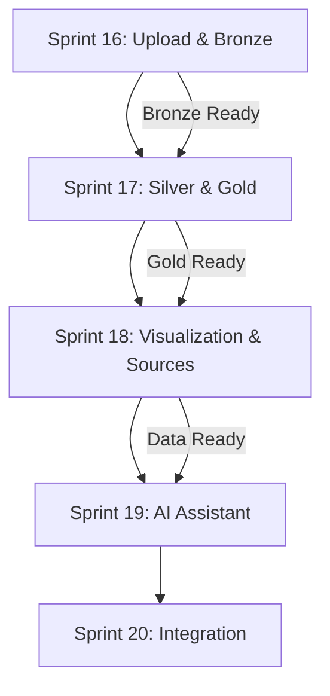

# CoreBanking Brain - Technical Specification

> **Document**: COREBANKING_BRAIN_SPEC.md
> **Version**: 1.1
> **Created**: 2025-12-04
> **Updated**: 2025-12-04
> **Status**: SPECIFICATION APPROVED - Ready for Sprint Planning
> **Codename**: CoreBanking Brain

---

## 1. EXECUTIVE SUMMARY

### 1.1 Purpose

This specification defines a comprehensive **RAG (Retrieval-Augmented Generation) Document Ingestion and AI Brain System** for the entire CoreBanking platform within intelliCore. The system enables intelligent document processing, contextual AI responses, and automated validation generation based on regulatory requirements (BACEN), internal policies, KYC procedures, compliance rules, product definitions, and any other business domain documentation.

### 1.2 Business Value

- **Universal Knowledge Base**: Single RAG system serving ALL business domains (PIX, DICT, KYC, Compliance, Products, Operations)
- **Regulatory Compliance**: Automated extraction of validation rules from BACEN documentation
- **Reduced Time-to-Market**: AI-generated ObjectTypes and validation rules from regulatory context
- **Operational Efficiency**: Single source of truth for all CoreBanking requirements
- **Scalable Knowledge**: Easily ingest new document categories as business needs evolve
- **Audit Trail**: Complete traceability from regulatory document to implemented validation

### 1.3 Scope

| In Scope | Out of Scope |
|----------|--------------|
| Document upload with category/pipeline selection | Real-time DICT integration with BACEN |
| Bronze → Silver → Gold processing pipeline | SPI (Sistema de Pagamentos Instantâneos) integration |
| External data source configuration | Production payment processing |
| AI Assistant for RAG testing | Multi-tenant document isolation (future) |
| ValidationsRequest generation for ANY business domain | |
| ObjectType generation from regulatory/policy context | |
| KYC, Compliance, PIX, DICT, Products knowledge base | |
| Processing visualization (real-time + historical) | |

---

## 2. ARCHITECTURE OVERVIEW

### 2.1 System Context Diagram

```
┌─────────────────────────────────────────────────────────────────────────────┐
│                           COREBANKING BRAIN                                  │
├─────────────────────────────────────────────────────────────────────────────┤
│                                                                              │
│  ┌──────────────────┐    ┌──────────────────┐    ┌──────────────────┐       │
│  │  Document Upload │    │  Processing View │    │   AI Assistant   │       │
│  │     Screen       │───▶│     Screen       │───▶│     Screen       │       │
│  └────────┬─────────┘    └────────┬─────────┘    └────────┬─────────┘       │
│           │                       │                       │                  │
│           ▼                       ▼                       ▼                  │
│  ┌────────────────────────────────────────────────────────────────────┐     │
│  │                     DOCUMENT PROCESSING PIPELINE                    │     │
│  │  ┌──────────┐     ┌──────────┐     ┌──────────────────────────┐   │     │
│  │  │  BRONZE  │────▶│  SILVER  │────▶│          GOLD            │   │     │
│  │  │  (Raw)   │     │(Processed)│    │  ┌─────┬─────┬─────┐    │   │     │
│  │  └──────────┘     └──────────┘     │  │  A  │  B  │  C  │    │   │     │
│  │                                     │  │Trino│Graph│Vector│   │   │     │
│  │                                     │  └─────┴─────┴─────┘    │   │     │
│  │                                     └──────────────────────────┘   │     │
│  └────────────────────────────────────────────────────────────────────┘     │
│                                                                              │
│  ┌────────────────────────────────────────────────────────────────────┐     │
│  │                    EXTERNAL DATA SOURCES                            │     │
│  │  ┌──────────────────┐    ┌──────────────────┐                      │     │
│  │  │  TigerBeetle     │    │  CoreBanking DB  │                      │     │
│  │  │  REST API        │    │  (PostgreSQL)    │                      │     │
│  │  └──────────────────┘    └──────────────────┘                      │     │
│  └────────────────────────────────────────────────────────────────────┘     │
│                                                                              │
└─────────────────────────────────────────────────────────────────────────────┘
```

### 2.2 Integration with Existing Infrastructure

The CoreBanking Brain leverages the existing Sprint 7 (RAG) and Sprint 9 (LLM Validation) infrastructure:

| Component | Status | Port | Usage |
|-----------|--------|------|-------|
| **Qdrant** | ✅ Running | 6333, 6334 | Vector storage (Gold C) |
| **NebulaGraph** | ✅ Running | 9559, 9779, 9669 | Graph relationships (Gold B) |
| **Ollama** | ✅ Running | 11434 | LLM embeddings & generation |
| **LLM Gateway** | ✅ Running | 8001 | FastAPI orchestration |
| **MinIO** | ✅ Running | 9000, 9001 | Document storage (Bronze) |
| **PostgreSQL** | ✅ Running | 5432 | Metadata & processing state |
| **Trino** | 🔄 To Configure | 8080 | SQL analytics (Gold A) |

---

## 3. FUNCTIONAL REQUIREMENTS

### 3.1 Epic: Document Submission (FR-DS)

#### FR-DS-001: Document Upload Screen Evolution

**Description**: Enhance existing document upload screen to support RAG pipeline categorization.

**Acceptance Criteria**:
- [ ] User can select document category/pipeline before upload
- [ ] Categories displayed as dropdown with descriptions
- [ ] Visual indication of which Gold layer(s) the category targets
- [ ] Support for multiple file upload (batch processing)
- [ ] File type validation (PDF, Markdown, images)
- [ ] Progress indicator during upload

**Document Categories** (Extensible - new categories can be added as business needs evolve):

| Category ID | Name | Description | Target Gold |
|-------------|------|-------------|-------------|
| **BACEN - Regulatory** |
| `BACEN_MANUAL_PIX` | Manual do Pix | BACEN Pix specification manual | A, B, C |
| `BACEN_MANUAL_DICT` | Manual Operacional do DICT | DICT operational procedures | A, B, C |
| `BACEN_MANUAL_DISPUTAS` | Manual de Resolução de Disputas | Dispute resolution procedures | A, C |
| `BACEN_MANUAL_PENALIDADES` | Manual de Penalidades | Penalty and compliance rules | A, C |
| `BACEN_CIRCULAR` | Circulares BACEN | Regulatory circulars and updates | A, C |
| **KYC & Compliance** |
| `KYC_PF` | KYC Pessoa Física | Individual customer verification procedures | A, B, C |
| `KYC_PJ` | KYC Pessoa Jurídica | Business customer verification procedures | A, B, C |
| `COMPLIANCE_AML` | Anti-Money Laundering | AML policies and procedures | A, B, C |
| `COMPLIANCE_PEP` | PEP Policies | Politically Exposed Persons policies | A, C |
| `COMPLIANCE_SANCTIONS` | Sanctions Lists | International sanctions and restricted parties | A, C |
| **Products & Operations** |
| `PRODUCT_CONTA_PAGAMENTO` | Conta de Pagamento | Payment account product specification | A, B, C |
| `PRODUCT_EMPRESTIMOS` | Empréstimos | Lending product specifications | A, B, C |
| `PRODUCT_INVESTIMENTOS` | Investimentos | Investment product specifications | A, B, C |
| `OPS_PROCEDURES` | Procedimentos Operacionais | Operational procedures and workflows | A, B |
| **Internal Policies** |
| `LBPAY_POLITICAS` | Políticas Internas | Internal business policies | A, B, C |
| `LBPAY_TIGERBEETLE` | Interface TigerBeetle | TigerBeetle API documentation | A, B |
| `LBPAY_DATABASE` | Esquema Banco de Dados | CoreBanking schema documentation | A, B |
| `LBPAY_INTEGRACAO` | Integrações Externas | External integration specifications | A, B, C |
| **General Knowledge** |
| `GENERAL_BANKING` | Conhecimento Bancário | General banking domain knowledge | A, C |
| `CUSTOM` | Categoria Personalizada | User-defined custom category | A, B, C |

#### FR-DS-002: Process for RAG Button

**Description**: Add "Processar para RAG" action button per document in the document list.

**Acceptance Criteria**:
- [ ] Button visible in document actions column
- [ ] Confirmation modal before processing
- [ ] Shows estimated processing time based on file size
- [ ] Disables button while processing is in progress
- [ ] Shows processing status indicator

#### FR-DS-003: OCR Processing for Images and Diagrams

**Description**: Process embedded images, flowcharts, and diagrams in BACEN documents.

**Acceptance Criteria**:
- [ ] Detect images within PDF documents
- [ ] Extract text from images using OCR (Tesseract)
- [ ] Parse flowchart structures when detected
- [ ] Store extracted content with image reference metadata
- [ ] Support Portuguese language OCR

---

### 3.2 Epic: Processing Pipeline (FR-PP)

#### FR-PP-001: Bronze Layer Processing

**Description**: Ingest raw documents into Bronze layer with metadata extraction.

**Acceptance Criteria**:
- [ ] Store original file in MinIO with unique identifier
- [ ] Extract basic metadata (filename, size, type, upload date, uploader)
- [ ] Create processing record in PostgreSQL
- [ ] Generate document hash for deduplication
- [ ] Emit event for Silver processing trigger

**Bronze Schema**:
```typescript
interface BronzeDocument {
  id: string;                    // UUID
  minio_path: string;            // Object storage path
  original_filename: string;
  file_type: 'PDF' | 'MARKDOWN' | 'IMAGE';
  file_size_bytes: number;
  content_hash: string;          // SHA-256
  category_id: string;           // FK to DocumentCategory
  uploaded_by: string;           // User ID
  uploaded_at: Date;
  processing_status: 'PENDING' | 'PROCESSING' | 'COMPLETED' | 'FAILED';
  error_message?: string;
}
```

#### FR-PP-002: Silver Layer Processing

**Description**: Transform raw documents into structured, chunked content.

**Acceptance Criteria**:
- [ ] Extract text from PDF using pdf-parse
- [ ] Parse Markdown structure
- [ ] Apply OCR to embedded images
- [ ] Chunk content using existing ChunkingService (512 tokens, 50 overlap)
- [ ] Extract section headers and hierarchy
- [ ] Identify tables and structured data
- [ ] Generate chunk metadata (section, page, position)

**Silver Schema**:
```typescript
interface SilverChunk {
  id: string;                    // UUID
  bronze_id: string;             // FK to BronzeDocument
  chunk_index: number;
  content: string;
  token_count: number;
  section_hierarchy: string[];   // ['Chapter 1', 'Section 1.1', 'Subsection']
  page_number?: number;
  has_table: boolean;
  has_image: boolean;
  extracted_entities: string[];  // Named entities
  processing_status: 'PENDING' | 'PROCESSING' | 'COMPLETED' | 'FAILED';
}
```

#### FR-PP-003: Gold Layer Distribution

**Description**: Route processed chunks to appropriate Gold layers based on category and content type.

**Gold A - SQL/Trino (Structured Analytics)**:
- [ ] Store structured data extractions (tables, lists, definitions)
- [ ] Create queryable validation rules table
- [ ] Index by document category and section

**Gold B - Graph/NebulaGraph (Relationships)**:
- [ ] Create nodes for document sections
- [ ] Create edges for cross-references between documents
- [ ] Map validation dependencies
- [ ] Store entity relationships (PIX concepts → validation rules)

**Gold C - Vector/Qdrant (Semantic Search)**:
- [ ] Generate embeddings using Ollama (nomic-embed-text)
- [ ] Store in existing Qdrant collection with enhanced metadata
- [ ] Support hybrid search (semantic + keyword)

**Gold Distribution Schema**:
```typescript
interface GoldDistribution {
  chunk_id: string;
  gold_a_record_id?: string;    // If stored in Trino
  gold_b_node_id?: string;      // NebulaGraph node VID
  gold_c_vector_id?: string;    // Qdrant point ID
  distributed_at: Date;
  distribution_metadata: {
    gold_a: boolean;
    gold_b: boolean;
    gold_c: boolean;
  };
}
```

---

### 3.3 Epic: Processing Visualization (FR-PV)

#### FR-PV-001: Real-Time Processing Dashboard

**Description**: Visual dashboard showing live document processing status.

**Acceptance Criteria**:
- [ ] Pipeline visualization (Bronze → Silver → Gold)
- [ ] Real-time progress indicators per document
- [ ] Current processing step highlighted
- [ ] Time elapsed and estimated completion
- [ ] Error notifications with details
- [ ] WebSocket updates for live status

**UI Mockup**:
```
┌─────────────────────────────────────────────────────────────────┐
│  CoreBanking Brain - Processing Pipeline                        │
├─────────────────────────────────────────────────────────────────┤
│                                                                  │
│  Document: Manual_do_Pix_v3.2.pdf                               │
│  ═══════════════════════════════════════════════════════════════ │
│                                                                  │
│  [✓ BRONZE]────[▶ SILVER]────[○ GOLD A]────[○ GOLD B]────[○ GOLD C] │
│    100%         45%           Pending      Pending      Pending │
│                                                                  │
│  Current: Chunking content (chunk 23 of 156)                    │
│  Elapsed: 2m 34s | Estimated: 4m remaining                      │
│                                                                  │
│  ┌─────────────────────────────────────────────────────────────┐ │
│  │ Processing Log                                               │ │
│  │ 14:32:01 - Bronze: File uploaded to MinIO                   │ │
│  │ 14:32:02 - Bronze: Metadata extracted                       │ │
│  │ 14:32:03 - Silver: Started PDF text extraction              │ │
│  │ 14:32:15 - Silver: Extracted 156 pages                      │ │
│  │ 14:32:16 - Silver: Starting chunking process                │ │
│  │ 14:33:45 - Silver: Processing chunk 23/156...               │ │
│  └─────────────────────────────────────────────────────────────┘ │
└─────────────────────────────────────────────────────────────────┘
```

#### FR-PV-002: Historical Processing View

**Description**: Table view of all processed documents with status and metrics.

**Acceptance Criteria**:
- [ ] Sortable/filterable table of all documents
- [ ] Status column (Completed, Processing, Failed)
- [ ] Processing time metrics
- [ ] Chunk count and Gold distribution stats
- [ ] Reprocess action for failed documents
- [ ] Export processing report (CSV/PDF)

#### FR-PV-003: Gold Layer Sample Queries

**Description**: Show example queries per Gold layer to demonstrate RAG capabilities.

**Sample Queries by Gold Layer**:

| Gold Layer | Example Query | Expected Result |
|------------|---------------|-----------------|
| **Gold A (SQL)** | "List all validation rules for EVP key type" | Structured table of rules |
| **Gold B (Graph)** | "Show relationship between Claim and Portability" | Visual graph of dependencies |
| **Gold C (Vector)** | "What are the timeout requirements for DICT queries?" | Semantic search results with scores |

---

### 3.4 Epic: External Data Sources (FR-ED)

#### FR-ED-001: Data Source Configuration Screen

**Description**: UI for configuring external data sources as RAG context.

**Acceptance Criteria**:
- [ ] List of configurable data sources
- [ ] Connection test functionality
- [ ] Sync schedule configuration
- [ ] Last sync status and timestamp
- [ ] Enable/disable per source

**Supported Data Sources**:

| Source | Type | Configuration |
|--------|------|---------------|
| TigerBeetle | REST API | Base URL, API Key, Endpoints |
| CoreBanking DB | PostgreSQL | Host, Port, Database, Schema |

#### FR-ED-002: TigerBeetle Schema Ingestion

**Description**: Ingest TigerBeetle REST API documentation as RAG context.

**Acceptance Criteria**:
- [ ] Fetch OpenAPI/Swagger specification from TigerBeetle
- [ ] Parse endpoints, parameters, and response schemas
- [ ] Generate natural language descriptions from API spec
- [ ] Store as Silver chunks with API metadata
- [ ] Update on schedule or manual trigger

#### FR-ED-003: CoreBanking Database Schema Ingestion

**Description**: Ingest CoreBanking PostgreSQL schema as RAG context.

**Acceptance Criteria**:
- [ ] Connect to CoreBanking database (read-only)
- [ ] Extract table definitions with columns and types
- [ ] Extract foreign key relationships
- [ ] Generate natural language descriptions of tables
- [ ] Identify domain-relevant tables and columns (accounts, customers, transactions, etc.)
- [ ] Store with schema metadata for SQL generation context

---

### 3.5 Epic: AI Assistant (FR-AI)

#### FR-AI-001: RAG Chat Interface

**Description**: Conversational interface for testing RAG system.

**Acceptance Criteria**:
- [ ] Chat input with markdown support
- [ ] Response streaming (SSE)
- [ ] Source attribution with document references
- [ ] Copy response functionality
- [ ] Clear conversation history
- [ ] Export conversation

#### FR-AI-002: Context Source Selection

**Description**: Allow user to select which Gold layers to query.

**Acceptance Criteria**:
- [ ] Toggles for Gold A, B, C layers
- [ ] Document category filters
- [ ] Show which sources contributed to response
- [ ] Relevance score per source

#### FR-AI-003: ValidationsRequest Submission

**Description**: Submit natural language validation request and receive JSON response.

**Acceptance Criteria**:
- [ ] Dedicated input mode for validation requests
- [ ] JSON response formatting and syntax highlighting
- [ ] Schema validation of response
- [ ] Copy JSON to clipboard
- [ ] Export for Front-Office integration

**Example Interaction**:

```
User Input:
"Preciso validar um registro de chave DICT do tipo CPF.
Quais são todas as regras de validação que devem ser aplicadas
antes de enviar para o BACEN?"

Expected JSON Response:
{
  "validationsRequest": {
    "objectType": "DictRegistroChave",
    "keyType": "CPF",
    "validations": [
      {
        "rule": "CPF_FORMAT",
        "description": "CPF deve ter 11 dígitos numéricos",
        "regex": "^[0-9]{11}$",
        "errorCode": "DICT_001",
        "errorMessage": "CPF inválido: formato incorreto"
      },
      {
        "rule": "CPF_CHECKSUM",
        "description": "Dígitos verificadores do CPF devem ser válidos",
        "algorithm": "MOD11",
        "errorCode": "DICT_002",
        "errorMessage": "CPF inválido: dígito verificador"
      },
      {
        "rule": "CPF_NOT_BLACKLISTED",
        "description": "CPF não pode estar na lista de bloqueio do BACEN",
        "checkEndpoint": "/api/dict/blacklist/cpf",
        "errorCode": "DICT_003",
        "errorMessage": "CPF bloqueado pelo BACEN"
      }
    ],
    "workflow": {
      "nextState": "PENDING_BACEN_VALIDATION",
      "requiredApprovals": [],
      "timeoutSeconds": 10
    },
    "sourceDocuments": [
      "Manual Operacional do DICT v3.2 - Seção 4.2.1",
      "Manual do Pix v2.8 - Seção 2.1.3"
    ]
  }
}
```

---

### 3.6 Epic: ObjectType Generation (FR-OG)

#### FR-OG-001: DictRegistroChave ObjectType Generation

**Description**: LLM generates complete ObjectType definition from BACEN context.

**Acceptance Criteria**:
- [ ] Analyze BACEN documentation for DICT key registration requirements
- [ ] Generate ObjectType with all required fields
- [ ] Include field validations based on regulatory rules
- [ ] Generate description in Portuguese
- [ ] Output compatible with intelliCore ObjectType schema

**Generated ObjectType Example**:
```typescript
{
  "name": "DictRegistroChave",
  "description": "Registro de chave Pix no DICT conforme Manual Operacional BACEN",
  "is_active": true,
  "fields": [
    {
      "name": "tipo_chave",
      "field_type": "ENUM",
      "is_required": true,
      "description": "Tipo da chave Pix (CPF, CNPJ, EMAIL, TELEFONE, EVP)",
      "validation_rules": {
        "enum": ["CPF", "CNPJ", "EMAIL", "TELEFONE", "EVP"]
      }
    },
    {
      "name": "valor_chave",
      "field_type": "STRING",
      "is_required": true,
      "description": "Valor da chave Pix",
      "validation_rules": {
        "maxLength": 77,
        "pattern": "dynamic_by_type"
      }
    },
    {
      "name": "titular_cpf_cnpj",
      "field_type": "STRING",
      "is_required": true,
      "description": "CPF ou CNPJ do titular da chave",
      "validation_rules": {
        "pattern": "^([0-9]{11}|[0-9]{14})$"
      }
    },
    // ... additional fields
  ]
}
```

#### FR-OG-002: ValidationsRequest Schema Generation

**Description**: Generate validation request schemas for DICT operations.

**Acceptance Criteria**:
- [ ] Define ValidationsRequest TypeScript interface
- [ ] Include validation rules with error codes
- [ ] Map to BACEN error code standards
- [ ] Support workflow state transitions
- [ ] Include source document references

---

## 4. NON-FUNCTIONAL REQUIREMENTS

### 4.1 Performance (NFR-P)

| Requirement | Metric | Target |
|-------------|--------|--------|
| **NFR-P-001** | Document upload response time | < 2 seconds for 10MB file |
| **NFR-P-002** | Bronze processing latency | < 5 seconds per document |
| **NFR-P-003** | Silver chunking throughput | > 50 chunks/second |
| **NFR-P-004** | Gold embedding generation | < 100ms per chunk |
| **NFR-P-005** | RAG query response time | < 3 seconds (p95) |
| **NFR-P-006** | AI Assistant streaming start | < 500ms first token |
| **NFR-P-007** | Concurrent document processing | 10 documents parallel |

### 4.2 Scalability (NFR-S)

| Requirement | Metric | Target |
|-------------|--------|--------|
| **NFR-S-001** | Total documents supported | > 10,000 documents |
| **NFR-S-002** | Total chunks in Qdrant | > 1,000,000 vectors |
| **NFR-S-003** | Concurrent AI Assistant users | 50 users |
| **NFR-S-004** | Processing queue depth | 1,000 documents |

### 4.3 Reliability (NFR-R)

| Requirement | Description |
|-------------|-------------|
| **NFR-R-001** | Failed processing must be retryable |
| **NFR-R-002** | Partial processing state must be recoverable |
| **NFR-R-003** | Document deduplication by content hash |
| **NFR-R-004** | Processing idempotency (re-run same result) |
| **NFR-R-005** | Graceful degradation if Gold layer unavailable |

### 4.4 Security (NFR-SEC)

| Requirement | Description |
|-------------|-------------|
| **NFR-SEC-001** | Document access controlled by RBAC |
| **NFR-SEC-002** | External data source credentials encrypted |
| **NFR-SEC-003** | Audit log for all document operations |
| **NFR-SEC-004** | No PII in processing logs |
| **NFR-SEC-005** | CoreBanking DB connection read-only |

### 4.5 Observability (NFR-O)

| Requirement | Description |
|-------------|-------------|
| **NFR-O-001** | Processing metrics in Prometheus format |
| **NFR-O-002** | Distributed tracing for pipeline stages |
| **NFR-O-003** | Error alerting for failed processing |
| **NFR-O-004** | Dashboard for processing health |

---

## 5. TECHNICAL SPECIFICATION

### 5.1 New Database Entities

```sql
-- Document Categories
CREATE TABLE document_categories (
  id UUID PRIMARY KEY DEFAULT gen_random_uuid(),
  code VARCHAR(50) UNIQUE NOT NULL,
  name VARCHAR(200) NOT NULL,
  description TEXT,
  target_gold_a BOOLEAN DEFAULT true,
  target_gold_b BOOLEAN DEFAULT true,
  target_gold_c BOOLEAN DEFAULT true,
  is_active BOOLEAN DEFAULT true,
  created_at TIMESTAMP DEFAULT NOW(),
  updated_at TIMESTAMP DEFAULT NOW()
);

-- Bronze Documents
CREATE TABLE bronze_documents (
  id UUID PRIMARY KEY DEFAULT gen_random_uuid(),
  minio_path VARCHAR(500) NOT NULL,
  original_filename VARCHAR(255) NOT NULL,
  file_type VARCHAR(50) NOT NULL,
  file_size_bytes BIGINT NOT NULL,
  content_hash VARCHAR(64) NOT NULL,
  category_id UUID REFERENCES document_categories(id),
  uploaded_by VARCHAR(100) NOT NULL,
  uploaded_at TIMESTAMP DEFAULT NOW(),
  processing_status VARCHAR(20) DEFAULT 'PENDING',
  error_message TEXT,
  created_at TIMESTAMP DEFAULT NOW(),
  updated_at TIMESTAMP DEFAULT NOW()
);

-- Silver Chunks
CREATE TABLE silver_chunks (
  id UUID PRIMARY KEY DEFAULT gen_random_uuid(),
  bronze_id UUID REFERENCES bronze_documents(id),
  chunk_index INTEGER NOT NULL,
  content TEXT NOT NULL,
  token_count INTEGER NOT NULL,
  section_hierarchy JSONB,
  page_number INTEGER,
  has_table BOOLEAN DEFAULT false,
  has_image BOOLEAN DEFAULT false,
  extracted_entities JSONB,
  processing_status VARCHAR(20) DEFAULT 'PENDING',
  created_at TIMESTAMP DEFAULT NOW()
);

-- Gold Distribution Tracking
CREATE TABLE gold_distributions (
  id UUID PRIMARY KEY DEFAULT gen_random_uuid(),
  chunk_id UUID REFERENCES silver_chunks(id),
  gold_a_record_id VARCHAR(100),
  gold_b_node_id VARCHAR(100),
  gold_c_vector_id VARCHAR(100),
  distributed_at TIMESTAMP DEFAULT NOW(),
  distribution_metadata JSONB
);

-- External Data Sources
CREATE TABLE external_data_sources (
  id UUID PRIMARY KEY DEFAULT gen_random_uuid(),
  name VARCHAR(100) NOT NULL,
  source_type VARCHAR(50) NOT NULL, -- 'REST_API', 'DATABASE'
  connection_config JSONB NOT NULL, -- Encrypted
  sync_schedule VARCHAR(50), -- Cron expression
  last_sync_at TIMESTAMP,
  last_sync_status VARCHAR(20),
  is_enabled BOOLEAN DEFAULT true,
  created_at TIMESTAMP DEFAULT NOW(),
  updated_at TIMESTAMP DEFAULT NOW()
);

-- Processing Jobs (for queue management)
CREATE TABLE processing_jobs (
  id UUID PRIMARY KEY DEFAULT gen_random_uuid(),
  bronze_id UUID REFERENCES bronze_documents(id),
  job_type VARCHAR(50) NOT NULL, -- 'SILVER', 'GOLD_A', 'GOLD_B', 'GOLD_C'
  status VARCHAR(20) DEFAULT 'QUEUED',
  started_at TIMESTAMP,
  completed_at TIMESTAMP,
  error_message TEXT,
  retry_count INTEGER DEFAULT 0,
  created_at TIMESTAMP DEFAULT NOW()
);
```

### 5.2 New GraphQL Schema

```graphql
# Enums
enum ProcessingStatus {
  PENDING
  PROCESSING
  COMPLETED
  FAILED
}

enum DocumentFileType {
  PDF
  MARKDOWN
  IMAGE
}

enum DataSourceType {
  REST_API
  DATABASE
}

# Types
type DocumentCategory {
  id: ID!
  code: String!
  name: String!
  description: String
  targetGoldA: Boolean!
  targetGoldB: Boolean!
  targetGoldC: Boolean!
  isActive: Boolean!
  createdAt: DateTime!
}

type BronzeDocument {
  id: ID!
  minioPath: String!
  originalFilename: String!
  fileType: DocumentFileType!
  fileSizeBytes: Int!
  contentHash: String!
  category: DocumentCategory!
  uploadedBy: String!
  uploadedAt: DateTime!
  processingStatus: ProcessingStatus!
  errorMessage: String
  chunks: [SilverChunk!]
}

type SilverChunk {
  id: ID!
  bronzeDocument: BronzeDocument!
  chunkIndex: Int!
  content: String!
  tokenCount: Int!
  sectionHierarchy: [String!]
  pageNumber: Int
  hasTable: Boolean!
  hasImage: Boolean!
  extractedEntities: [String!]
  processingStatus: ProcessingStatus!
  goldDistribution: GoldDistribution
}

type GoldDistribution {
  id: ID!
  chunkId: ID!
  goldARecordId: String
  goldBNodeId: String
  goldCVectorId: String
  distributedAt: DateTime!
}

type ExternalDataSource {
  id: ID!
  name: String!
  sourceType: DataSourceType!
  syncSchedule: String
  lastSyncAt: DateTime
  lastSyncStatus: ProcessingStatus
  isEnabled: Boolean!
}

type ProcessingJob {
  id: ID!
  bronzeId: ID!
  jobType: String!
  status: ProcessingStatus!
  startedAt: DateTime
  completedAt: DateTime
  errorMessage: String
  retryCount: Int!
}

type ValidationsResponse {
  objectType: String!
  keyType: String
  validations: [ValidationRule!]!
  workflow: WorkflowDefinition
  sourceDocuments: [String!]!
}

type ValidationRule {
  rule: String!
  description: String!
  regex: String
  algorithm: String
  checkEndpoint: String
  errorCode: String!
  errorMessage: String!
}

type WorkflowDefinition {
  nextState: String!
  requiredApprovals: [String!]
  timeoutSeconds: Int
}

# Inputs
input UploadDocumentInput {
  categoryId: ID!
  file: Upload!
}

input ConfigureDataSourceInput {
  name: String!
  sourceType: DataSourceType!
  connectionConfig: JSON!
  syncSchedule: String
}

input RAGQueryInput {
  query: String!
  useGoldA: Boolean
  useGoldB: Boolean
  useGoldC: Boolean
  categoryFilter: [String!]
  maxResults: Int
}

input ValidationsRequestInput {
  naturalLanguageRequest: String!
  contextObjectType: String
}

# Queries
type Query {
  # Document Categories
  documentCategories: [DocumentCategory!]!
  documentCategory(id: ID!): DocumentCategory

  # Bronze Documents
  bronzeDocuments(
    first: Int
    after: String
    categoryId: ID
    status: ProcessingStatus
  ): BronzeDocumentConnection!
  bronzeDocument(id: ID!): BronzeDocument

  # Processing Status
  processingJobs(bronzeId: ID!): [ProcessingJob!]!
  processingStats: ProcessingStats!

  # External Data Sources
  externalDataSources: [ExternalDataSource!]!

  # RAG Queries
  ragQuery(input: RAGQueryInput!): RAGQueryResult!

  # Validations
  generateValidations(input: ValidationsRequestInput!): ValidationsResponse!
}

# Mutations
type Mutation {
  # Document Upload
  uploadDocument(input: UploadDocumentInput!): BronzeDocument!
  processDocumentForRAG(bronzeId: ID!): ProcessingJob!
  reprocessDocument(bronzeId: ID!): ProcessingJob!
  deleteDocument(bronzeId: ID!): Boolean!

  # External Data Sources
  configureDataSource(input: ConfigureDataSourceInput!): ExternalDataSource!
  testDataSourceConnection(id: ID!): ConnectionTestResult!
  syncDataSource(id: ID!): ProcessingJob!
  toggleDataSource(id: ID!, enabled: Boolean!): ExternalDataSource!

  # AI Assistant
  startRAGConversation: ConversationSession!
  sendRAGMessage(sessionId: ID!, message: String!): RAGResponse!
}

# Subscriptions (WebSocket)
type Subscription {
  processingStatusUpdated(bronzeId: ID!): ProcessingStatusUpdate!
  ragResponseStream(sessionId: ID!): RAGResponseChunk!
}
```

### 5.3 New API Endpoints (LLM Gateway)

```yaml
# FastAPI endpoints for LLM Gateway

/api/v1/corebanking-brain:
  /documents:
    POST: Upload document to Bronze layer
    GET: List documents with filtering

  /documents/{id}:
    GET: Get document details with processing status
    DELETE: Soft delete document

  /documents/{id}/process:
    POST: Trigger RAG processing pipeline

  /documents/{id}/status:
    GET: Get real-time processing status
    WS: WebSocket for live updates

  /categories:
    GET: List document categories
    POST: Create new category

  /data-sources:
    GET: List external data sources
    POST: Configure new data source

  /data-sources/{id}:
    PUT: Update data source config
    DELETE: Remove data source

  /data-sources/{id}/test:
    POST: Test connection

  /data-sources/{id}/sync:
    POST: Trigger manual sync

/api/v1/corebanking-brain/ai:
  /chat:
    POST: Send message to RAG assistant
    WS: Streaming responses

  /validations:
    POST: Generate validations from natural language

  /object-types/generate:
    POST: Generate ObjectType from regulatory/policy context
```

### 5.4 Service Architecture

```
┌─────────────────────────────────────────────────────────────────────────────┐
│                       COREBANKING BRAIN SERVICES                             │
├─────────────────────────────────────────────────────────────────────────────┤
│                                                                              │
│  ┌─────────────────────────────────────────────────────────────────────┐    │
│  │                        API LAYER (NestJS)                            │    │
│  │  ┌─────────────┐ ┌─────────────┐ ┌─────────────┐ ┌─────────────┐   │    │
│  │  │  Document   │ │  Processing │ │  DataSource │ │     AI      │   │    │
│  │  │  Resolver   │ │  Resolver   │ │  Resolver   │ │  Resolver   │   │    │
│  │  └─────────────┘ └─────────────┘ └─────────────┘ └─────────────┘   │    │
│  └─────────────────────────────────────────────────────────────────────┘    │
│                                      │                                       │
│  ┌─────────────────────────────────────────────────────────────────────┐    │
│  │                      SERVICE LAYER (NestJS)                          │    │
│  │  ┌─────────────────┐ ┌─────────────────┐ ┌─────────────────┐        │    │
│  │  │ DocumentService │ │ ProcessingService│ │ DataSourceService│       │    │
│  │  │ - upload()      │ │ - processBronze()│ │ - configure()   │        │    │
│  │  │ - delete()      │ │ - processSilver()│ │ - testConnection()│      │    │
│  │  │ - getStatus()   │ │ - distributeGold()│ │ - sync()        │       │    │
│  │  └─────────────────┘ └─────────────────┘ └─────────────────┘        │    │
│  │                                                                      │    │
│  │  ┌─────────────────┐ ┌─────────────────┐ ┌─────────────────┐        │    │
│  │  │  ChunkingService│ │ EmbeddingService │ │  AIAssistantSvc │        │    │
│  │  │  (existing)     │ │  (existing)      │ │ - chat()        │        │    │
│  │  │                 │ │                  │ │ - generateVal() │        │    │
│  │  └─────────────────┘ └─────────────────┘ └─────────────────┘        │    │
│  └─────────────────────────────────────────────────────────────────────┘    │
│                                      │                                       │
│  ┌─────────────────────────────────────────────────────────────────────┐    │
│  │                     QUEUE LAYER (BullMQ + Redis)                     │    │
│  │  ┌─────────────┐ ┌─────────────┐ ┌─────────────┐ ┌─────────────┐   │    │
│  │  │bronze-queue │ │silver-queue │ │ gold-queue  │ │ sync-queue  │   │    │
│  │  └─────────────┘ └─────────────┘ └─────────────┘ └─────────────┘   │    │
│  └─────────────────────────────────────────────────────────────────────┘    │
│                                      │                                       │
│  ┌─────────────────────────────────────────────────────────────────────┐    │
│  │                     STORAGE LAYER                                    │    │
│  │  ┌──────────┐ ┌──────────┐ ┌──────────┐ ┌──────────┐ ┌──────────┐ │    │
│  │  │PostgreSQL│ │  MinIO   │ │  Qdrant  │ │ Nebula   │ │  Trino   │ │    │
│  │  │(metadata)│ │ (files)  │ │(vectors) │ │ (graph)  │ │ (SQL)    │ │    │
│  │  └──────────┘ └──────────┘ └──────────┘ └──────────┘ └──────────┘ │    │
│  └─────────────────────────────────────────────────────────────────────┘    │
│                                                                              │
└─────────────────────────────────────────────────────────────────────────────┘
```

---

## 6. USER INTERFACE SPECIFICATIONS

### 6.1 Document Upload Screen

**Route**: `/backoffice/brain/upload`

**Components**:
- `DocumentCategorySelect` - Dropdown with category descriptions
- `FileUploadZone` - Drag & drop with progress
- `ProcessingQueueTable` - List of pending/processing documents

### 6.2 Processing Dashboard Screen

**Route**: `/backoffice/brain/processing`

**Components**:
- `PipelineVisualization` - Bronze → Silver → Gold flow
- `ProcessingJobsTable` - All jobs with status
- `RealTimeLogViewer` - WebSocket-powered log stream
- `ProcessingMetricsCards` - Stats (docs processed, avg time, error rate)

### 6.3 External Data Sources Screen

**Route**: `/backoffice/brain/data-sources`

**Components**:
- `DataSourceList` - Configured sources with status
- `DataSourceConfigModal` - Add/edit source configuration
- `ConnectionTestResult` - Show test results
- `SyncHistoryTable` - Past sync operations

### 6.4 AI Assistant Screen

**Route**: `/backoffice/brain/assistant`

**Components**:
- `ChatInterface` - Message input with markdown
- `SourceFilters` - Gold layer toggles, category filters
- `ResponseRenderer` - Markdown + code blocks + source citations
- `ValidationsRequestMode` - Toggle for JSON validation output
- `ConversationHistory` - Sidebar with past conversations

---

## 7. SPRINT PLANNING RECOMMENDATIONS

### 7.1 Proposed Sprint Structure

| Sprint | Focus | Story Points | Duration |
|--------|-------|--------------|----------|
| **Sprint 16** | Document Upload Evolution & Bronze Processing | 26 | 2 weeks |
| **Sprint 17** | Silver Processing & Gold Distribution | 28 | 2 weeks |
| **Sprint 18** | Processing Visualization & External Sources | 24 | 2 weeks |
| **Sprint 19** | AI Assistant & ValidationsRequest | 26 | 2 weeks |
| **Sprint 20** | Integration Testing & Polish | 20 | 2 weeks |

### 7.2 Sprint 16 - Document Upload Evolution (Recommended First Sprint)

**Sprint Goal**: Enable document upload with category selection and Bronze layer processing

**User Stories**:

| ID | Story | Points | Priority |
|----|-------|--------|----------|
| US-DB-001 | Document category management (CRUD) | 5 | P0 |
| US-DB-002 | Enhanced document upload with category selection | 5 | P0 |
| US-DB-003 | Bronze layer processing service | 8 | P0 |
| US-DB-004 | "Process for RAG" button per document | 3 | P0 |
| US-DB-005 | Processing status indicator in document list | 5 | P1 |

**Squad Assignment**:
- Lead: `backend-architect`
- Frontend: `frontend-developer`
- Database: `database-architect`

### 7.3 Dependencies



---

## 8. TESTING STRATEGY

### 8.1 Unit Tests

- Document upload validation
- Chunking algorithm correctness
- Gold layer distribution logic
- Validation rule generation

### 8.2 Integration Tests

- Bronze → Silver → Gold pipeline end-to-end
- External data source sync
- RAG query with all Gold layers
- AI Assistant conversation flow

### 8.3 Performance Tests

- 100 concurrent document uploads
- 10,000 chunk embedding generation
- RAG query under load (50 concurrent users)

### 8.4 Acceptance Tests

- Upload BACEN PDF and verify chunk extraction
- Query RAG for validation rules and verify accuracy
- Generate ValidationsRequest and validate JSON schema

---

## 9. RISKS AND MITIGATIONS

| Risk | Impact | Probability | Mitigation |
|------|--------|-------------|------------|
| Trino configuration complexity | High | Medium | Start with PostgreSQL for Gold A, migrate later |
| OCR accuracy for flowcharts | Medium | High | Use multiple OCR engines, allow manual correction |
| LLM hallucination in validations | High | Medium | Always cite source documents, human review |
| External source connection failures | Medium | Medium | Graceful degradation, cached last-good state |
| Processing queue bottlenecks | Medium | Low | Horizontal scaling with BullMQ workers |

---

## 10. SUCCESS METRICS

| Metric | Target | Measurement |
|--------|--------|-------------|
| Document processing success rate | > 95% | Completed / Total |
| Average processing time (10MB PDF) | < 5 minutes | End-to-end pipeline |
| RAG query relevance score | > 0.8 | User feedback + semantic similarity |
| ValidationsRequest accuracy | > 90% | Comparison with manual extraction |
| AI Assistant user satisfaction | > 4/5 | User ratings |

---

## 11. GLOSSARY

| Term | Definition |
|------|------------|
| **Bronze Layer** | Raw data storage with minimal processing |
| **Silver Layer** | Cleaned, structured, and chunked data |
| **Gold Layer** | Analytics-ready data in specialized stores |
| **RAG** | Retrieval-Augmented Generation - AI with document context |
| **DICT** | Diretório de Identificadores de Contas Transacionais |
| **EVP** | Endereço Virtual de Pagamento (random Pix key) |
| **ValidationsRequest** | Natural language + JSON validation specification |

---

## 12. DOCUMENT HISTORY

| Version | Date | Author | Changes |
|---------|------|--------|---------|
| 1.0 | 2025-12-04 | AI Agent | Initial specification |

---

## 13. APPROVALS

| Role | Name | Date | Signature |
|------|------|------|-----------|
| Product Owner | | | |
| Tech Lead | | | |
| Architect | | | |
| Scrum Master | | | |

---

**End of Specification**
