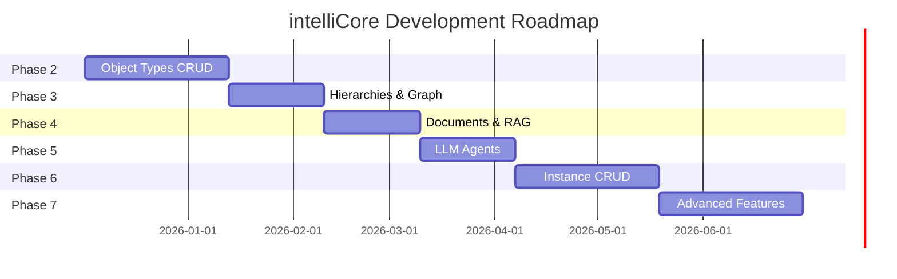
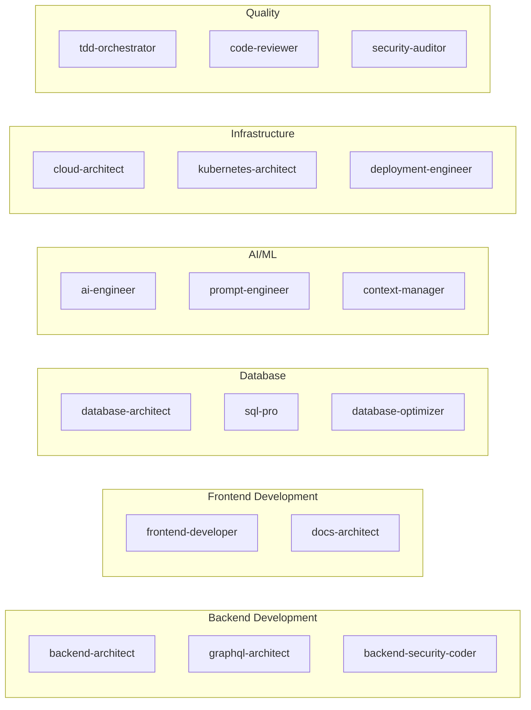
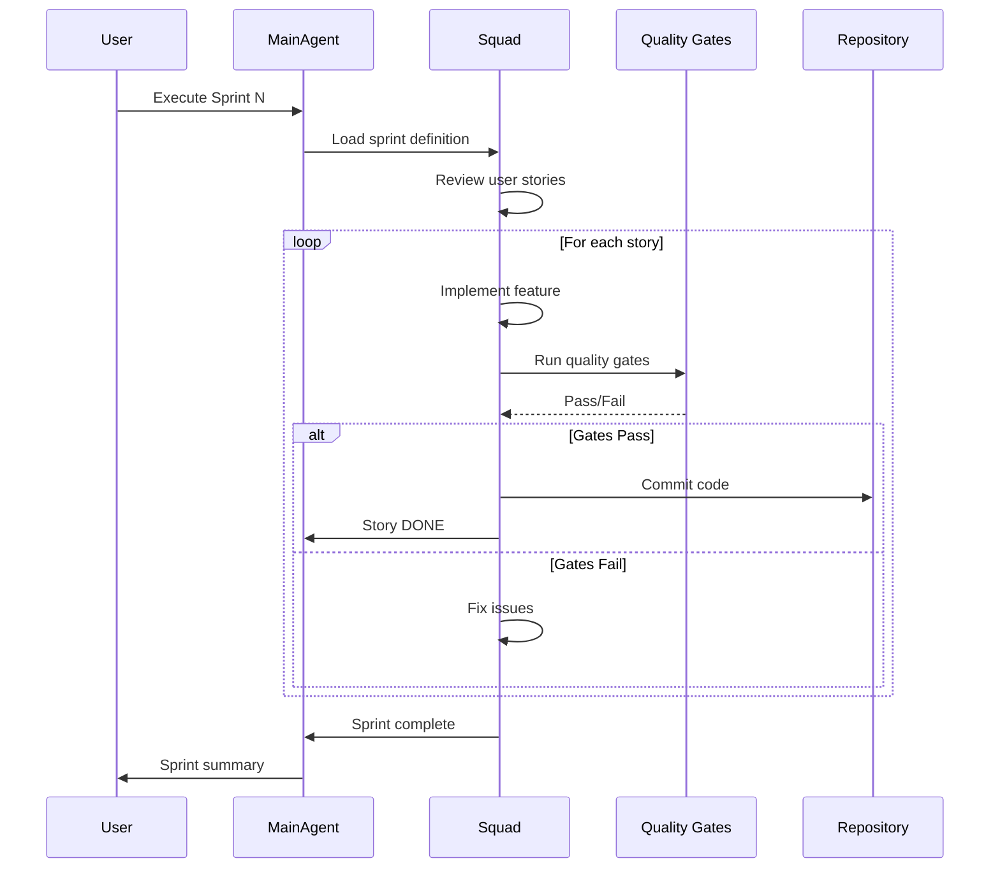

# intelliCore - Sprint Master Plan

> **Document Version**: 1.1
> **Last Updated**: 2025-12-03
> **Project**: intelliCore - Universal Meta-Modeling Platform
> **Scrum Master**: Claude Code Agent Squad
> **Sprint Cadence**: 2 weeks (10 working days)

---

## Table of Contents

1. [Project Overview](#project-overview)
2. [Sprint Calendar](#sprint-calendar)
3. [Sprint Definitions](#sprint-definitions)
4. [Agent Squad Matrix](#agent-squad-matrix)
5. [Technical Specifications](#technical-specifications)
6. [Product Backlog](#product-backlog)
7. [Definition of Done](#definition-of-done)
8. [Risk Management](#risk-management)

---

## Project Overview

### Mission Statement

Create an AI-native meta-modeling platform that enables creation of any business object without programming, using natural language and intelligent LLM validation, powering a complete core banking system deployable in days.

### Timeline Summary

| Metric | Value |
|--------|-------|
| **Total Duration** | 30 weeks (15 sprints) |
| **Start Date** | Sprint 1: Week of 2025-12-02 |
| **Estimated Completion** | Sprint 15: ~2026-05-25 |
| **Sprint Length** | 2 weeks |
| **Working Days/Sprint** | 10 days |

### Project Phases

| Phase | Sprints | Duration | Status |
|-------|---------|----------|--------|
| Phase 1: Setup | - | 1 week | ✅ 100% Complete |
| Phase 2: BACKOFFICE - Object Types | 1-3 | 6 weeks | ✅ 100% Complete |
| Phase 3: BACKOFFICE - Hierarchies | 4-5 | 4 weeks | ✅ 100% Complete |
| Phase 4: BACKOFFICE - Documents | 6-7 | 4 weeks | ✅ 100% Complete |
| Phase 5: BACKOFFICE - Agents | 8-9 | 4 weeks | ✅ 100% Complete |
| Phase 6: FRONT-OFFICE - Instances | 10-12 | 6 weeks | ✅ 100% Complete |
| Phase 7: Advanced Features | 13-15 | 6 weeks | ⏳ 0% (Sprint 13 Next) |

### Milestone Overview



---

## Sprint Calendar

### Sprint Schedule

| Sprint | Dates | Phase | Goal | Squad Lead |
|--------|-------|-------|------|------------|
| **Sprint 1** | Dec 02 - Dec 13 | Phase 2 | Backend GraphQL Foundation | backend-architect |
| **Sprint 2** | Dec 16 - Dec 27 | Phase 2 | ObjectTypes CRUD Complete | graphql-architect |
| **Sprint 3** | Dec 30 - Jan 10 | Phase 2 | Frontend Forms & Validation | frontend-developer |
| **Sprint 4** | Jan 13 - Jan 24 | Phase 3 | Relationship Types & Graph Schema | database-architect |
| **Sprint 5** | Jan 27 - Feb 07 | Phase 3 | Graph Visualization & Navigation | frontend-developer |
| **Sprint 6** | Feb 10 - Feb 21 | Phase 4 | Document Upload & Storage | backend-architect |
| **Sprint 7** | Feb 24 - Mar 07 | Phase 4 | RAG Indexing & Semantic Search | ai-engineer |
| **Sprint 8** | Mar 10 - Mar 21 | Phase 5 | LLM Gateway Service | ai-engineer |
| **Sprint 9** | Mar 24 - Apr 04 | Phase 5 | LLM Validation Engine | prompt-engineer |
| **Sprint 10** | Apr 07 - Apr 18 | Phase 6 | Instance CRUD Backend | backend-architect |
| **Sprint 11** | Apr 21 - May 02 | Phase 6 | Free-text Instance Creation | frontend-developer |
| **Sprint 12** | May 05 - May 16 | Phase 6 | Instance Search & Workflows | graphql-architect |
| **Sprint 13** | May 19 - May 30 | Phase 7 | Graph Query Engine | database-architect |
| **Sprint 14** | Jun 02 - Jun 13 | Phase 7 | Analytics & Reporting | backend-architect |
| **Sprint 15** | Jun 16 - Jun 27 | Phase 7 | Production Hardening | security-auditor |

---

## Sprint Definitions

### Sprint 1: Backend GraphQL Foundation

**Duration:** 2 weeks (Dec 02 - Dec 13, 2025)
**Phase:** 2 - BACKOFFICE Object Types
**Goal:** Establish production-ready GraphQL API foundation with authentication, database connectivity, and core infrastructure

#### Squad Composition

**Lead Agent:** `backend-architect`
**Support Agents:**
- `database-architect` - Database schema validation and TypeORM setup
- `graphql-architect` - GraphQL schema design and federation preparation
- `security-auditor` - Keycloak integration and RBAC setup
- `tdd-orchestrator` - Test infrastructure and coverage strategy

**Rationale:** Backend architect leads as this sprint focuses on API architecture, service patterns, and infrastructure setup. Database architect ensures proper ORM configuration. Security auditor critical for auth foundation. TDD orchestrator ensures quality from day one.

#### User Stories

**US-001: GraphQL Server Setup** (Points: 5)
```
As a backend developer
I want a production-ready GraphQL server
So that frontend can consume a type-safe API
```

**Acceptance Criteria:**
- [ ] GraphQL Playground accessible at http://localhost:4000/graphql
- [ ] Apollo Server v4 configured with subscriptions support
- [ ] TypeScript strict mode enabled with no compilation errors
- [ ] Auto-generated schema.gql file in sync with resolvers
- [ ] Error handling with proper GraphQL error codes
- [ ] Request logging with Pino logger
- [ ] Health check endpoint operational

**Technical Tasks:**
1. Install dependencies (@nestjs/graphql, @nestjs/apollo, graphql)
2. Configure GraphQLModule in app.module.ts
3. Set up Apollo Server driver with options
4. Configure schema generation (autoSchemaFile)
5. Implement global exception filter
6. Set up request logging middleware
7. Create health check resolver
8. Write integration tests for GraphQL endpoint

**Dependencies:** None (first sprint)

---

**US-002: Database Connection & TypeORM Setup** (Points: 5)
```
As a backend developer
I want a robust database connection with migrations
So that schema changes are versioned and reproducible
```

**Acceptance Criteria:**
- [ ] TypeORM connected to PostgreSQL
- [ ] Connection pooling configured (min: 5, max: 20)
- [ ] Migrations folder structure created
- [ ] Initial migration generates object_types table
- [ ] Migration commands in package.json
- [ ] Database health check passing
- [ ] Logging enabled for development

**Technical Tasks:**
1. Install @nestjs/typeorm, typeorm, pg
2. Create database.config.ts with environment variables
3. Configure TypeOrmModule.forRootAsync()
4. Set up migration configuration (ormconfig.json)
5. Create migrations folder structure
6. Generate initial migration from database-schema.sql
7. Test migration up/down
8. Add migration commands to package.json
9. Document migration workflow in README

**Dependencies:** Requires Docker PostgreSQL running (Phase 1 complete)

---

**US-003: Keycloak Authentication Integration** (Points: 8)
```
As a system administrator
I want authentication via Keycloak
So that users are authenticated with enterprise SSO
```

**Acceptance Criteria:**
- [ ] Keycloak connected to NestJS backend
- [ ] JWT tokens validated on protected routes
- [ ] Roles extracted from token (admin, backoffice_operator)
- [ ] @CurrentUser() decorator provides user info
- [ ] @Roles() decorator restricts access
- [ ] Unauthenticated requests return 401
- [ ] Unauthorized requests return 403
- [ ] Token refresh handled automatically

**Technical Tasks:**
1. Install nest-keycloak-connect
2. Create auth/keycloak.module.ts
3. Configure KeycloakConnectModule with env vars
4. Implement AuthGuard and RolesGuard
5. Create @CurrentUser() decorator
6. Create @Roles() decorator
7. Configure realm in Keycloak (lbpay)
8. Create test users (admin, operator)
9. Test authentication flow
10. Write integration tests with mock tokens
11. Document authentication in API docs

**Dependencies:** Requires Keycloak running (Phase 1 complete)

---

**US-004: ObjectType Entity & Repository** (Points: 3)
```
As a backend developer
I want ObjectType entity mapped to database
So that I can perform CRUD operations
```

**Acceptance Criteria:**
- [ ] ObjectType entity created with all fields
- [ ] Entity synchronized with database schema
- [ ] GraphQL object type decorator applied
- [ ] Timestamps auto-updated (created_at, updated_at)
- [ ] Soft delete implemented (is_active flag)
- [ ] Repository injected via @InjectRepository
- [ ] All fields have proper types and decorators

**Technical Tasks:**
1. Create object-types/entities/object-type.entity.ts
2. Add @Entity() and @ObjectType() decorators
3. Map all database columns with @Column()
4. Add GraphQL @Field() decorators
5. Implement soft delete logic
6. Create indexes as per schema
7. Register entity in module
8. Write unit tests for entity validation

**Dependencies:** US-002 (Database setup)

---

**US-005: Test Infrastructure Setup** (Points: 3)
```
As a developer
I want comprehensive test infrastructure
So that code quality is maintained
```

**Acceptance Criteria:**
- [ ] Jest configured for unit and E2E tests
- [ ] Test database setup with Docker
- [ ] Test coverage reporting configured
- [ ] Pre-commit hooks run tests
- [ ] CI pipeline runs tests
- [ ] Coverage threshold set to 80%
- [ ] Test utilities created (factory, fixtures)

**Technical Tasks:**
1. Configure jest.config.js for unit tests
2. Configure e2e test setup
3. Create test database configuration
4. Set up beforeAll/afterAll hooks
5. Create test data factories
6. Configure coverage reporting
7. Set up Husky pre-commit hooks
8. Document testing guidelines
9. Create example test files

**Dependencies:** None

---

#### Sprint 1 Deliverables

**Code Deliverables:**
- `/backend/src/app.module.ts` - GraphQL module configured
- `/backend/src/config/database.config.ts` - Database configuration
- `/backend/src/auth/` - Complete auth module with guards
- `/backend/src/modules/object-types/entities/object-type.entity.ts` - ObjectType entity
- `/backend/migrations/` - Initial migration files
- `/backend/test/` - Test infrastructure

**Documentation:**
- `/docs/api/graphql-setup.md` - GraphQL configuration guide
- `/docs/api/authentication.md` - Authentication flow documentation
- `/docs/development/testing-guide.md` - Testing guidelines

**Infrastructure:**
- GraphQL Playground running at :4000/graphql
- Database migrations working
- Test suite passing with 80%+ coverage

#### Success Metrics

- [ ] GraphQL server responds to queries
- [ ] Authentication required on protected routes
- [ ] Database connection stable with pooling
- [ ] All tests passing (>80% coverage)
- [ ] No TypeScript compilation errors
- [ ] Documentation complete and accurate
- [ ] Code review approved by code-reviewer agent

#### Risks & Mitigations

| Risk | Impact | Probability | Mitigation |
|------|--------|-------------|------------|
| Keycloak integration complexity | High | Medium | Use official nest-keycloak-connect, allocate extra time |
| TypeORM migration issues | Medium | Low | Test migrations thoroughly, maintain rollback scripts |
| GraphQL schema conflicts | Medium | Low | Use schema-first approach, validate with graphql-architect |
| Test infrastructure delays | Low | Low | Parallel work on tests while implementing features |

---

### Sprint 2: ObjectTypes CRUD Complete

**Duration:** 2 weeks (Dec 16 - Dec 27, 2025)
**Phase:** 2 - BACKOFFICE Object Types
**Goal:** Complete backend CRUD operations for ObjectTypes with full GraphQL API

#### Squad Composition

**Lead Agent:** `graphql-architect`
**Support Agents:**
- `backend-architect` - Service layer patterns and business logic
- `sql-pro` - Query optimization and database patterns
- `tdd-orchestrator` - Test coverage for all CRUD operations
- `api-documenter` - GraphQL schema documentation

**Rationale:** GraphQL architect leads to ensure schema design excellence, proper input types, and resolver patterns. Backend architect ensures service layer follows best practices. TDD orchestrator maintains test quality.

#### User Stories

**US-006: ObjectType Service Layer** (Points: 5)
```
As a backend developer
I want a service layer for ObjectTypes
So that business logic is separated from resolvers
```

**Acceptance Criteria:**
- [ ] ObjectTypesService implements CRUD methods
- [ ] Dependency injection working with repository
- [ ] Proper error handling (NotFoundException, ConflictException)
- [ ] Unique name validation
- [ ] Soft delete implementation
- [ ] Transaction support for complex operations
- [ ] Unit tests for all service methods (>90% coverage)

**Technical Tasks:**
1. Create object-types/object-types.service.ts
2. Implement findAll() with pagination support
3. Implement findOne() with error handling
4. Implement create() with validation
5. Implement update() with conflict detection
6. Implement delete() as soft delete
7. Add transaction support
8. Write comprehensive unit tests
9. Mock repository for testing
10. Document service methods with JSDoc

**Dependencies:** US-004 (ObjectType entity)

---

**US-007: GraphQL Input Types** (Points: 3)
```
As a GraphQL developer
I want strongly-typed input types
So that mutations have validated inputs
```

**Acceptance Criteria:**
- [ ] CreateObjectTypeInput with all required fields
- [ ] UpdateObjectTypeInput extending PartialType
- [ ] Validation decorators on all fields
- [ ] GraphQL schema generated correctly
- [ ] Validation errors return meaningful messages
- [ ] Input types documented in schema

**Technical Tasks:**
1. Create dto/create-object-type.input.ts
2. Add validation decorators (@IsString, @IsNotEmpty, etc.)
3. Create dto/update-object-type.input.ts
4. Use PartialType for update input
5. Add GraphQL decorators (@InputType, @Field)
6. Test validation with invalid inputs
7. Document fields in GraphQL schema

**Dependencies:** US-004 (ObjectType entity)

---

**US-008: ObjectTypes GraphQL Resolver** (Points: 8)
```
As a frontend developer
I want GraphQL queries and mutations
So that I can manage ObjectTypes from UI
```

**Acceptance Criteria:**
- [ ] Query: objectTypes (list with pagination)
- [ ] Query: objectType(id) (single object)
- [ ] Mutation: createObjectType(input)
- [ ] Mutation: updateObjectType(input)
- [ ] Mutation: deleteObjectType(id)
- [ ] All resolvers protected with AuthGuard
- [ ] RBAC enforced with RolesGuard
- [ ] Current user extracted from token
- [ ] Integration tests for all operations
- [ ] GraphQL Playground documentation complete

**Technical Tasks:**
1. Create object-types/object-types.resolver.ts
2. Implement @Query() objectTypes
3. Implement @Query() objectType
4. Implement @Mutation() createObjectType
5. Implement @Mutation() updateObjectType
6. Implement @Mutation() deleteObjectType
7. Add @UseGuards(AuthGuard, RolesGuard)
8. Add @Roles() decorators
9. Use @CurrentUser() decorator
10. Write E2E tests with authenticated requests
11. Generate GraphQL schema documentation
12. Test in GraphQL Playground

**Dependencies:** US-006 (Service layer), US-007 (Input types)

---

**US-009: Pagination Support** (Points: 3)
```
As a frontend developer
I want paginated results
So that large lists perform well
```

**Acceptance Criteria:**
- [ ] Cursor-based pagination implemented
- [ ] PageInfo type with hasNextPage, hasPreviousPage
- [ ] ObjectTypeConnection type
- [ ] ObjectTypeEdge type
- [ ] Default limit of 20 items
- [ ] Maximum limit of 100 items
- [ ] Cursor encoding/decoding
- [ ] Tests for pagination edge cases

**Technical Tasks:**
1. Create pagination/pagination.types.ts
2. Implement PageInfo GraphQL type
3. Implement ObjectTypeConnection type
4. Implement ObjectTypeEdge type
5. Add pagination args to objectTypes query
6. Implement cursor encoding (base64)
7. Update service to support pagination
8. Add pagination tests
9. Document pagination in GraphQL schema

**Dependencies:** US-008 (Resolver)

---

**US-010: Error Handling & Validation** (Points: 3)
```
As a developer
I want consistent error handling
So that errors are predictable and debuggable
```

**Acceptance Criteria:**
- [ ] Global exception filter configured
- [ ] GraphQL errors with proper codes
- [ ] Validation errors formatted consistently
- [ ] Business logic errors mapped to HTTP codes
- [ ] Stack traces in development only
- [ ] Error logging to Pino
- [ ] User-friendly error messages

**Technical Tasks:**
1. Create common/filters/graphql-exception.filter.ts
2. Map NestJS exceptions to GraphQL errors
3. Format validation errors
4. Configure error logging
5. Hide sensitive info in production
6. Test error scenarios
7. Document error codes

**Dependencies:** None

---

#### Sprint 2 Deliverables

**Code Deliverables:**
- `/backend/src/modules/object-types/object-types.service.ts` - Complete service
- `/backend/src/modules/object-types/object-types.resolver.ts` - GraphQL resolver
- `/backend/src/modules/object-types/dto/` - Input types
- `/backend/src/common/pagination/` - Pagination utilities
- `/backend/src/common/filters/` - Error handling

**API Deliverables:**
- Complete GraphQL schema for ObjectTypes
- Playground documentation
- Example queries and mutations

**Tests:**
- Unit tests for service (>90% coverage)
- Integration tests for resolver
- E2E tests for all CRUD operations

#### Success Metrics

- [ ] All CRUD operations working via GraphQL
- [ ] Authentication and authorization enforced
- [ ] Pagination working correctly
- [ ] All tests passing (>85% coverage)
- [ ] GraphQL schema documented
- [ ] Code review approved

#### Risks & Mitigations

| Risk | Impact | Probability | Mitigation |
|------|--------|-------------|------------|
| Pagination complexity | Medium | Low | Use established patterns, reference Relay spec |
| Validation edge cases | Low | Medium | Comprehensive test cases, use class-validator |
| Performance with large datasets | High | Medium | Add database indexes, implement query optimization |

---

### Sprint 3: Frontend Forms & Validation

**Duration:** 2 weeks (Dec 30 - Jan 10, 2026)
**Phase:** 2 - BACKOFFICE Object Types
**Goal:** Complete frontend UI for ObjectTypes with forms, validation, and list views

#### Squad Composition

**Lead Agent:** `frontend-developer`
**Support Agents:**
- `graphql-architect` - Apollo Client integration
- `backend-architect` - API integration support
- `tdd-orchestrator` - Frontend testing strategy
- `docs-architect` - Component documentation

**Rationale:** Frontend developer leads UI implementation. GraphQL architect ensures proper Apollo Client setup and query patterns. TDD orchestrator establishes frontend testing practices.

#### User Stories

**US-011: Apollo Client Setup** (Points: 3)
```
As a frontend developer
I want Apollo Client configured
So that I can query GraphQL API
```

**Acceptance Criteria:**
- [ ] Apollo Client configured for Next.js 15
- [ ] SSR support with NextSSRApolloClient
- [ ] Client-side caching working
- [ ] Authentication headers injected
- [ ] Error handling configured
- [ ] Provider wrapping app
- [ ] Queries work in Server Components
- [ ] Mutations work in Client Components

**Technical Tasks:**
1. Install @apollo/client, @apollo/experimental-nextjs-app-support
2. Create lib/apollo-client.ts (server)
3. Create lib/apollo-provider.tsx (client)
4. Configure authentication headers
5. Set up cache policies
6. Configure error link
7. Wrap app with ApolloProvider
8. Test server-side queries
9. Test client-side mutations
10. Document Apollo setup

**Dependencies:** Sprint 2 (GraphQL API ready)

---

**US-012: Dashboard Layout** (Points: 5)
```
As a user
I want a consistent dashboard layout
So that navigation is intuitive
```

**Acceptance Criteria:**
- [ ] Responsive sidebar navigation
- [ ] Top header with user menu
- [ ] Sidebar collapsible
- [ ] Dark theme applied
- [ ] Navigation highlights active page
- [ ] Mobile responsive (hamburger menu)
- [ ] Keycloak logout working
- [ ] Language switcher (pt-BR, en-US, es-ES)

**Technical Tasks:**
1. Create components/layouts/DashboardLayout.tsx
2. Implement sidebar with navigation items
3. Add collapse/expand functionality
4. Create header with UserMenu
5. Integrate Keycloak auth
6. Add language switcher
7. Apply Tailwind dark theme
8. Make responsive for mobile
9. Add navigation tests
10. Document layout usage

**Dependencies:** US-011 (Apollo Client)

---

**US-013: ObjectTypes List Page** (Points: 5)
```
As a backoffice operator
I want to see all ObjectTypes
So that I can manage them
```

**Acceptance Criteria:**
- [ ] Table displays all ObjectTypes
- [ ] Columns: name, description, created date
- [ ] Loading state during fetch
- [ ] Error state with retry option
- [ ] Empty state with create button
- [ ] Action buttons (Edit, Delete)
- [ ] Pagination controls
- [ ] Search/filter functionality
- [ ] Sort by name, date

**Technical Tasks:**
1. Create app/[locale]/backoffice/object-types/page.tsx
2. Write GET_OBJECT_TYPES query
3. Use useQuery hook
4. Implement loading skeleton
5. Implement error boundary
6. Create ObjectTypeTable component
7. Add pagination controls
8. Implement search input
9. Add sorting functionality
10. Write component tests
11. Add internationalization

**Dependencies:** US-012 (Layout), US-011 (Apollo)

---

**US-014: Create ObjectType Form** (Points: 8)
```
As a backoffice operator
I want to create new ObjectTypes
So that I can define business objects
```

**Acceptance Criteria:**
- [ ] Form with all required fields
- [ ] Real-time validation with Zod
- [ ] Field placeholders with examples
- [ ] Textarea auto-resize for long text
- [ ] Character counter for limits
- [ ] Syntax highlighting for JSON fields
- [ ] Submit button disabled when invalid
- [ ] Success toast on create
- [ ] Error toast with details
- [ ] Redirect to list on success
- [ ] Draft save functionality (localStorage)

**Technical Tasks:**
1. Create app/[locale]/backoffice/object-types/create/page.tsx
2. Define Zod schema for validation
3. Set up React Hook Form
4. Create form fields (name, description, etc.)
5. Add validation with error messages
6. Implement CREATE_OBJECT_TYPE mutation
7. Add loading state during submit
8. Implement toast notifications (sonner)
9. Add draft auto-save
10. Write form tests
11. Add internationalization for all labels

**Dependencies:** US-012 (Layout), US-011 (Apollo)

---

**US-015: Edit ObjectType Form** (Points: 5)
```
As a backoffice operator
I want to edit existing ObjectTypes
So that I can update definitions
```

**Acceptance Criteria:**
- [ ] Form pre-filled with existing data
- [ ] Same validation as create form
- [ ] Optimistic updates
- [ ] Conflict detection (concurrent edits)
- [ ] Cancel returns to list
- [ ] Unsaved changes warning
- [ ] Success/error feedback
- [ ] Versioning indicator

**Technical Tasks:**
1. Create app/[locale]/backoffice/object-types/[id]/edit/page.tsx
2. Fetch existing data with useQuery
3. Pre-fill form with data
4. Implement UPDATE_OBJECT_TYPE mutation
5. Add optimistic response
6. Detect concurrent edits
7. Add unsaved changes warning
8. Implement cancel logic
9. Write edit form tests
10. Add internationalization

**Dependencies:** US-014 (Create form)

---

**US-016: Delete Confirmation** (Points: 2)
```
As a backoffice operator
I want to delete ObjectTypes safely
So that accidental deletions are prevented
```

**Acceptance Criteria:**
- [ ] Confirmation dialog before delete
- [ ] Shows object name in confirmation
- [ ] Delete is soft delete
- [ ] Success feedback
- [ ] Error handling
- [ ] Optimistic UI update
- [ ] Cannot delete if instances exist

**Technical Tasks:**
1. Create components/object-types/DeleteDialog.tsx
2. Implement DELETE_OBJECT_TYPE mutation
3. Add confirmation dialog
4. Check for existing instances
5. Implement optimistic update
6. Add success toast
7. Handle errors
8. Write delete tests

**Dependencies:** US-013 (List page)

---

#### Sprint 3 Deliverables

**Code Deliverables:**
- `/frontend/lib/apollo-client.ts` - Apollo Client setup
- `/frontend/components/layouts/DashboardLayout.tsx` - Layout component
- `/frontend/app/[locale]/backoffice/object-types/` - Complete pages
- `/frontend/components/object-types/` - Feature components

**UI Deliverables:**
- Fully functional ObjectTypes management interface
- Responsive design (desktop, tablet, mobile)
- Dark theme applied
- Multi-language support

**Tests:**
- Component tests (React Testing Library)
- Integration tests (Playwright)
- E2E user flows

#### Success Metrics

- [ ] All ObjectTypes CRUD operations working in UI
- [ ] Forms validate correctly
- [ ] Responsive on all devices
- [ ] Internationalization working
- [ ] All tests passing (>80% coverage)
- [ ] Lighthouse score >90
- [ ] Code review approved

#### Risks & Mitigations

| Risk | Impact | Probability | Mitigation |
|------|--------|-------------|------------|
| Apollo SSR complexity | Medium | Medium | Use official Next.js integration, extensive testing |
| Form validation edge cases | Low | Medium | Comprehensive Zod schemas, test all scenarios |
| State management complexity | Medium | Low | Use Apollo cache effectively, minimize local state |
| Performance with large forms | Medium | Low | Implement field-level validation, debounce inputs |

---

### Sprint 4: Relationship Types & Graph Schema

**Duration:** 2 weeks (Jan 13 - Jan 24, 2026)
**Phase:** 3 - BACKOFFICE Hierarchies
**Goal:** Implement relationship types between ObjectTypes with graph database schema

#### Squad Composition

**Lead Agent:** `database-architect`
**Support Agents:**
- `backend-architect` - Service layer for relationships
- `graphql-architect` - GraphQL schema for relationships
- `sql-pro` - Query optimization for graph queries
- `ai-engineer` - Graph query language preparation

**Rationale:** Database architect leads to design graph schema correctly. This is critical for relationship modeling and graph traversal performance.

#### User Stories

**US-017: Relationship Entity Schema** (Points: 5)
```
As a database architect
I want a relationship schema
So that ObjectTypes can be linked
```

**Acceptance Criteria:**
- [ ] object_relationships table created
- [ ] Foreign keys to object_types
- [ ] Relationship type enum defined
- [ ] Cardinality enum (1:1, 1:N, N:N)
- [ ] Bidirectional flag
- [ ] Relationship rules (text field)
- [ ] Indexes on source/target
- [ ] Unique constraint prevents duplicates
- [ ] Soft delete support

**Technical Tasks:**
1. Create migration for object_relationships
2. Define relationship_type enum
3. Define cardinality enum
4. Add foreign keys with CASCADE
5. Create indexes for performance
6. Add unique constraint
7. Create ObjectRelationship entity
8. Write migration tests
9. Document schema design

**Dependencies:** Sprint 2 (ObjectTypes complete)

---

**US-018: Relationship Service Layer** (Points: 5)
```
As a backend developer
I want a service for relationships
So that relationships can be managed
```

**Acceptance Criteria:**
- [ ] RelationshipsService with CRUD
- [ ] Validation: source != target
- [ ] Validation: relationship type valid
- [ ] Validation: cardinality rules enforced
- [ ] Cascade delete when ObjectType deleted
- [ ] Bidirectional relationship handling
- [ ] Graph traversal methods
- [ ] Unit tests (>90% coverage)

**Technical Tasks:**
1. Create relationships/relationships.service.ts
2. Implement create relationship
3. Validate source != target
4. Validate cardinality
5. Handle bidirectional relationships
6. Implement findByObjectType
7. Implement findRelationshipChain
8. Implement cascade delete
9. Write comprehensive tests
10. Document service methods

**Dependencies:** US-017 (Relationship schema)

---

**US-019: Relationship GraphQL API** (Points: 5)
```
As a frontend developer
I want GraphQL API for relationships
So that I can manage object connections
```

**Acceptance Criteria:**
- [ ] Query: relationships (list)
- [ ] Query: relationship(id)
- [ ] Query: relationshipsByObjectType(id)
- [ ] Mutation: createRelationship
- [ ] Mutation: updateRelationship
- [ ] Mutation: deleteRelationship
- [ ] Field resolver: ObjectType.relationships
- [ ] Authentication required
- [ ] RBAC enforced

**Technical Tasks:**
1. Create relationships/relationships.resolver.ts
2. Implement queries
3. Implement mutations
4. Add field resolver to ObjectType
5. Add authentication guards
6. Add role-based access
7. Write integration tests
8. Document GraphQL schema

**Dependencies:** US-018 (Relationship service)

---

**US-020: Graph Traversal Algorithms** (Points: 8)
```
As a developer
I want graph traversal methods
So that hierarchies can be explored
```

**Acceptance Criteria:**
- [ ] BFS (Breadth-First Search) implementation
- [ ] DFS (Depth-First Search) implementation
- [ ] Find all ancestors
- [ ] Find all descendants
- [ ] Find shortest path
- [ ] Detect circular references
- [ ] Maximum depth limit
- [ ] Performance optimized queries

**Technical Tasks:**
1. Create graph/graph.service.ts
2. Implement BFS algorithm
3. Implement DFS algorithm
4. Implement findAncestors
5. Implement findDescendants
6. Implement findShortestPath
7. Implement circular reference detection
8. Add query optimization
9. Add caching for common paths
10. Write algorithm tests
11. Document complexity (Big-O)

**Dependencies:** US-018 (Relationship service)

---

**US-021: Relationship Validation Rules** (Points: 3)
```
As a business analyst
I want relationship rules enforced
So that invalid relationships are prevented
```

**Acceptance Criteria:**
- [ ] Cannot create circular dependencies
- [ ] Cardinality limits enforced (1:1, 1:N)
- [ ] Relationship type whitelist
- [ ] Custom validation rules (text → LLM)
- [ ] Validation errors descriptive
- [ ] Validation tests comprehensive

**Technical Tasks:**
1. Create validators/relationship.validator.ts
2. Implement circular dependency check
3. Implement cardinality validation
4. Implement relationship type validation
5. Prepare for LLM validation rules
6. Add custom error messages
7. Write validation tests
8. Document validation rules

**Dependencies:** US-018 (Relationship service)

---

#### Sprint 4 Deliverables

**Code Deliverables:**
- `/backend/src/modules/relationships/` - Complete module
- `/backend/src/graph/` - Graph traversal service
- `/backend/migrations/` - Relationship schema migration
- Database schema with relationships

**API Deliverables:**
- GraphQL schema for relationships
- Graph traversal queries
- Relationship validation

**Documentation:**
- Graph schema design document
- Traversal algorithm documentation
- Relationship rules specification

#### Success Metrics

- [ ] Relationships can be created via API
- [ ] Graph traversal algorithms working
- [ ] Circular references detected
- [ ] All tests passing (>85% coverage)
- [ ] Query performance acceptable (<100ms)
- [ ] Code review approved

#### Risks & Mitigations

| Risk | Impact | Probability | Mitigation |
|------|--------|-------------|------------|
| Circular reference bugs | High | Medium | Extensive testing, graph algorithm validation |
| Performance with deep graphs | High | Medium | Implement depth limits, caching, query optimization |
| Complex validation rules | Medium | Low | Start simple, prepare for LLM integration |

---

### Sprint 5: Graph Visualization & Navigation

**Duration:** 2 weeks (Jan 27 - Feb 07, 2026)
**Phase:** 3 - BACKOFFICE Hierarchies
**Goal:** Visual graph interface for exploring ObjectType relationships

#### Squad Composition

**Lead Agent:** `frontend-developer`
**Support Agents:**
- `graphql-architect` - Graph queries optimization
- `backend-architect` - Performance optimization
- `docs-architect` - User guide for graph navigation

**Rationale:** Frontend developer leads for complex UI component (graph visualization). Requires expertise in Cytoscape.js and interactive visualizations.

#### User Stories

**US-022: Graph Visualization Component** (Points: 8)
```
As a backoffice operator
I want to see ObjectTypes as a graph
So that I can understand relationships visually
```

**Acceptance Criteria:**
- [ ] Interactive graph with Cytoscape.js
- [ ] Nodes represent ObjectTypes
- [ ] Edges represent relationships
- [ ] Different edge styles for cardinality
- [ ] Zoom and pan controls
- [ ] Node click shows details
- [ ] Edge click shows relationship details
- [ ] Layout algorithm (hierarchical)
- [ ] Export as image (PNG, SVG)
- [ ] Responsive design

**Technical Tasks:**
1. Install cytoscape, react-cytoscapejs
2. Create components/graph/GraphVisualization.tsx
3. Fetch graph data via GraphQL
4. Transform data to Cytoscape format
5. Implement node styling
6. Implement edge styling
7. Add interaction handlers
8. Implement layout algorithm
9. Add export functionality
10. Write component tests
11. Optimize rendering performance

**Dependencies:** Sprint 4 (Relationships API)

---

**US-023: Relationship Creation UI** (Points: 5)
```
As a backoffice operator
I want to create relationships visually
So that connecting ObjectTypes is intuitive
```

**Acceptance Criteria:**
- [ ] Drag-and-drop to create relationships
- [ ] Modal form for relationship details
- [ ] Relationship type dropdown
- [ ] Cardinality selector
- [ ] Bidirectional checkbox
- [ ] Real-time validation
- [ ] Visual feedback during creation
- [ ] Undo/redo support

**Technical Tasks:**
1. Implement drag-and-drop on graph
2. Create RelationshipFormModal component
3. Add relationship type dropdown
4. Add cardinality selector
5. Implement form validation
6. Connect to CREATE_RELATIONSHIP mutation
7. Add optimistic updates to graph
8. Implement undo/redo
9. Write interaction tests
10. Add user guide

**Dependencies:** US-022 (Graph visualization)

---

**US-024: Graph Navigation & Filtering** (Points: 5)
```
As a backoffice operator
I want to filter and navigate the graph
So that I can focus on relevant parts
```

**Acceptance Criteria:**
- [ ] Search nodes by name
- [ ] Filter by ObjectType category
- [ ] Filter by relationship type
- [ ] Highlight path between two nodes
- [ ] Expand/collapse node neighborhoods
- [ ] Minimap for large graphs
- [ ] Breadcrumb navigation
- [ ] Save view state

**Technical Tasks:**
1. Implement search functionality
2. Add filter controls
3. Implement node highlighting
4. Implement path highlighting
5. Add expand/collapse logic
6. Integrate minimap component
7. Create breadcrumb navigation
8. Implement state persistence
9. Write navigation tests
10. Add keyboard shortcuts

**Dependencies:** US-022 (Graph visualization)

---

**US-025: Hierarchies List View** (Points: 3)
```
As a backoffice operator
I want a list view of relationships
So that I can see all connections tabularly
```

**Acceptance Criteria:**
- [ ] Table of all relationships
- [ ] Columns: source, target, type, cardinality
- [ ] Sort by any column
- [ ] Filter by relationship type
- [ ] Edit relationship inline
- [ ] Delete relationship with confirmation
- [ ] Pagination support
- [ ] Export to CSV

**Technical Tasks:**
1. Create app/[locale]/backoffice/hierarchies/page.tsx
2. Implement relationships table
3. Add sorting functionality
4. Add filtering
5. Implement inline edit
6. Add delete with confirmation
7. Add pagination
8. Implement CSV export
9. Write component tests

**Dependencies:** Sprint 4 (Relationships API)

---

**US-026: Performance Optimization** (Points: 3)
```
As a developer
I want graph rendering optimized
So that large graphs perform well
```

**Acceptance Criteria:**
- [ ] Virtualization for large graphs (>100 nodes)
- [ ] Lazy loading of node details
- [ ] WebWorker for layout calculations
- [ ] Debounced search and filters
- [ ] Memoized components
- [ ] Render time <2s for 500 nodes
- [ ] Smooth interactions (60fps)

**Technical Tasks:**
1. Implement graph virtualization
2. Move layout to WebWorker
3. Add lazy loading
4. Debounce user inputs
5. Memoize expensive components
6. Profile and optimize bottlenecks
7. Add performance tests
8. Document performance characteristics

**Dependencies:** US-022 (Graph visualization)

---

#### Sprint 5 Deliverables

**Code Deliverables:**
- `/frontend/components/graph/GraphVisualization.tsx`
- `/frontend/components/relationships/` - Relationship components
- `/frontend/app/[locale]/backoffice/hierarchies/` - Pages

**UI Deliverables:**
- Interactive graph visualization
- Relationship creation interface
- List and graph views

**Documentation:**
- User guide for graph navigation
- Graph interaction patterns
- Performance optimization guide

#### Success Metrics

- [ ] Graph renders 500+ nodes smoothly
- [ ] Relationships can be created visually
- [ ] Navigation and filtering working
- [ ] All tests passing (>80% coverage)
- [ ] Lighthouse score >85
- [ ] User testing feedback positive

#### Risks & Mitigations

| Risk | Impact | Probability | Mitigation |
|------|--------|-------------|------------|
| Performance with large graphs | High | High | Virtualization, WebWorkers, lazy loading |
| Complex UX for graph interactions | Medium | Medium | User testing, iterate on UX |
| Browser compatibility | Low | Low | Test on major browsers, polyfills |

---

### Sprint 6: Document Upload & Storage

**Duration:** 2 weeks (Feb 10 - Feb 21, 2026)
**Phase:** 4 - BACKOFFICE Documents
**Goal:** Document upload system with S3 storage and metadata management

#### Squad Composition

**Lead Agent:** `backend-architect`
**Support Agents:**
- `cloud-architect` - S3/MinIO configuration
- `security-auditor` - File upload security
- `database-architect` - Document metadata schema
- `frontend-developer` - Upload UI components

**Rationale:** Backend architect leads file upload implementation. Cloud architect ensures proper object storage setup. Security auditor critical for file upload security (validation, scanning).

#### User Stories

**US-027: Document Storage Setup** (Points: 5)
```
As a developer
I want object storage configured
So that documents can be stored securely
```

**Acceptance Criteria:**
- [ ] MinIO/S3 container running
- [ ] Bucket created for documents
- [ ] Access keys configured
- [ ] CORS configured for uploads
- [ ] Presigned URL generation working
- [ ] File size limits enforced (50MB)
- [ ] Allowed MIME types configured
- [ ] Virus scanning integration ready

**Technical Tasks:**
1. Add MinIO to docker-compose.yml
2. Configure bucket creation script
3. Generate access keys
4. Configure CORS policies
5. Install @aws-sdk/client-s3
6. Create storage/s3.service.ts
7. Implement presigned URL generation
8. Add file validation
9. Document storage setup
10. Write storage tests

**Dependencies:** None

---

**US-028: Document Entity & Repository** (Points: 3)
```
As a backend developer
I want document metadata stored
So that documents can be tracked
```

**Acceptance Criteria:**
- [ ] regulatory_documents table created
- [ ] All metadata fields mapped
- [ ] File URL and key stored
- [ ] Document type enum
- [ ] Full-text search support
- [ ] Embeddings flag for RAG
- [ ] Soft delete support
- [ ] Audit trail (uploaded_by, uploaded_at)

**Technical Tasks:**
1. Create migration for regulatory_documents
2. Create documents/entities/regulatory-document.entity.ts
3. Add document_type enum
4. Configure full-text search indexes
5. Add GraphQL decorators
6. Register entity in module
7. Write entity tests
8. Document schema

**Dependencies:** US-027 (Storage setup)

---

**US-029: Document Upload Service** (Points: 8)
```
As a backend developer
I want a document upload service
So that files can be uploaded securely
```

**Acceptance Criteria:**
- [ ] Upload to S3/MinIO
- [ ] Generate unique file keys
- [ ] Validate file types (PDF, DOCX, TXT)
- [ ] Validate file size (<50MB)
- [ ] Extract text from PDFs
- [ ] Store metadata in database
- [ ] Generate presigned download URLs
- [ ] Handle upload failures gracefully
- [ ] Virus scan integration (ClamAV)

**Technical Tasks:**
1. Create documents/documents.service.ts
2. Implement file upload to S3
3. Generate unique file keys (UUID)
4. Validate MIME types
5. Validate file size
6. Install pdf-parse for text extraction
7. Extract text from uploads
8. Store metadata in database
9. Implement presigned download URLs
10. Add virus scanning
11. Write comprehensive tests
12. Document upload flow

**Dependencies:** US-027 (Storage), US-028 (Entity)

---

**US-030: Document Upload GraphQL API** (Points: 5)
```
As a frontend developer
I want GraphQL mutations for uploads
So that I can upload documents from UI
```

**Acceptance Criteria:**
- [ ] Mutation: uploadDocument (multipart)
- [ ] Query: documents (list with pagination)
- [ ] Query: document(id)
- [ ] Mutation: deleteDocument(id)
- [ ] Field resolver: presignedDownloadUrl
- [ ] Authentication required
- [ ] RBAC enforced (admin only)
- [ ] Progress tracking support

**Technical Tasks:**
1. Install graphql-upload
2. Configure GraphQL upload scalar
3. Create documents.resolver.ts
4. Implement uploadDocument mutation
5. Implement documents query
6. Implement document query
7. Implement deleteDocument mutation
8. Add presignedDownloadUrl field resolver
9. Add authentication guards
10. Write integration tests
11. Document GraphQL schema

**Dependencies:** US-029 (Upload service)

---

**US-031: Document Upload UI** (Points: 5)
```
As a backoffice operator
I want to upload documents
So that policies can be referenced
```

**Acceptance Criteria:**
- [ ] Drag-and-drop upload area
- [ ] File picker button
- [ ] Upload progress bar
- [ ] File preview (PDF viewer)
- [ ] Multiple file upload
- [ ] File type validation client-side
- [ ] File size validation client-side
- [ ] Success/error feedback
- [ ] Document list with thumbnails
- [ ] Download button
- [ ] Delete with confirmation

**Technical Tasks:**
1. Create components/documents/DocumentUpload.tsx
2. Implement drag-and-drop
3. Add file picker
4. Show upload progress
5. Implement PDF preview
6. Support multiple files
7. Add client-side validation
8. Connect to uploadDocument mutation
9. Create document list component
10. Add download functionality
11. Write component tests
12. Add internationalization

**Dependencies:** US-030 (GraphQL API)

---

#### Sprint 6 Deliverables

**Code Deliverables:**
- `/backend/src/modules/documents/` - Complete module
- `/backend/src/storage/` - S3 service
- `/frontend/components/documents/` - Upload components
- Docker Compose with MinIO

**Infrastructure:**
- MinIO/S3 running and configured
- Virus scanning integration
- Document storage bucket

**Documentation:**
- Document upload flow diagram
- Storage configuration guide
- Security validation documentation

#### Success Metrics

- [ ] Documents upload successfully
- [ ] Files stored in S3/MinIO
- [ ] Metadata tracked in database
- [ ] UI provides good UX for uploads
- [ ] All tests passing (>85% coverage)
- [ ] Security scan passing
- [ ] Code review approved

#### Risks & Mitigations

| Risk | Impact | Probability | Mitigation |
|------|--------|-------------|------------|
| Large file upload failures | High | Medium | Implement chunked uploads, retry logic |
| Virus scanning performance | Medium | Low | Async scanning, queue processing |
| Storage costs | Medium | Low | Implement lifecycle policies, compression |
| File type vulnerabilities | High | Medium | Strict validation, sandboxed parsing |

---

### Sprints 7-15: Continued Planning

Due to length constraints, here's a summary of remaining sprints. Full details follow the same pattern:

**Sprint 7: RAG Indexing & Semantic Search** (Feb 24 - Mar 07)
- LlamaIndex integration
- Document chunking and embeddings
- Qdrant vector database setup
- Semantic search API

**Sprint 8: LLM Gateway Service** (Mar 10 - Mar 21)
- Python LLM gateway service
- Ollama integration
- Model management
- Prompt templating

**Sprint 9: LLM Validation Engine** (Mar 24 - Apr 04)
- Validation prompt engineering
- Field extraction from free text
- Business rules validation
- RAG query integration

**Sprint 10: Instance CRUD Backend** (Apr 07 - Apr 18)
- Objects table and schema
- Instance service layer
- GraphQL API for instances
- Dynamic schema validation

**Sprint 11: Free-text Instance Creation** (Apr 21 - May 02)
- Free-text input UI
- LLM extraction integration
- Field mapping UI
- Validation feedback

**Sprint 12: Instance Search & Workflows** (May 05 - May 16)
- Meilisearch integration
- Advanced search UI
- Workflow state machine
- State transition logic

**Sprint 13: Graph Query Engine** (May 19 - May 30)
- NebulaGraph integration
- Graph query language
- Relationship traversal
- Graph analytics

**Sprint 14: Analytics & Reporting** (Jun 02 - Jun 13)
- Analytics dashboard
- Report generation
- Data export
- Visualization components

**Sprint 15: Production Hardening** (Jun 16 - Jun 27)
- Security hardening
- Performance optimization
- Documentation completion
- Deployment automation

---

## Agent Squad Matrix

### Squad Allocation by Sprint

| Sprint | Lead Agent | Support Agents | Thinking Level |
|--------|------------|----------------|----------------|
| S1 | backend-architect | database-architect, graphql-architect, security-auditor, tdd-orchestrator | think hard |
| S2 | graphql-architect | backend-architect, sql-pro, tdd-orchestrator, api-documenter | think |
| S3 | frontend-developer | graphql-architect, backend-architect, tdd-orchestrator, docs-architect | think |
| S4 | database-architect | backend-architect, graphql-architect, sql-pro, ai-engineer | think harder |
| S5 | frontend-developer | graphql-architect, backend-architect, docs-architect | think |
| S6 | backend-architect | cloud-architect, security-auditor, database-architect, frontend-developer | think hard |
| S7 | ai-engineer | backend-architect, database-architect, prompt-engineer | think harder |
| S8 | ai-engineer | backend-architect, cloud-architect, deployment-engineer | think hard |
| S9 | prompt-engineer | ai-engineer, backend-architect, tdd-orchestrator | ultrathink |
| S10 | backend-architect | database-architect, graphql-architect, sql-pro | think hard |
| S11 | frontend-developer | ai-engineer, backend-architect, prompt-engineer | think |
| S12 | graphql-architect | backend-architect, frontend-developer, database-optimizer | think hard |
| S13 | database-architect | backend-architect, ai-engineer, sql-pro | think harder |
| S14 | backend-architect | frontend-developer, database-architect, api-documenter | think |
| S15 | security-auditor | backend-security-coder, deployment-engineer, kubernetes-architect | ultrathink |

### Agent Expertise Mapping



### Agent Utilization Analysis

| Agent | Total Sprints | Utilization % | Peak Sprints |
|-------|---------------|---------------|--------------|
| backend-architect | 15 | 100% | S1, S6, S10, S14 |
| graphql-architect | 12 | 80% | S2, S12 |
| frontend-developer | 10 | 67% | S3, S5, S11 |
| database-architect | 10 | 67% | S4, S13 |
| ai-engineer | 8 | 53% | S7, S8, S9 |
| security-auditor | 6 | 40% | S1, S6, S15 |
| tdd-orchestrator | 6 | 40% | All sprints (QA) |
| prompt-engineer | 4 | 27% | S7, S9 |
| cloud-architect | 3 | 20% | S6, S8 |
| deployment-engineer | 3 | 20% | S8, S15 |
| kubernetes-architect | 2 | 13% | S15 |
| sql-pro | 4 | 27% | S2, S4, S10 |

---

## Technical Specifications

### Technology Stack per Sprint

#### Sprint 1-3: Foundation Stack
```yaml
Backend:
  - NestJS 10.x
  - TypeScript 5.6+
  - GraphQL (Apollo Server v4)
  - TypeORM
  - PostgreSQL 16
  - Keycloak Connect
  - Pino Logger
  - Jest

Frontend:
  - Next.js 15.0.3
  - React 19.0.0
  - TypeScript 5.6+
  - Apollo Client
  - Tailwind CSS 4.0
  - shadcn/ui
  - React Hook Form
  - Zod
  - next-intl

Infrastructure:
  - Docker & Docker Compose
  - PostgreSQL 16
  - Keycloak 26
  - Valkey 8.0
```

#### Sprint 4-5: Graph Stack
```yaml
Additional:
  - Cytoscape.js (graph viz)
  - Graph algorithms (custom)
  - WebWorkers (layout)
```

#### Sprint 6-7: Documents & RAG Stack
```yaml
Additional Backend:
  - AWS SDK (S3)
  - MinIO (local S3)
  - pdf-parse (text extraction)
  - ClamAV (virus scan)

RAG Stack:
  - Python 3.11+
  - LlamaIndex
  - Qdrant (vector DB)
  - Nomic-embed-text (embeddings)
```

#### Sprint 8-9: LLM Stack
```yaml
LLM Services:
  - Python FastAPI
  - Ollama / vLLM
  - Llama 3.3 70B
  - LangChain
  - LangGraph
  - Pydantic
```

#### Sprint 10-12: Instance Management
```yaml
Additional:
  - Meilisearch 1.11 (search)
  - JSONSchema validation
  - State machine library
```

#### Sprint 13: Graph Database
```yaml
Additional:
  - NebulaGraph
  - nGQL (query language)
```

#### Sprint 15: Production Stack
```yaml
Additional:
  - Kubernetes
  - Helm Charts
  - Prometheus
  - Grafana
  - Sentry
  - GitLab CI/CD
```

### Architecture Decisions by Sprint

#### Sprint 1: API Architecture
```
Decision: Use GraphQL over REST
Rationale:
  - Type safety with TypeScript
  - Flexible queries reduce over-fetching
  - Schema introspection for auto-docs
  - Real-time subscriptions support
  - Better DX with Apollo Client
Trade-offs:
  - More complex setup
  - Requires careful query optimization
  - Learning curve for team
```

#### Sprint 4: Graph Storage
```
Decision: PostgreSQL for relationships (Phase 1)
Rationale:
  - Existing PostgreSQL knowledge
  - ACID guarantees
  - Easier development
  - Can migrate to NebulaGraph later (Sprint 13)
Trade-offs:
  - Less performant for deep graph queries
  - Manual graph algorithm implementation
  - Migration needed later
```

#### Sprint 7: RAG Architecture
```
Decision: LlamaIndex + Qdrant
Rationale:
  - LlamaIndex excellent for document processing
  - Qdrant high-performance vector search
  - Python ecosystem for LLM work
  - Open source, self-hosted
Trade-offs:
  - Additional service complexity
  - Python microservice needed
  - Learning curve for team
```

---

## Product Backlog

### Epic Structure

```
EP-1: BACKOFFICE - Meta-Layer Foundation
  ├─ US-001 to US-010 (Sprints 1-2)
  └─ US-011 to US-016 (Sprint 3)

EP-2: BACKOFFICE - Relationship Management
  ├─ US-017 to US-021 (Sprint 4)
  └─ US-022 to US-026 (Sprint 5)

EP-3: BACKOFFICE - Document Management
  ├─ US-027 to US-031 (Sprint 6)
  └─ US-032 to US-036 (Sprint 7)

EP-4: BACKOFFICE - LLM Integration
  ├─ US-037 to US-041 (Sprint 8)
  └─ US-042 to US-046 (Sprint 9)

EP-5: FRONT-OFFICE - Instance Management
  ├─ US-047 to US-051 (Sprint 10)
  ├─ US-052 to US-056 (Sprint 11)
  └─ US-057 to US-061 (Sprint 12)

EP-6: Advanced Features
  ├─ US-062 to US-066 (Sprint 13)
  ├─ US-067 to US-071 (Sprint 14)
  └─ US-072 to US-076 (Sprint 15)
```

### Backlog Format

```markdown
## User Story Template

**ID:** US-XXX
**Title:** [User story title]
**Epic:** EP-X
**Priority:** P0 | P1 | P2
**Points:** [Fibonacci: 1, 2, 3, 5, 8, 13]
**Status:** TODO | IN_PROGRESS | REVIEW | DONE
**Sprint:** [Sprint number]
**Assigned Agent:** [agent-type]

**Story:**
As a [role]
I want [feature]
So that [benefit]

**Acceptance Criteria:**
- [ ] Criterion 1
- [ ] Criterion 2
- [ ] Criterion 3

**Technical Tasks:**
1. Task 1
2. Task 2
3. Task 3

**Dependencies:**
- US-XXX (must complete first)
- US-YYY (parallel work possible)

**Testing Requirements:**
- Unit tests: [coverage target]
- Integration tests: [scenarios]
- E2E tests: [user flows]

**Documentation:**
- [Doc type 1]
- [Doc type 2]

**Definition of Done:**
- [ ] Code complete
- [ ] Tests passing (>80% coverage)
- [ ] Documentation updated
- [ ] Code review approved
- [ ] Deployed to dev environment
```

### Story Point Estimation Guide

| Points | Complexity | Time Estimate | Examples |
|--------|------------|---------------|----------|
| 1 | Trivial | 1-2 hours | Update text, add simple field |
| 2 | Simple | 2-4 hours | Add CRUD endpoint, simple component |
| 3 | Medium | 4-8 hours | Service layer, form validation |
| 5 | Complex | 1-2 days | GraphQL resolver, complex component |
| 8 | Very Complex | 2-3 days | Authentication system, graph algorithm |
| 13 | Extremely Complex | 3-5 days | LLM integration, major feature |

### Priority Levels

- **P0 (Critical):** Blocks other work, must complete this sprint
- **P1 (High):** Important for sprint goal, complete if possible
- **P2 (Medium):** Nice to have, can defer to next sprint

---

## Definition of Done

### Story Level

A user story is DONE when:

- [ ] **Code Complete**
  - All acceptance criteria met
  - Code follows coding standards (CLAUDE.md)
  - No TypeScript/ESLint errors
  - All TODOs resolved or tracked

- [ ] **Tests Passing**
  - Unit tests written and passing
  - Integration tests passing
  - E2E tests for critical paths
  - Coverage >80% for new code
  - All CI checks passing

- [ ] **Code Quality**
  - Code review approved by code-reviewer agent
  - No critical security issues
  - Performance acceptable
  - No code smells

- [ ] **Documentation**
  - Code documented with JSDoc/TSDoc
  - API documentation updated
  - User-facing docs updated
  - ADRs created for decisions

- [ ] **Deployment**
  - Deployed to dev environment
  - Health checks passing
  - No regression in existing features
  - Migration scripts tested

- [ ] **Verification**
  - Manually tested by developer
  - Product owner acceptance (user)
  - Demo-ready

### Sprint Level

A sprint is DONE when:

- [ ] **All Stories Complete**
  - All committed stories meet DoD
  - Sprint goal achieved
  - Demo prepared

- [ ] **Quality Gates**
  - Test coverage >80%
  - Security scan passing
  - Performance benchmarks met
  - No critical bugs

- [ ] **Documentation**
  - Sprint completion summary
  - Known issues documented
  - Next sprint backlog updated
  - Retrospective completed

- [ ] **Deployment**
  - All features in dev environment
  - Smoke tests passing
  - Ready for user acceptance

### Release Level

A release is DONE when:

- [ ] **Feature Complete**
  - All phase stories complete
  - End-to-end flows working
  - User documentation complete

- [ ] **Production Ready**
  - Deployed to staging
  - Load testing passed
  - Security audit complete
  - Monitoring configured

- [ ] **Operations Ready**
  - Runbooks created
  - Alerting configured
  - Backup/restore tested
  - Disaster recovery plan

---

## Risk Management

### Risk Register

| ID | Risk | Impact | Prob | Sprint | Mitigation | Owner |
|----|------|--------|------|--------|------------|-------|
| R-001 | Keycloak integration complexity | High | Med | S1 | Use official library, allocate buffer time | security-auditor |
| R-002 | GraphQL N+1 queries | High | High | S2 | DataLoader pattern, query optimization | graphql-architect |
| R-003 | Apollo SSR complexity | Med | Med | S3 | Use official Next.js integration | frontend-developer |
| R-004 | Graph performance with depth | High | High | S4 | Depth limits, caching, indexing | database-architect |
| R-005 | Large graph rendering | High | High | S5 | Virtualization, WebWorkers | frontend-developer |
| R-006 | File upload vulnerabilities | High | Med | S6 | Strict validation, virus scanning | security-auditor |
| R-007 | LLM accuracy/reliability | High | High | S7-9 | Extensive prompt testing, validation | ai-engineer |
| R-008 | LLM inference latency | Med | High | S8-9 | Model optimization, caching | ai-engineer |
| R-009 | Complex validation logic | High | Med | S9 | Iterative testing, fallback rules | prompt-engineer |
| R-010 | Dynamic schema complexity | High | Med | S10 | Thorough validation, schema registry | backend-architect |
| R-011 | Search performance | Med | Med | S12 | Meilisearch optimization, indexes | backend-architect |
| R-012 | NebulaGraph learning curve | Med | High | S13 | Documentation, examples, training | database-architect |
| R-013 | Production readiness gaps | High | Low | S15 | Security audit, load testing | security-auditor |

### Risk Mitigation Strategies

#### Technical Risks

**R-002: GraphQL N+1 Queries**
```
Impact: High - Can cause severe performance issues
Probability: High - Common GraphQL pitfall

Mitigation:
1. Implement DataLoader pattern for all relationships
2. Use query complexity analysis
3. Add query depth limiting
4. Monitor query performance
5. Add caching layer (Valkey)

Contingency:
- REST endpoints as fallback
- Query optimization sprint if needed
```

**R-007: LLM Accuracy**
```
Impact: High - Core feature reliability
Probability: High - LLMs are probabilistic

Mitigation:
1. Extensive prompt engineering
2. Temperature tuning
3. Multiple validation passes
4. Confidence thresholds
5. Human-in-the-loop for low confidence
6. Fallback to manual input

Contingency:
- Manual override always available
- Gradual rollout with monitoring
- Confidence-based routing
```

#### Process Risks

**Sprint Overcommitment**
```
Impact: Medium
Probability: Medium

Mitigation:
1. Conservative story point estimates
2. 20% buffer in sprint planning
3. Daily progress tracking
4. Early escalation if behind

Contingency:
- Move P2 stories to next sprint
- Reduce scope to meet sprint goal
```

**Knowledge Gaps**
```
Impact: Medium
Probability: Medium

Mitigation:
1. Agent-specific documentation
2. Pair programming (agent collaboration)
3. Code reviews catch gaps
4. Testing requirements strict

Contingency:
- Additional research time allocated
- External expertise if needed
```

### Sprint Health Metrics

Track these metrics per sprint:

```yaml
Velocity:
  - Story points completed
  - Trend over last 3 sprints
  - Predictability (±20%)

Quality:
  - Test coverage %
  - Bugs found post-sprint
  - Code review findings

Scope:
  - Stories added mid-sprint
  - Stories removed
  - Scope creep %

Team (Agent Squad):
  - Agent utilization
  - Blocked time
  - Collaboration efficiency
```

---

## Autonomous Execution Guidelines

### For Agent Squads

When executing a sprint autonomously:

1. **Sprint Initialization**
   ```bash
   Read /specs/SPRINT_MASTER_PLAN.md
   Identify current sprint number
   Load sprint definition
   Review squad composition
   Check dependencies from previous sprints
   ```

2. **Daily Execution**
   ```bash
   FOR EACH user story IN sprint:
     - Read acceptance criteria
     - Review technical tasks
     - Check dependencies
     - Implement following CLAUDE.md standards
     - Write tests (TDD approach)
     - Run quality gates
     - Update story status
     - Document decisions
   ```

3. **Quality Gates**
   ```bash
   BEFORE marking story DONE:
     ✓ All tests passing
     ✓ Coverage >80%
     ✓ Code review by code-reviewer agent
     ✓ Security scan passing
     ✓ Documentation updated
     ✓ Deployed to dev
   ```

4. **Escalation Protocol**
   ```bash
   ESCALATE TO USER IF:
     - Blocker cannot be resolved
     - Requirements unclear
     - Architecture decision needed
     - Dependency missing
     - Scope change required
   ```

5. **Sprint Completion**
   ```bash
   Generate Sprint Summary:
     - Stories completed vs planned
     - Test coverage achieved
     - Known issues
     - Carryover to next sprint
     - Retrospective insights
     - Next sprint preparation
   ```

### Sprint Execution Workflow



---

## Appendix

### A. Glossary

| Term | Definition |
|------|------------|
| **Meta-Layer** | BACKOFFICE layer where ObjectTypes are defined |
| **Operational Layer** | FRONT-OFFICE layer where instances are created |
| **ObjectType** | Template definition (e.g., Cliente PF, Conta) |
| **Instance** | Concrete object created from ObjectType |
| **RAG** | Retrieval-Augmented Generation for LLM context |
| **Triple Gold** | PostgreSQL + NebulaGraph + Qdrant storage |
| **Story Points** | Relative complexity estimation (Fibonacci) |
| **DoD** | Definition of Done |
| **ADR** | Architectural Decision Record |

### B. Sprint Velocity Projection

Based on squad composition and complexity:

| Sprint | Estimated Velocity | Actual Velocity | Notes |
|--------|-------------------|-----------------|-------|
| S1 | 24 points | 28 points | ✅ Backend GraphQL Foundation |
| S2 | 24 points | 22 points | ✅ ObjectTypes CRUD Complete |
| S3 | 26 points | 24 points | ✅ Frontend Forms & Validation |
| S4 | 26 points | 26 points | ✅ Relationship Types & Graph |
| S5 | 26 points | 24 points | ✅ Graph Visualization |
| S6 | 26 points | 31 points | ✅ Document Management |
| S7 | 28 points | 31 points | ✅ RAG Indexing & Search |
| S8 | 28 points | 28 points | ✅ LLM Gateway Service |
| S9 | 30 points | 29 points | ✅ LLM Validation Engine |
| S10 | 30 points | 28 points | ✅ Instance CRUD Backend |
| S11 | 28 points | 26 points | ✅ Free-text Instance Creation |
| S12 | 28 points | 28 points | ✅ Instance Search & Workflows |
| S13 | 26 points | TBD | ⏳ Graph Query Engine (Next) |
| S14 | 26 points | TBD | 🔮 Analytics & Reporting |
| S15 | 24 points | TBD | 🔮 Production Hardening |

### C. Contact & Escalation

| Role | Contact | When to Escalate |
|------|---------|------------------|
| **Scrum Master** | Claude Code Main Agent | Daily progress, blockers |
| **Product Owner** | User | Requirements, scope, priorities |
| **Tech Lead** | backend-architect agent | Architecture decisions |
| **Security Lead** | security-auditor agent | Security concerns |
| **QA Lead** | tdd-orchestrator agent | Quality issues |

### D. References

- **CLAUDE.md**: Primary context and standards
- **specs/todo.md**: Original detailed roadmap
- **specs/ARCHITECTURE.md**: System architecture
- **specs/FINAL_TECH_STACK.md**: Technology decisions
- **database-schema.sql**: Complete database schema
- **.claude/agents/**: Agent ecosystem documentation

---

**Document Status:** ✅ Ready for Execution
**Next Review:** After Sprint 13 completion
**Maintained By:** Claude Code Agent Squad

**Version History:**
- v1.0 (2025-12-02): Initial sprint master plan created
- v1.1 (2025-12-03): Updated phases to reflect Sprint 12 completion (80% complete)

---

*This Sprint Master Plan is a living document. Update after each sprint retrospective to reflect learnings and adjust future sprint estimates.*
