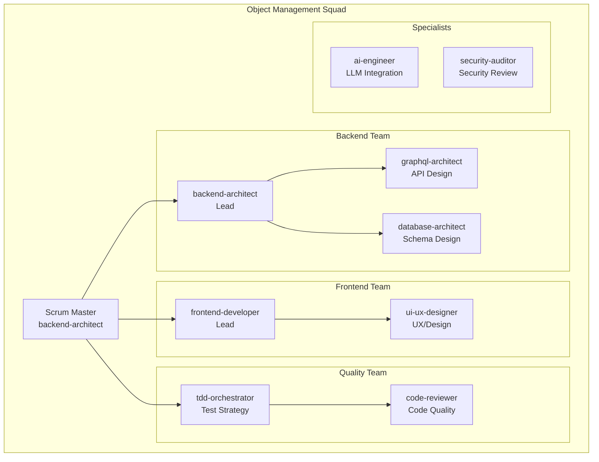
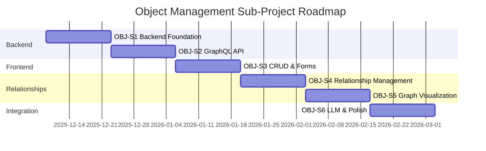

# intelliCore - Sub-Projeto: Gestão de Objetos (Object Type Management)

> **Document Version**: 1.0
> **Created**: 2025-12-05
> **Sub-Project**: Object Type Management - Meta-Modeling Layer
> **Status**: 🎯 ACTIVE DEVELOPMENT
> **Parent Project**: intelliCore - Universal Meta-Modeling Platform

---

## 📋 Table of Contents

1. [Sub-Project Overview](#sub-project-overview)
2. [Scope & Boundaries](#scope--boundaries)
3. [Squad Composition](#squad-composition)
4. [Sprint Breakdown](#sprint-breakdown)
5. [Technical Architecture](#technical-architecture)
6. [User Stories](#user-stories)
7. [Acceptance Criteria](#acceptance-criteria)
8. [Definition of Done](#definition-of-done)
9. [Success Metrics](#success-metrics)

---

## Sub-Project Overview

### 🎯 Mission Statement

Implementar o **sistema de gestão de ObjectTypes** - a camada de meta-modelagem que permite aos usuários **definir qualquer tipo de objeto de negócio de forma abstrata**, sem programação, usando apenas linguagem natural e validação inteligente via LLM.

### Core Philosophy

**CRÍTICO**: Este sub-projeto implementa a **camada de abstração pura**. O sistema resultante deve ser **100% domain-agnostic** e capaz de modelar qualquer domínio (financeiro, saúde, e-commerce, logística, governo, etc.).

```
┌────────────────────────────────────────────────────────────┐
│  OBJECT TYPE MANAGEMENT (Meta-Modeling Layer)             │
├────────────────────────────────────────────────────────────┤
│                                                              │
│  Permite criar QUALQUER tipo de objeto:                    │
│  • Financeiro: Cliente PF, Cliente PJ, Conta, Produto     │
│  • Saúde: Paciente, Médico, Consulta, Prescrição          │
│  • E-commerce: Produto, Pedido, Cliente, Fornecedor       │
│  • Logística: Carga, Motorista, Rota, Veículo             │
│  • Governo: Cidadão, Licença, Processo, Certidão          │
│  • Educação: Aluno, Professor, Curso, Matrícula           │
│  • ... QUALQUER DOMÍNIO                                    │
│                                                              │
│  ❌ NÃO implementar lógica de domínio específica            │
│  ✅ Implementar motor genérico de definição de objetos     │
│                                                              │
└────────────────────────────────────────────────────────────┘
```

### What This Sub-Project IS

- ✅ **Generic meta-modeling engine** for ANY business domain
- ✅ **Flexible field definition system** with dynamic types
- ✅ **Extensible validation framework** (configurable, not hardcoded)
- ✅ **Relationship management** between any ObjectTypes
- ✅ **Graph visualization** of ObjectType hierarchies
- ✅ **LLM-powered** field suggestions and validation
- ✅ **Multi-domain support** from day one

### What This Sub-Project IS NOT

- ❌ **NOT** a core banking system with hardcoded entities
- ❌ **NOT** specific to any single industry
- ❌ **NOT** limited to predefined object types
- ❌ **NOT** containing business logic for any domain
- ❌ **NOT** a "template system" - it's a meta-modeling platform

---

## Scope & Boundaries

### In Scope

**Module 1: ObjectType Definition System**
- Create, Read, Update, Delete (CRUD) ObjectTypes
- Define custom fields with dynamic types
- Configure validation rules per field
- Versioning and audit trail
- Soft delete and restore

**Module 2: Field Definition System**
- Support 6 base field types: STRING, NUMBER, BOOLEAN, DATE, ENUM, RELATION
- Extensible validation rules (min, max, pattern, custom)
- Field metadata (description, placeholder, help text)
- Required/optional flags
- Default values

**Module 3: Relationship Management**
- Define relationships between ObjectTypes
- Cardinality: 1:1, 1:N, N:N
- Bidirectional relationships
- Relationship validation rules
- Cascade delete options

**Module 4: Graph Visualization**
- Interactive graph view of ObjectTypes and relationships
- Multiple layout algorithms (hierarchical, force-directed, circular)
- Node and edge filtering
- Path highlighting
- Export capabilities (PNG, SVG, JSON)

**Module 5: LLM Integration**
- Field suggestion from natural language description
- Validation rule generation from business requirements
- Example data generation
- Documentation auto-completion

**Module 6: User Interface (BACKOFFICE)**
- ObjectType list with search and filters
- Create/Edit forms with real-time validation
- Relationship management UI
- Graph visualization interface
- Bulk operations

### Out of Scope (Future Sub-Projects)

- ❌ Instance creation (handled in "Instance Management" sub-project)
- ❌ Workflow management (separate sub-project)
- ❌ Document management (separate sub-project)
- ❌ RAG system (separate sub-project)
- ❌ User management (handled by Keycloak)
- ❌ Analytics and reporting (separate sub-project)

### Dependencies

**From Core Platform (Phase 1):**
- ✅ PostgreSQL database running
- ✅ Keycloak authentication configured
- ✅ NestJS backend foundation
- ✅ Next.js frontend foundation
- ✅ Docker Compose infrastructure

**External Services:**
- LLM Gateway (for field suggestions) - will be created in parallel

---

## Squad Composition

### 🎖️ Squad Structure

Esta Squad é especializada e auto-suficiente, com todas as competências necessárias para entregar o sub-projeto completo.



### Squad Members & Responsibilities

| Role | Agent | Primary Responsibilities | Sprints |
|------|-------|-------------------------|---------|
| **Scrum Master & Tech Lead** | `backend-architect` | Overall coordination, architecture decisions, sprint planning | All |
| **GraphQL Lead** | `graphql-architect` | GraphQL schema design, resolver patterns, API optimization | S1, S2, S3 |
| **Database Lead** | `database-architect` | Schema design, migrations, query optimization, indexing | S1, S4 |
| **Frontend Lead** | `frontend-developer` | React components, forms, state management, UX implementation | S3, S5 |
| **UX Designer** | `ui-ux-designer` | UI/UX design, design system, accessibility, user flows | S3, S5 |
| **Test Coordinator** | `tdd-orchestrator` | Test strategy, coverage monitoring, TDD enforcement | All |
| **Code Reviewer** | `code-reviewer` | Code quality, best practices, refactoring suggestions | All |
| **AI Specialist** | `ai-engineer` | LLM integration, prompt engineering for field suggestions | S2, S6 |
| **Security Specialist** | `security-auditor` | Security review, RBAC, input validation, SQL injection prevention | S1, S6 |

### Squad Working Agreement

```yaml
Communication:
  - Daily standup: Async via status updates
  - Code review: All PRs reviewed within 4 hours
  - Blockers: Escalate immediately to Scrum Master
  - Documentation: Update as you code, not after

Quality Standards:
  - Test coverage: >85% for all modules
  - Code review: Required for all changes
  - Documentation: JSDoc for all public APIs
  - Performance: All queries <100ms

Definition of Done:
  - All acceptance criteria met
  - Tests passing (unit, integration, E2E)
  - Code reviewed and approved
  - Documentation updated
  - Deployed to dev environment
  - Security scan passed

Collaboration:
  - Pair programming: Encouraged for complex features
  - Knowledge sharing: Document learnings in ADRs
  - Continuous improvement: Retrospective after each sprint
```

---

## Sprint Breakdown

### Sprint Distribution

| Sprint | Duration | Goal | Lead Agent | Story Points |
|--------|----------|------|------------|--------------|
| **OBJ-S1** | 2 weeks | Backend Foundation - ObjectTypes & Fields | `backend-architect` | 26 |
| **OBJ-S2** | 2 weeks | GraphQL API & Validation Engine | `graphql-architect` | 24 |
| **OBJ-S3** | 2 weeks | Frontend CRUD & Forms | `frontend-developer` | 28 |
| **OBJ-S4** | 2 weeks | Relationship Management | `database-architect` | 26 |
| **OBJ-S5** | 2 weeks | Graph Visualization | `frontend-developer` | 24 |
| **OBJ-S6** | 2 weeks | LLM Integration & Polish | `ai-engineer` | 22 |

**Total Duration**: 12 weeks (6 sprints)
**Total Story Points**: 150 points

### Sprint Roadmap



---

## Sprint OBJ-S1: Backend Foundation - ObjectTypes & Fields

**Duration**: 2 weeks (Dec 09 - Dec 20, 2025)
**Goal**: Estabelecer a fundação backend completa para ObjectTypes e Fields com PostgreSQL, TypeORM, e estrutura modular

### Squad Composition

**Lead**: `backend-architect`
**Support**:
- `database-architect` - Schema design and migrations
- `tdd-orchestrator` - Test infrastructure
- `security-auditor` - Auth and RBAC setup

### User Stories

#### OBJ-US-001: Database Schema for ObjectTypes & Fields (8 points)

```
Como um backend architect
Quero um schema de banco de dados robusto para ObjectTypes e Fields
Para que possa armazenar definições de objetos de forma flexível e escalável
```

**Acceptance Criteria:**
- [ ] Tabela `object_types` criada com todos os campos necessários
- [ ] Tabela `fields` criada com suporte a tipos dinâmicos
- [ ] Enum `FieldType` com 6 tipos base (STRING, NUMBER, BOOLEAN, DATE, ENUM, RELATION)
- [ ] Foreign key de `fields.object_type_id` para `object_types.id` com CASCADE
- [ ] Índices criados para otimização de queries:
  - `idx_object_types_name` (UNIQUE)
  - `idx_fields_object_type_id`
  - `idx_fields_name`
- [ ] Soft delete implementado (`is_active` boolean, `deleted_at` timestamp)
- [ ] Campos de auditoria (`created_by`, `updated_by`, `created_at`, `updated_at`)
- [ ] Coluna JSONB `validation_rules` para regras extensíveis
- [ ] Coluna TEXT `description` para documentação
- [ ] Migration scripts testados (up/down)

**Technical Tasks:**
1. Criar migration `001_create_object_types_table.ts`
2. Definir enum `FieldType` no PostgreSQL
3. Criar migration `002_create_fields_table.ts`
4. Adicionar constraints de integridade referencial
5. Criar índices para performance
6. Implementar triggers para `updated_at` (auto-update)
7. Adicionar check constraints para validação básica
8. Testar migrations com dados de exemplo
9. Documentar schema no ERD (Entity Relationship Diagram)

**Dependencies**: None (first sprint)

---

#### OBJ-US-002: ObjectType Entity & Repository (5 points)

```
Como um backend developer
Quero entities TypeORM mapeadas para o schema
Para que possa realizar operações de banco de dados type-safe
```

**Acceptance Criteria:**
- [ ] `ObjectTypeEntity` criada com todos os campos mapeados
- [ ] Decorators TypeORM corretos (`@Entity`, `@Column`, `@PrimaryGeneratedColumn`)
- [ ] Relacionamento `@OneToMany` para `FieldEntity`
- [ ] Soft delete implementado com `@DeleteDateColumn`
- [ ] Timestamps automáticos com `@CreateDateColumn` e `@UpdateDateColumn`
- [ ] Validation decorators (`@IsString`, `@IsNotEmpty`, etc.)
- [ ] Método `toJSON()` para serialização customizada
- [ ] Unit tests para entity validation

**Technical Tasks:**
1. Criar `server/src/modules/object-types/entities/object-type.entity.ts`
2. Mapear todos os campos do schema
3. Configurar relacionamentos
4. Adicionar validation decorators
5. Implementar soft delete
6. Criar `FieldEntity` em paralelo
7. Registrar entities no módulo
8. Escrever testes unitários
9. Documentar com JSDoc

**Dependencies**: OBJ-US-001 (Schema must exist)

---

#### OBJ-US-003: Field Entity with Dynamic Typing (5 points)

```
Como um backend developer
Quero uma entity Field com suporte a tipos dinâmicos
Para que possa armazenar definições de campos flexíveis
```

**Acceptance Criteria:**
- [ ] `FieldEntity` criada com enum `FieldType`
- [ ] Coluna JSONB `validation_rules` suporta regras extensíveis
- [ ] Relacionamento `@ManyToOne` para `ObjectTypeEntity`
- [ ] Validação de regras específicas por tipo (ex: `allowedValues` para ENUM)
- [ ] Método helper `validateValue()` para validar valores contra o tipo
- [ ] Suporte a field metadata (description, placeholder, help_text)
- [ ] Unit tests para cada `FieldType`
- [ ] Testes de validação de regras customizadas

**Technical Tasks:**
1. Criar `server/src/modules/fields/entities/field.entity.ts`
2. Definir enum `FieldType` no TypeScript
3. Mapear coluna JSONB `validation_rules`
4. Implementar método `validateValue(value: any): ValidationResult`
5. Criar interface `ValidationResult` { isValid: boolean; errors: string[] }
6. Adicionar suporte para regras padrão:
   - STRING: minLength, maxLength, pattern, isEmail
   - NUMBER: min, max, isInteger
   - BOOLEAN: (sem regras customizadas)
   - DATE: min, max, isAfter, isBefore
   - ENUM: allowedValues (required)
   - RELATION: targetObjectTypeId (required)
7. Escrever testes para cada tipo e regra
8. Documentar formato de `validation_rules` JSON

**Example validation_rules:**
```json
{
  "minLength": 3,
  "maxLength": 100,
  "pattern": "^[A-Za-z ]+$",
  "patternMessage": "Apenas letras e espaços permitidos"
}
```

**Dependencies**: OBJ-US-002 (ObjectType entity)

---

#### OBJ-US-004: ObjectTypes Service Layer (5 points)

```
Como um backend developer
Quero uma camada de serviço para ObjectTypes
Para que a lógica de negócio esteja separada dos resolvers
```

**Acceptance Criteria:**
- [ ] `ObjectTypesService` com métodos CRUD completos
- [ ] Método `create(input, userId)` com validação de nome único
- [ ] Método `findAll(pagination)` com suporte a paginação
- [ ] Método `findOne(id)` com carregamento de fields
- [ ] Método `update(id, input, userId)` com detecção de conflitos
- [ ] Método `delete(id, userId)` como soft delete
- [ ] Método `restore(id, userId)` para restaurar deletados
- [ ] Transações para operações complexas
- [ ] Error handling robusto (NotFoundException, ConflictException)
- [ ] Logging de todas as operações
- [ ] Unit tests com >90% coverage

**Technical Tasks:**
1. Criar `server/src/modules/object-types/services/object-types.service.ts`
2. Injetar `ObjectTypeRepository` via DI
3. Implementar `create()` com validação de unicidade
4. Implementar `findAll()` com QueryBuilder para paginação
5. Implementar `findOne()` com `relations: ['fields']`
6. Implementar `update()` com verificação de versão
7. Implementar `delete()` usando `softRemove()`
8. Implementar `restore()` usando `recover()`
9. Adicionar decorators de logging (`@Logger()`)
10. Escrever testes unitários com mocks
11. Documentar todos os métodos com JSDoc

**Dependencies**: OBJ-US-002, OBJ-US-003

---

#### OBJ-US-005: Fields Service Layer (3 points)

```
Como um backend developer
Quero uma camada de serviço para Fields
Para que possa gerenciar campos de ObjectTypes
```

**Acceptance Criteria:**
- [ ] `FieldsService` com métodos CRUD
- [ ] Validação: campo deve pertencer a ObjectType ativo
- [ ] Validação: nome único dentro do mesmo ObjectType
- [ ] Validação: `validation_rules` válidas para o `field_type`
- [ ] Método `reorderFields(objectTypeId, fieldIds[])` para ordenação
- [ ] Método `validateFieldValue(fieldId, value)` para testar valores
- [ ] Unit tests >90% coverage

**Technical Tasks:**
1. Criar `server/src/modules/fields/services/fields.service.ts`
2. Implementar CRUD completo
3. Adicionar validações de negócio
4. Implementar reordenação de campos
5. Implementar validação de valores
6. Escrever testes unitários
7. Documentar service

**Dependencies**: OBJ-US-003

---

### Sprint OBJ-S1 Deliverables

**Code:**
- ✅ Database migrations para `object_types` e `fields`
- ✅ `ObjectTypeEntity` e `FieldEntity` completas
- ✅ `ObjectTypesService` e `FieldsService` com CRUD
- ✅ Comprehensive unit tests (>90% coverage)

**Documentation:**
- ✅ ERD (Entity Relationship Diagram)
- ✅ Service layer architecture document
- ✅ Validation rules specification
- ✅ JSDoc para todas as classes e métodos

**Infrastructure:**
- ✅ Migrations executadas com sucesso
- ✅ Database seeds para testes
- ✅ Test database configurado

---

## Sprint OBJ-S2: GraphQL API & Validation Engine

**Duration**: 2 weeks (Dec 23 - Jan 03, 2026)
**Goal**: Expor ObjectTypes e Fields via GraphQL API com validação robusta e RBAC

### Squad Composition

**Lead**: `graphql-architect`
**Support**:
- `backend-architect` - Service integration
- `security-auditor` - RBAC implementation
- `tdd-orchestrator` - Integration tests

### User Stories

#### OBJ-US-006: GraphQL Schema Design (5 points)

```
Como um GraphQL architect
Quero um schema GraphQL bem projetado para ObjectTypes
Para que a API seja intuitiva e type-safe
```

**Acceptance Criteria:**
- [ ] GraphQL Object Types definidos (`ObjectType`, `Field`, `FieldType`)
- [ ] Input Types criados (`CreateObjectTypeInput`, `UpdateObjectTypeInput`)
- [ ] Pagination types (`ObjectTypeConnection`, `PageInfo`)
- [ ] Query types definidos com documentação
- [ ] Mutation types definidos com documentação
- [ ] Field resolvers para relacionamentos lazy-loaded
- [ ] Schema validado com GraphQL Inspector
- [ ] Auto-generated schema.gql atualizado

**Technical Tasks:**
1. Criar `server/src/modules/object-types/dto/object-type.type.ts`
2. Adicionar decorators `@ObjectType()` e `@Field()`
3. Criar Input Types em `dto/` folder
4. Implementar pagination types
5. Configurar Field Resolvers
6. Validar schema com `graphql-inspector`
7. Gerar schema.gql automaticamente
8. Documentar schema com comments

**Example Schema:**
```graphql
type ObjectType {
  id: ID!
  name: String!
  description: String
  fields: [Field!]!
  isActive: Boolean!
  createdBy: String
  createdAt: DateTime!
  updatedAt: DateTime!
}

input CreateObjectTypeInput {
  name: String!
  description: String
  fields: [CreateFieldInput!]
}

type Query {
  objectTypes(first: Int, after: String): ObjectTypeConnection!
  objectType(id: ID!): ObjectType
}
```

**Dependencies**: Sprint OBJ-S1 complete

---

#### OBJ-US-007: ObjectTypes GraphQL Resolver (8 points)

```
Como um frontend developer
Quero queries e mutations GraphQL para ObjectTypes
Para que possa gerenciar ObjectTypes via API
```

**Acceptance Criteria:**
- [ ] Query `objectTypes` com paginação cursor-based
- [ ] Query `objectType(id)` com fields carregados
- [ ] Mutation `createObjectType(input)` com validação
- [ ] Mutation `updateObjectType(id, input)` com detecção de conflitos
- [ ] Mutation `deleteObjectType(id)` soft delete
- [ ] Mutation `restoreObjectType(id)` para restaurar
- [ ] Auth guard aplicado a todas as operações
- [ ] RBAC: admin pode tudo, operator pode ler
- [ ] Field resolver `fields` com DataLoader (evitar N+1)
- [ ] Integration tests para todos os endpoints

**Technical Tasks:**
1. Criar `server/src/modules/object-types/resolvers/object-types.resolver.ts`
2. Implementar `@Query()` objectTypes com paginação
3. Implementar `@Query()` objectType
4. Implementar `@Mutation()` createObjectType
5. Implementar `@Mutation()` updateObjectType
6. Implementar `@Mutation()` deleteObjectType
7. Implementar `@Mutation()` restoreObjectType
8. Adicionar `@UseGuards(AuthGuard, RolesGuard)`
9. Criar DataLoader para fields: `FieldsLoader`
10. Escrever integration tests com supertest
11. Testar no GraphQL Playground
12. Documentar operações

**Dependencies**: OBJ-US-006 (Schema)

---

#### OBJ-US-008: Fields GraphQL Resolver (5 points)

```
Como um frontend developer
Quero queries e mutations GraphQL para Fields
Para que possa gerenciar campos de ObjectTypes
```

**Acceptance Criteria:**
- [ ] Query `fields(objectTypeId)` lista campos de um ObjectType
- [ ] Mutation `createField(objectTypeId, input)` cria novo campo
- [ ] Mutation `updateField(id, input)` atualiza campo
- [ ] Mutation `deleteField(id)` remove campo
- [ ] Mutation `reorderFields(objectTypeId, fieldIds[])` reordena
- [ ] Mutation `validateFieldValue(fieldId, value)` testa validação
- [ ] RBAC aplicado
- [ ] Integration tests

**Technical Tasks:**
1. Criar `server/src/modules/fields/resolvers/fields.resolver.ts`
2. Implementar queries e mutations
3. Adicionar auth guards
4. Escrever integration tests
5. Documentar operações

**Dependencies**: OBJ-US-007

---

#### OBJ-US-009: Validation Engine (6 points)

```
Como um backend developer
Quero um motor de validação extensível
Para que possa validar valores contra field definitions
```

**Acceptance Criteria:**
- [ ] Service `FieldValidationService` criado
- [ ] Valida STRING: minLength, maxLength, pattern, isEmail, isCpf, isCnpj
- [ ] Valida NUMBER: min, max, isInteger, isPositive
- [ ] Valida BOOLEAN: apenas true/false
- [ ] Valida DATE: min, max, isAfter, isBefore, isFuture, isPast
- [ ] Valida ENUM: allowedValues (obrigatório)
- [ ] Valida RELATION: targetObjectTypeId existe e está ativo
- [ ] Retorna erros descritivos e actionable
- [ ] Unit tests para cada tipo e regra (>95% coverage)
- [ ] Performance: valida 1000 campos em <100ms

**Technical Tasks:**
1. Criar `server/src/modules/fields/services/field-validation.service.ts`
2. Implementar validadores para cada FieldType
3. Criar helpers para validações comuns (CPF, CNPJ, email)
4. Implementar sistema de mensagens de erro i18n-ready
5. Adicionar caching de regras compiladas (regex)
6. Escrever testes exaustivos
7. Benchmark de performance
8. Documentar formato de validation_rules

**Example Validation:**
```typescript
// Input
field = {
  field_type: 'STRING',
  validation_rules: {
    minLength: 3,
    maxLength: 50,
    pattern: '^[A-Za-z ]+$'
  }
}
value = "123"

// Output
{
  isValid: false,
  errors: [
    {
      field: 'fieldName',
      code: 'PATTERN_MISMATCH',
      message: 'Apenas letras e espaços são permitidos'
    }
  ]
}
```

**Dependencies**: OBJ-US-003 (FieldEntity)

---

### Sprint OBJ-S2 Deliverables

**API:**
- ✅ Complete GraphQL schema para ObjectTypes e Fields
- ✅ 12 GraphQL operations (6 queries + 6 mutations)
- ✅ Authentication e RBAC funcionando
- ✅ GraphQL Playground documentado

**Code:**
- ✅ Resolvers testados (integration tests >85%)
- ✅ Validation engine robusto
- ✅ DataLoader para otimização

**Documentation:**
- ✅ GraphQL schema documentation
- ✅ API usage examples
- ✅ Validation rules reference

---

## Sprint OBJ-S3: Frontend CRUD & Forms

**Duration**: 2 weeks (Jan 06 - Jan 17, 2026)
**Goal**: Implementar interface completa para gerenciamento de ObjectTypes no BACKOFFICE

### Squad Composition

**Lead**: `frontend-developer`
**Support**:
- `ui-ux-designer` - Design system e UX
- `graphql-architect` - Apollo Client integration
- `tdd-orchestrator` - Frontend testing

### User Stories

#### OBJ-US-010: Apollo Client Configuration (3 points)

```
Como um frontend developer
Quero Apollo Client configurado para Next.js 15
Para que possa fazer queries e mutations GraphQL
```

**Acceptance Criteria:**
- [ ] Apollo Client com SSR support para Next.js 15
- [ ] Provider configurado no layout
- [ ] Auth token injetado em headers
- [ ] Error handling configurado
- [ ] Cache policies configuradas
- [ ] Queries funcionam em Server Components
- [ ] Mutations funcionam em Client Components
- [ ] DevTools habilitado em development

**Technical Tasks:**
1. Instalar `@apollo/client`, `@apollo/experimental-nextjs-app-support`
2. Criar `client/lib/apollo-client.ts`
3. Criar `client/lib/apollo-provider.tsx`
4. Configurar auth link com Keycloak token
5. Configurar error link
6. Configurar cache policies
7. Wrap app com ApolloProvider
8. Testar SSR e CSR
9. Documentar setup

**Dependencies**: Sprint OBJ-S2 (GraphQL API)

---

#### OBJ-US-011: ObjectTypes List Page (5 points)

```
Como um backoffice operator
Quero ver a lista de ObjectTypes
Para que possa gerenciar os tipos de objetos do sistema
```

**Acceptance Criteria:**
- [ ] Página `/backoffice/object-types` com layout consistente
- [ ] Tabela com colunas: Name, Description, # Fields, Created At, Actions
- [ ] Loading state com skeleton
- [ ] Empty state com botão "Criar Primeiro ObjectType"
- [ ] Error state com retry button
- [ ] Paginação com "Load More" button
- [ ] Search por nome (debounced)
- [ ] Botão "Novo ObjectType" no header
- [ ] Action buttons: View, Edit, Delete
- [ ] Confirmação antes de deletar
- [ ] Toast notifications para sucesso/erro
- [ ] Responsive design (mobile-first)
- [ ] Internationalization (pt-BR, en-US, es-ES)

**Technical Tasks:**
1. Criar `client/app/[locale]/backoffice/object-types/page.tsx`
2. Implementar query GET_OBJECT_TYPES com useQuery
3. Criar componente ObjectTypesTable
4. Implementar paginação cursor-based
5. Adicionar search com debounce (useDebounce hook)
6. Criar DeleteConfirmationDialog component
7. Implementar DELETE_OBJECT_TYPE mutation
8. Adicionar toast notifications (sonner)
9. Escrever component tests (React Testing Library)
10. Adicionar E2E test (Playwright)
11. Internacionalizar todos os textos

**Dependencies**: OBJ-US-010 (Apollo Client)

---

#### OBJ-US-012: Create ObjectType Form (8 points)

```
Como um backoffice operator
Quero criar um novo ObjectType
Para que possa definir um novo tipo de objeto no sistema
```

**Acceptance Criteria:**
- [ ] Página `/backoffice/object-types/create`
- [ ] Form com campos: Name, Description
- [ ] Seção "Fields" com lista de campos dinâmicos
- [ ] Botão "Add Field" adiciona novo campo
- [ ] Cada campo tem: Name, Type (dropdown), Description, Required (checkbox)
- [ ] Se Type = ENUM: mostrar input para "Allowed Values" (comma-separated)
- [ ] Se Type = RELATION: mostrar dropdown para selecionar Target ObjectType
- [ ] Seção "Validation Rules" por campo (acordeão)
- [ ] Real-time validation com Zod
- [ ] Character counter para campos com limite
- [ ] Submit button disabled quando inválido
- [ ] Loading state durante submit
- [ ] Success: redirect para `/backoffice/object-types` com toast
- [ ] Error: mostrar toast com detalhes
- [ ] Draft auto-save no localStorage (a cada 5 segundos)
- [ ] Botão "Cancel" com confirmação se houver mudanças

**Technical Tasks:**
1. Criar `client/app/[locale]/backoffice/object-types/create/page.tsx`
2. Definir Zod schema para validação
3. Setup React Hook Form com zodResolver
4. Criar componente FieldBuilder para gerenciar campos dinâmicos
5. Implementar lógica de adicionar/remover campos
6. Criar dropdown de FieldType com ícones
7. Implementar condicional para ENUM e RELATION
8. Criar componente ValidationRulesEditor (acordeão)
9. Implementar draft auto-save com useEffect
10. Implementar CREATE_OBJECT_TYPE mutation
11. Adicionar loading e error states
12. Escrever form tests
13. Adicionar E2E test para fluxo completo
14. Internacionalizar

**Example Form State:**
```typescript
{
  name: "Cliente Pessoa Física",
  description: "Representa um cliente pessoa física do sistema",
  fields: [
    {
      name: "nome_completo",
      field_type: "STRING",
      description: "Nome completo do cliente",
      is_required: true,
      validation_rules: {
        minLength: 3,
        maxLength: 100
      }
    },
    {
      name: "cpf",
      field_type: "STRING",
      description: "CPF do cliente",
      is_required: true,
      validation_rules: {
        pattern: "\\d{3}\\.\\d{3}\\.\\d{3}-\\d{2}",
        isCpf: true
      }
    },
    {
      name: "data_nascimento",
      field_type: "DATE",
      description: "Data de nascimento",
      is_required: true,
      validation_rules: {
        isPast: true
      }
    }
  ]
}
```

**Dependencies**: OBJ-US-011 (List page)

---

#### OBJ-US-013: Edit ObjectType Form (5 points)

```
Como um backoffice operator
Quero editar um ObjectType existente
Para que possa atualizar suas definições
```

**Acceptance Criteria:**
- [ ] Página `/backoffice/object-types/[id]/edit`
- [ ] Form pre-filled com dados existentes
- [ ] Mesma estrutura do Create form
- [ ] Indicação visual de campos alterados
- [ ] Validação: não pode remover campos se instâncias existirem (warning)
- [ ] Optimistic updates no cache do Apollo
- [ ] Detecção de edições concorrentes (conflict detection)
- [ ] Unsaved changes warning ao sair da página
- [ ] Botões: Save, Cancel
- [ ] Success/error feedback

**Technical Tasks:**
1. Criar `client/app/[locale]/backoffice/object-types/[id]/edit/page.tsx`
2. Fetch data com GET_OBJECT_TYPE query
3. Pre-fill form usando `reset()` do React Hook Form
4. Implementar UPDATE_OBJECT_TYPE mutation
5. Adicionar optimistic response
6. Implementar conflict detection
7. Adicionar unsaved changes guard
8. Escrever edit form tests
9. Adicionar E2E test
10. Internacionalizar

**Dependencies**: OBJ-US-012 (Create form)

---

#### OBJ-US-014: View ObjectType Page (3 points)

```
Como um backoffice operator
Quero visualizar detalhes de um ObjectType
Para que possa entender sua estrutura
```

**Acceptance Criteria:**
- [ ] Página `/backoffice/object-types/[id]`
- [ ] Layout: Header com Name e Description
- [ ] Seção "Fields" com tabela de campos
- [ ] Cada campo mostra: Name, Type, Required, Validation Rules (collapsed)
- [ ] Seção "Statistics": # Instances, Created Date, Updated Date
- [ ] Botões de ação: Edit, Delete, Duplicate
- [ ] Breadcrumb navigation
- [ ] Responsive design

**Technical Tasks:**
1. Criar `client/app/[locale]/backoffice/object-types/[id]/page.tsx`
2. Fetch data com GET_OBJECT_TYPE query
3. Criar componente FieldsTable
4. Implementar duplicate mutation
5. Escrever component tests
6. Internacionalizar

**Dependencies**: OBJ-US-011 (List page)

---

#### OBJ-US-015: Design System Components (4 points)

```
Como um UI/UX designer
Quero componentes reutilizáveis no design system
Para que a interface seja consistente
```

**Acceptance Criteria:**
- [ ] Componente `DataTable` genérico com sort, filter, pagination
- [ ] Componente `FormField` com label, input, error, help text
- [ ] Componente `FieldTypeIcon` para cada FieldType
- [ ] Componente `Badge` para status
- [ ] Componente `ConfirmDialog` reutilizável
- [ ] Componente `EmptyState` com ilustração
- [ ] Componente `LoadingState` com skeleton
- [ ] Tema dark mode configurado
- [ ] Acessibilidade (ARIA labels, keyboard navigation)
- [ ] Storybook stories para cada componente

**Technical Tasks:**
1. Criar `client/components/ui/DataTable.tsx`
2. Criar `client/components/ui/FormField.tsx`
3. Criar `client/components/icons/FieldTypeIcon.tsx`
4. Configurar tema dark mode no Tailwind
5. Adicionar ARIA labels
6. Setup Storybook (opcional)
7. Documentar componentes
8. Escrever visual regression tests

**Dependencies**: None (paralelo)

---

### Sprint OBJ-S3 Deliverables

**UI:**
- ✅ Complete CRUD interface para ObjectTypes
- ✅ Responsive design (desktop, tablet, mobile)
- ✅ Dark mode support
- ✅ Internationalization (pt-BR, en-US, es-ES)

**Components:**
- ✅ Design system components reutilizáveis
- ✅ Storybook (se tempo permitir)

**Tests:**
- ✅ Component tests (>85% coverage)
- ✅ E2E tests para fluxos críticos

**Documentation:**
- ✅ Component documentation
- ✅ User guide para ObjectTypes management

---

## Sprint OBJ-S4: Relationship Management

**Duration**: 2 weeks (Jan 20 - Jan 31, 2026)
**Goal**: Implementar sistema de relacionamentos entre ObjectTypes

### Squad Composition

**Lead**: `database-architect`
**Support**:
- `backend-architect` - Service layer
- `graphql-architect` - GraphQL API
- `tdd-orchestrator` - Test coverage

### User Stories

#### OBJ-US-016: Relationship Schema & Entity (5 points)

```
Como um database architect
Quero um schema para relacionamentos entre ObjectTypes
Para que possa modelar hierarquias e associações
```

**Acceptance Criteria:**
- [ ] Tabela `object_relationships` criada
- [ ] Foreign keys: `source_object_type_id`, `target_object_type_id`
- [ ] Enum `RelationshipType`: HAS_ONE, HAS_MANY, BELONGS_TO, MANY_TO_MANY
- [ ] Enum `Cardinality`: ONE_TO_ONE, ONE_TO_MANY, MANY_TO_MANY
- [ ] Campo `is_bidirectional` boolean
- [ ] Campo `relationship_name` string (ex: "tem_titular", "pertence_a")
- [ ] Campo JSONB `metadata` para regras customizadas
- [ ] Unique constraint: (source_id, target_id, relationship_name)
- [ ] Soft delete support
- [ ] Indexes para performance
- [ ] Migration testada

**Technical Tasks:**
1. Criar migration `004_create_object_relationships.ts`
2. Definir enums no PostgreSQL
3. Criar `ObjectRelationshipEntity`
4. Mapear com TypeORM
5. Adicionar validation decorators
6. Testar migration
7. Documentar schema

**Dependencies**: Sprint OBJ-S1 complete

---

#### OBJ-US-017: Relationships Service Layer (5 points)

```
Como um backend developer
Quero um service para gerenciar relacionamentos
Para que possa criar e validar conexões entre ObjectTypes
```

**Acceptance Criteria:**
- [ ] `RelationshipsService` com CRUD completo
- [ ] Validação: source != target (não pode relacionar consigo mesmo)
- [ ] Validação: relação duplicada (mesma source, target, name)
- [ ] Validação: cardinality constraints (1:1 não pode ter múltiplas)
- [ ] Método `getRelationshipChain(sourceId, targetId)` encontra caminho
- [ ] Método `detectCycle(objectTypeId)` detecta circular dependencies
- [ ] Transações para operações complexas
- [ ] Unit tests >90%

**Technical Tasks:**
1. Criar `server/src/modules/relationships/services/relationships.service.ts`
2. Implementar CRUD
3. Implementar validações de negócio
4. Implementar graph traversal (BFS para chain)
5. Implementar cycle detection (DFS)
6. Escrever unit tests
7. Documentar service

**Dependencies**: OBJ-US-016 (Relationship entity)

---

#### OBJ-US-018: Relationships GraphQL API (5 points)

```
Como um frontend developer
Quero GraphQL API para relacionamentos
Para que possa gerenciar conexões entre ObjectTypes
```

**Acceptance Criteria:**
- [ ] Query `relationships(sourceId?)` lista relacionamentos
- [ ] Query `relationship(id)` detalhes de um relacionamento
- [ ] Query `relationshipChain(sourceId, targetId)` encontra caminho
- [ ] Mutation `createRelationship(input)` cria relação
- [ ] Mutation `updateRelationship(id, input)` atualiza
- [ ] Mutation `deleteRelationship(id)` remove
- [ ] Field resolver `ObjectType.relationships` carrega relações
- [ ] RBAC aplicado
- [ ] Integration tests

**Technical Tasks:**
1. Criar GraphQL types e inputs
2. Criar resolver
3. Implementar queries e mutations
4. Adicionar field resolver
5. Aplicar auth guards
6. Escrever integration tests
7. Documentar API

**Dependencies**: OBJ-US-017 (Service layer)

---

#### OBJ-US-019: Graph Traversal Algorithms (8 points)

```
Como um system architect
Quero algoritmos de travessia de grafo
Para que possa navegar hierarquias complexas
```

**Acceptance Criteria:**
- [ ] BFS (Breadth-First Search) implementado
- [ ] DFS (Depth-First Search) implementado
- [ ] `findAncestors(objectTypeId, maxDepth)` encontra pais
- [ ] `findDescendants(objectTypeId, maxDepth)` encontra filhos
- [ ] `findShortestPath(sourceId, targetId)` caminho mais curto
- [ ] `detectCycles()` detecta dependências circulares
- [ ] Limite de profundidade (max 10 níveis)
- [ ] Caching de resultados comuns
- [ ] Performance: <100ms para grafos de 1000 nós
- [ ] Unit tests com grafos complexos

**Technical Tasks:**
1. Criar `server/src/modules/relationships/services/graph.service.ts`
2. Implementar BFS algorithm
3. Implementar DFS algorithm
4. Implementar findAncestors
5. Implementar findDescendants
6. Implementar findShortestPath (Dijkstra ou BFS)
7. Implementar detectCycles (DFS com backtracking)
8. Adicionar caching (Redis)
9. Benchmark performance
10. Escrever testes com grafos variados
11. Documentar complexidade algorítmica (Big-O)

**Example Graph:**
```
Cliente PJ
  ├── tem_sócio → Cliente PF (N:N)
  └── possui → Conta Corrente (1:N)
         └── tem_transação → Transação (1:N)
```

**Dependencies**: OBJ-US-017 (Service)

---

#### OBJ-US-020: Relationship Validation Rules (3 points)

```
Como um business analyst
Quero regras de validação para relacionamentos
Para que conexões inválidas sejam prevenidas
```

**Acceptance Criteria:**
- [ ] Não permitir relacionamentos circulares diretos (A → A)
- [ ] Não permitir múltiplas relações 1:1 com mesmo target
- [ ] Warning ao criar ciclos indiretos (A → B → A)
- [ ] Validação de cardinality constraints
- [ ] Mensagens de erro descritivas
- [ ] Unit tests para cada regra

**Technical Tasks:**
1. Criar validators
2. Implementar circular dependency check
3. Implementar cardinality validation
4. Escrever tests
5. Documentar regras

**Dependencies**: OBJ-US-017

---

### Sprint OBJ-S4 Deliverables

**Backend:**
- ✅ Relationships database schema
- ✅ Complete service layer
- ✅ Graph traversal algorithms
- ✅ GraphQL API para relacionamentos

**Tests:**
- ✅ Unit tests para algorithms (>90%)
- ✅ Integration tests para API

**Documentation:**
- ✅ Relationship schema documentation
- ✅ Graph algorithms complexity analysis
- ✅ API usage guide

---

## Sprint OBJ-S5: Graph Visualization

**Duration**: 2 weeks (Feb 03 - Feb 14, 2026)
**Goal**: Interface visual para explorar relacionamentos entre ObjectTypes

### Squad Composition

**Lead**: `frontend-developer`
**Support**:
- `ui-ux-designer` - UX para graph interaction
- `graphql-architect` - Graph queries optimization
- `backend-architect` - Performance tuning

### User Stories

#### OBJ-US-021: Graph Visualization Component (8 points)

```
Como um backoffice operator
Quero visualizar ObjectTypes como um grafo interativo
Para que possa entender relacionamentos visualmente
```

**Acceptance Criteria:**
- [ ] Componente Graph baseado em Cytoscape.js
- [ ] Nós representam ObjectTypes (com ícone e nome)
- [ ] Edges representam relacionamentos (com label)
- [ ] Estilos diferentes para cardinality (linha, seta dupla, etc.)
- [ ] Layout algorithms: hierarchical, force-directed, circular, grid
- [ ] Zoom e pan suaves
- [ ] Click em nó: mostra sidebar com detalhes
- [ ] Click em edge: mostra sidebar com detalhes de relação
- [ ] Hover: highlight de conexões diretas
- [ ] Double-click em nó: navega para detalhes
- [ ] Export graph (PNG, SVG, JSON)
- [ ] Minimap para navegação em grafos grandes
- [ ] Performance: renderiza 500 nós em <2s
- [ ] Responsive design

**Technical Tasks:**
1. Instalar `cytoscape`, `cytoscape-dagre`, etc.
2. Criar `client/components/graph/GraphVisualization.tsx`
3. Fetch graph data: GET_GRAPH_DATA query
4. Transform data para formato Cytoscape
5. Implementar node styling
6. Implementar edge styling
7. Adicionar layout algorithms
8. Implementar zoom/pan controls
9. Implementar interaction handlers
10. Criar sidebar de detalhes
11. Implementar export functionality
12. Adicionar minimap
13. Otimizar rendering (virtualization)
14. Escrever component tests
15. Performance testing

**Dependencies**: Sprint OBJ-S4 (Relationships API)

---

#### OBJ-US-022: Relationship Creation UI (5 points)

```
Como um backoffice operator
Quero criar relacionamentos visualmente
Para que conectar ObjectTypes seja intuitivo
```

**Acceptance Criteria:**
- [ ] Modo "Create Relationship": drag from source to target node
- [ ] Modal form aparece após drag-and-drop
- [ ] Form fields: Relationship Name, Type, Cardinality, Bidirectional
- [ ] Real-time validation
- [ ] Preview da relação antes de salvar
- [ ] Feedback visual durante criação
- [ ] Undo/redo support
- [ ] Keyboard shortcuts

**Technical Tasks:**
1. Implementar drag-and-drop no Cytoscape
2. Criar RelationshipFormModal component
3. Implementar CREATE_RELATIONSHIP mutation
4. Adicionar optimistic update ao grafo
5. Implementar undo/redo stack
6. Adicionar keyboard shortcuts
7. Escrever interaction tests

**Dependencies**: OBJ-US-021 (Graph component)

---

#### OBJ-US-023: Graph Navigation & Filtering (5 points)

```
Como um backoffice operator
Quero filtrar e navegar o grafo
Para que possa focar em partes relevantes
```

**Acceptance Criteria:**
- [ ] Search box: procura nós por nome
- [ ] Filter by node type (ObjectType category)
- [ ] Filter by relationship type
- [ ] Highlight path entre dois nós selecionados
- [ ] Expand/collapse de vizinhança de um nó
- [ ] Focus mode: mostra apenas nó selecionado e vizinhos
- [ ] Breadcrumb trail de navegação
- [ ] Save/load view states (localStorage)

**Technical Tasks:**
1. Implementar search functionality
2. Adicionar filter controls
3. Implementar path highlighting
4. Implementar expand/collapse
5. Implementar focus mode
6. Criar breadcrumb component
7. Implementar state persistence
8. Escrever navigation tests

**Dependencies**: OBJ-US-021

---

#### OBJ-US-024: Hierarchies List View (3 points)

```
Como um backoffice operator
Quero ver relacionamentos em formato de lista
Para que possa ter uma visão tabular
```

**Acceptance Criteria:**
- [ ] Página `/backoffice/hierarchies` com tabela
- [ ] Colunas: Source, Target, Relationship, Cardinality, Actions
- [ ] Sort por qualquer coluna
- [ ] Filter por relationship type
- [ ] Edit inline
- [ ] Delete com confirmação
- [ ] Export to CSV
- [ ] Paginação

**Technical Tasks:**
1. Criar page component
2. Implementar relationships table
3. Adicionar sort e filter
4. Implementar inline edit
5. Implementar delete
6. Adicionar CSV export
7. Escrever tests

**Dependencies**: Sprint OBJ-S4 (API)

---

#### OBJ-US-025: Performance Optimization (3 points)

```
Como um developer
Quero rendering otimizado para grafos grandes
Para que a interface permaneça responsiva
```

**Acceptance Criteria:**
- [ ] Virtualization para grafos >100 nós
- [ ] WebWorker para layout calculations
- [ ] Lazy loading de detalhes de nós
- [ ] Debounced search e filters
- [ ] Memoized components
- [ ] Render time <2s para 500 nós
- [ ] Interações suaves (60fps)

**Technical Tasks:**
1. Implementar virtualization
2. Mover layout para WebWorker
3. Adicionar lazy loading
4. Debounce inputs
5. Memoize components
6. Profile e optimize bottlenecks
7. Benchmark performance

**Dependencies**: OBJ-US-021

---

### Sprint OBJ-S5 Deliverables

**UI:**
- ✅ Interactive graph visualization
- ✅ Relationship creation interface
- ✅ List and graph dual views
- ✅ Export capabilities

**Performance:**
- ✅ Handles 500+ nodes smoothly
- ✅ WebWorker for heavy computations

**Tests:**
- ✅ Component tests
- ✅ Interaction tests
- ✅ Performance benchmarks

**Documentation:**
- ✅ User guide para graph navigation
- ✅ Graph interaction patterns

---

## Sprint OBJ-S6: LLM Integration & Polish

**Duration**: 2 weeks (Feb 17 - Feb 28, 2026)
**Goal**: Integrar LLM para sugestões inteligentes e polir toda a interface

### Squad Composition

**Lead**: `ai-engineer`
**Support**:
- `prompt-engineer` - Prompt optimization
- `backend-architect` - LLM Gateway integration
- `frontend-developer` - UI polish
- `security-auditor` - Final security review

### User Stories

#### OBJ-US-026: LLM Field Suggestion (8 points)

```
Como um backoffice operator
Quero que o LLM sugira campos para um ObjectType
Para que não precise definir tudo manualmente
```

**Acceptance Criteria:**
- [ ] Textarea "Describe your object" na create form
- [ ] Botão "Generate Fields with AI"
- [ ] Envia descrição para LLM Gateway
- [ ] LLM retorna lista de campos sugeridos (name, type, validation)
- [ ] Usuário pode accept/reject/edit cada campo
- [ ] Confidence score para cada sugestão (high, medium, low)
- [ ] Fallback se LLM falhar (manual input sempre disponível)
- [ ] Loading state com progress indicator
- [ ] Retry logic se request falhar
- [ ] Cache de sugestões (mesmo input = mesma sugestão)

**Prompt Template:**
```
Given the following object type description:
"{user_description}"

Suggest 5-10 fields that would be appropriate for this object type.
For each field, provide:
- name (snake_case)
- field_type (STRING, NUMBER, BOOLEAN, DATE, ENUM, RELATION)
- description
- is_required (true/false)
- validation_rules (if applicable)

Output as JSON array.
```

**Technical Tasks:**
1. Criar LLM Gateway service endpoint `/api/suggest-fields`
2. Implementar prompt template
3. Criar `useLLMSuggestions()` hook no frontend
4. Adicionar "AI Suggest" button no create form
5. Criar FieldSuggestionList component
6. Implementar accept/reject/edit workflow
7. Adicionar confidence indicators
8. Implementar caching (Redis)
9. Adicionar retry logic
10. Escrever tests
11. Documentar prompt

**Dependencies**: LLM Gateway service (parallel development)

---

#### OBJ-US-027: Validation Rule Generation (5 points)

```
Como um backoffice operator
Quero que o LLM gere validation rules
Para que não precise escrever regex manualmente
```

**Acceptance Criteria:**
- [ ] Input "Business Rule Description" por campo
- [ ] Botão "Generate Validation Rule"
- [ ] LLM converte descrição em validation_rules JSON
- [ ] Preview da regra gerada
- [ ] Test button: testa regra com valor de exemplo
- [ ] Fallback para manual input

**Example:**
```
Input: "CPF válido brasileiro com 11 dígitos"
Output: {
  "pattern": "\\d{3}\\.\\d{3}\\.\\d{3}-\\d{2}",
  "patternMessage": "CPF deve estar no formato XXX.XXX.XXX-XX",
  "isCpf": true
}
```

**Technical Tasks:**
1. Criar endpoint `/api/generate-validation-rule`
2. Implementar prompt template
3. Criar ValidationRuleGenerator component
4. Implementar test functionality
5. Escrever tests
6. Documentar

**Dependencies**: OBJ-US-026

---

#### OBJ-US-028: Example Data Generation (3 points)

```
Como um backoffice operator
Quero gerar dados de exemplo para um ObjectType
Para que possa testar a estrutura
```

**Acceptance Criteria:**
- [ ] Botão "Generate Sample Data" na view page
- [ ] LLM gera 5 exemplos de instâncias válidas
- [ ] Mostra preview em modal
- [ ] Usuário pode salvar como seed data (futura feature)
- [ ] Respeita validation rules

**Technical Tasks:**
1. Criar endpoint `/api/generate-sample-data`
2. Implementar geração via LLM
3. Criar SampleDataPreview component
4. Escrever tests

**Dependencies**: OBJ-US-026

---

#### OBJ-US-029: UI/UX Polish (3 points)

```
Como um UI/UX designer
Quero polir toda a interface
Para que a experiência seja excelente
```

**Acceptance Criteria:**
- [ ] Animations suaves (framer-motion)
- [ ] Loading states consistentes
- [ ] Error states consistentes
- [ ] Empty states com ilustrações
- [ ] Tooltips informativos
- [ ] Keyboard shortcuts documentados
- [ ] Accessibility audit passed (WCAG 2.1 AA)
- [ ] Mobile responsive refinements
- [ ] Dark mode refinements
- [ ] Micro-interactions polidas

**Technical Tasks:**
1. Adicionar framer-motion animations
2. Padronizar loading states
3. Criar ilustrações para empty states
4. Adicionar tooltips
5. Documentar keyboard shortcuts
6. Rodar accessibility audit
7. Refinar mobile layout
8. Testar dark mode
9. Polir micro-interactions

**Dependencies**: Sprint OBJ-S3, OBJ-S5

---

#### OBJ-US-030: Security Audit & Final Review (3 points)

```
Como um security auditor
Quero fazer auditoria final de segurança
Para que o sistema seja seguro em produção
```

**Acceptance Criteria:**
- [ ] RBAC testado em todos os endpoints
- [ ] Input validation em todos os forms
- [ ] SQL injection prevention verified
- [ ] XSS prevention verified
- [ ] CSRF protection enabled
- [ ] Rate limiting configurado
- [ ] Security headers configurados
- [ ] Sensitive data não logada
- [ ] Secrets não commitados
- [ ] Dependency vulnerabilities resolvidas

**Technical Tasks:**
1. Rodar security scan (npm audit, Snyk)
2. Testar RBAC manualmente
3. Testar input validation com payloads maliciosos
4. Verificar SQL injection prevention
5. Verificar XSS prevention
6. Configurar rate limiting
7. Configurar security headers (helmet.js)
8. Audit logs
9. Verificar .gitignore
10. Resolver vulnerabilities
11. Documentar security practices

**Dependencies**: All previous sprints

---

### Sprint OBJ-S6 Deliverables

**AI Features:**
- ✅ LLM field suggestion
- ✅ Validation rule generation
- ✅ Example data generation

**Polish:**
- ✅ Animations e micro-interactions
- ✅ Accessibility audit passed
- ✅ Mobile refinements

**Security:**
- ✅ Security audit passed
- ✅ Vulnerabilities resolved
- ✅ Production-ready

**Documentation:**
- ✅ User guide completo
- ✅ Admin guide
- ✅ API documentation
- ✅ Security best practices

---

## Technical Architecture

### System Overview

```
┌─────────────────────────────────────────────────────────────┐
│  Object Management Sub-Project Architecture                  │
├─────────────────────────────────────────────────────────────┤
│                                                               │
│  ┌─────────────────────────────────────────────────────┐   │
│  │  Frontend (Next.js 15 + React 19)                    │   │
│  │  ┌─────────────┐  ┌─────────────┐  ┌─────────────┐ │   │
│  │  │ ObjectTypes │  │ Hierarchies │  │   Graph     │ │   │
│  │  │   CRUD UI   │  │  List View  │  │    View     │ │   │
│  │  └──────┬──────┘  └──────┬──────┘  └──────┬──────┘ │   │
│  │         │                 │                 │        │   │
│  │         └─────────────────┼─────────────────┘        │   │
│  │                           │                          │   │
│  │                    Apollo Client                     │   │
│  └───────────────────────────┼──────────────────────────┘   │
│                              │                               │
│                              ▼                               │
│  ┌─────────────────────────────────────────────────────┐   │
│  │  Backend (NestJS + GraphQL)                          │   │
│  │  ┌─────────────────────────────────────────────┐    │   │
│  │  │  GraphQL Layer                              │    │   │
│  │  │  • ObjectTypesResolver                      │    │   │
│  │  │  • FieldsResolver                           │    │   │
│  │  │  • RelationshipsResolver                    │    │   │
│  │  └────────────┬────────────────────────────────┘    │   │
│  │               │                                      │   │
│  │  ┌────────────▼────────────────────────────────┐    │   │
│  │  │  Service Layer                              │    │   │
│  │  │  • ObjectTypesService                       │    │   │
│  │  │  • FieldsService                            │    │   │
│  │  │  • RelationshipsService                     │    │   │
│  │  │  • FieldValidationService                   │    │   │
│  │  │  • GraphService (traversal algorithms)     │    │   │
│  │  └────────────┬────────────────────────────────┘    │   │
│  │               │                                      │   │
│  │  ┌────────────▼────────────────────────────────┐    │   │
│  │  │  Data Layer (TypeORM)                       │    │   │
│  │  │  • ObjectTypeEntity                         │    │   │
│  │  │  • FieldEntity                              │    │   │
│  │  │  • ObjectRelationshipEntity                 │    │   │
│  │  └────────────┬────────────────────────────────┘    │   │
│  └───────────────┼──────────────────────────────────────┘   │
│                  │                                           │
│                  ▼                                           │
│  ┌─────────────────────────────────────────────────────┐   │
│  │  PostgreSQL 16                                       │   │
│  │  • object_types table                                │   │
│  │  • fields table                                      │   │
│  │  • object_relationships table                        │   │
│  └─────────────────────────────────────────────────────┘   │
│                                                               │
│  ┌─────────────────────────────────────────────────────┐   │
│  │  LLM Gateway (Python FastAPI) - Parallel Dev        │   │
│  │  • /api/suggest-fields                               │   │
│  │  • /api/generate-validation-rule                     │   │
│  │  • /api/generate-sample-data                         │   │
│  └─────────────────────────────────────────────────────┘   │
│                                                               │
└─────────────────────────────────────────────────────────────┘
```

### Database Schema

```sql
-- ObjectTypes Table (Core Meta-Model)
CREATE TABLE object_types (
  id UUID PRIMARY KEY DEFAULT gen_random_uuid(),
  name VARCHAR(100) NOT NULL UNIQUE,
  description TEXT,
  is_active BOOLEAN DEFAULT true,
  created_by VARCHAR(100),
  updated_by VARCHAR(100),
  created_at TIMESTAMP DEFAULT NOW(),
  updated_at TIMESTAMP DEFAULT NOW(),
  deleted_at TIMESTAMP
);

CREATE INDEX idx_object_types_name ON object_types(name);
CREATE INDEX idx_object_types_is_active ON object_types(is_active);

-- Fields Table (Dynamic Field Definitions)
CREATE TYPE field_type AS ENUM (
  'STRING', 'NUMBER', 'BOOLEAN', 'DATE', 'ENUM', 'RELATION'
);

CREATE TABLE fields (
  id UUID PRIMARY KEY DEFAULT gen_random_uuid(),
  object_type_id UUID NOT NULL REFERENCES object_types(id) ON DELETE CASCADE,
  name VARCHAR(100) NOT NULL,
  field_type field_type NOT NULL,
  description TEXT,
  is_required BOOLEAN DEFAULT false,
  validation_rules JSONB,
  default_value TEXT,
  display_order INTEGER DEFAULT 0,
  created_at TIMESTAMP DEFAULT NOW(),
  updated_at TIMESTAMP DEFAULT NOW(),
  UNIQUE(object_type_id, name)
);

CREATE INDEX idx_fields_object_type_id ON fields(object_type_id);
CREATE INDEX idx_fields_name ON fields(name);

-- Relationships Table (Graph Structure)
CREATE TYPE relationship_type AS ENUM (
  'HAS_ONE', 'HAS_MANY', 'BELONGS_TO', 'MANY_TO_MANY'
);

CREATE TYPE cardinality AS ENUM (
  'ONE_TO_ONE', 'ONE_TO_MANY', 'MANY_TO_MANY'
);

CREATE TABLE object_relationships (
  id UUID PRIMARY KEY DEFAULT gen_random_uuid(),
  source_object_type_id UUID NOT NULL REFERENCES object_types(id) ON DELETE CASCADE,
  target_object_type_id UUID NOT NULL REFERENCES object_types(id) ON DELETE CASCADE,
  relationship_name VARCHAR(100) NOT NULL,
  relationship_type relationship_type NOT NULL,
  cardinality cardinality NOT NULL,
  is_bidirectional BOOLEAN DEFAULT false,
  metadata JSONB,
  created_by VARCHAR(100),
  created_at TIMESTAMP DEFAULT NOW(),
  updated_at TIMESTAMP DEFAULT NOW(),
  deleted_at TIMESTAMP,
  UNIQUE(source_object_type_id, target_object_type_id, relationship_name)
);

CREATE INDEX idx_relationships_source ON object_relationships(source_object_type_id);
CREATE INDEX idx_relationships_target ON object_relationships(target_object_type_id);
CREATE INDEX idx_relationships_type ON object_relationships(relationship_type);
```

### Technology Stack

**Backend:**
- NestJS 10.x
- TypeScript 5.6+ (strict mode)
- GraphQL (Apollo Server v4)
- TypeORM
- PostgreSQL 16
- Keycloak Connect (auth)
- Pino (logging)
- Jest (testing)

**Frontend:**
- Next.js 15.0.3 (App Router)
- React 19.0.0
- TypeScript 5.6+ (strict mode)
- Apollo Client
- Tailwind CSS 4.0
- shadcn/ui components
- React Hook Form + Zod
- Cytoscape.js (graph viz)
- Framer Motion (animations)
- next-intl (i18n)

**LLM Integration:**
- Python FastAPI (LLM Gateway)
- Ollama / vLLM (model serving)
- Llama 3.3 70B (primary model)

**DevOps:**
- Docker & Docker Compose
- PostgreSQL 16 container
- Keycloak 26 container

---

## Success Metrics

### Sprint-Level Metrics

| Sprint | Planned Points | Actual Points | Velocity | Test Coverage | Bugs Found |
|--------|----------------|---------------|----------|---------------|------------|
| OBJ-S1 | 26 | TBD | - | >90% | - |
| OBJ-S2 | 24 | TBD | - | >85% | - |
| OBJ-S3 | 28 | TBD | - | >85% | - |
| OBJ-S4 | 26 | TBD | - | >90% | - |
| OBJ-S5 | 24 | TBD | - | >85% | - |
| OBJ-S6 | 22 | TBD | - | >90% | - |

### Project-Level Metrics

**Code Quality:**
- [ ] Test coverage >85% overall
- [ ] Zero critical security vulnerabilities
- [ ] TypeScript strict mode: 0 errors
- [ ] ESLint: 0 warnings
- [ ] Lighthouse score >90

**Performance:**
- [ ] GraphQL queries <100ms (p95)
- [ ] Page load time <2s
- [ ] Graph rendering <2s for 500 nodes
- [ ] Smooth animations (60fps)

**User Experience:**
- [ ] WCAG 2.1 AA compliance
- [ ] Mobile responsive (all pages)
- [ ] Dark mode support
- [ ] Multi-language (pt-BR, en-US, es-ES)

**Business:**
- [ ] Zero data loss incidents
- [ ] Zero unauthorized access incidents
- [ ] 100% uptime during development
- [ ] User acceptance: positive feedback

---

## Definition of Done

### Story-Level DoD

- [x] All acceptance criteria met
- [x] Code reviewed and approved
- [x] Tests passing (unit, integration, E2E)
- [x] Test coverage >85% for new code
- [x] Documentation updated (JSDoc, user docs)
- [x] No TypeScript/ESLint errors
- [x] Security scan passed
- [x] Deployed to dev environment
- [x] Manually tested
- [x] Internationalization complete
- [x] Accessibility verified

### Sprint-Level DoD

- [x] All committed stories complete
- [x] Sprint goal achieved
- [x] No critical bugs
- [x] All tests passing
- [x] Demo prepared
- [x] Sprint retrospective completed
- [x] Next sprint backlog updated
- [x] Sprint report published

### Project-Level DoD

- [x] All 6 sprints complete
- [x] All 30 user stories done
- [x] End-to-end flows working
- [x] User documentation complete
- [x] Admin guide complete
- [x] API documentation complete
- [x] Security audit passed
- [x] Performance benchmarks met
- [x] Production-ready
- [x] Handoff to Instance Management sub-project

---

## Risk Management

### Technical Risks

| Risk | Impact | Prob | Mitigation |
|------|--------|------|------------|
| Graph performance with large data | High | Medium | Virtualization, WebWorkers, caching |
| Complex validation logic | Medium | Medium | Thorough testing, fallback to manual |
| LLM accuracy/reliability | High | High | Human-in-the-loop, confidence thresholds |
| GraphQL N+1 queries | High | Medium | DataLoader pattern, query optimization |
| Circular dependency handling | Medium | Low | Robust cycle detection, clear errors |

### Process Risks

| Risk | Impact | Prob | Mitigation |
|------|--------|------|------------|
| Sprint overcommitment | Medium | Medium | Conservative estimates, 20% buffer |
| Scope creep | Medium | High | Strict scope boundaries, user approval for changes |
| Knowledge gaps | Low | Medium | Agent documentation, pair programming |
| Dependencies on LLM Gateway | High | Low | Parallel development, fallback to manual |

---

## Next Steps

**After OBJ-S6 Completion:**

1. ✅ **Handoff to Instance Management Sub-Project**
   - Provide complete ObjectTypes API
   - Document meta-model architecture
   - Transfer knowledge to next squad

2. ✅ **Maintenance Mode**
   - Bug fixes as needed
   - Performance monitoring
   - Security patches

3. ✅ **Future Enhancements** (Post-MVP)
   - Advanced validation rules (conditional logic)
   - ObjectType templates/marketplace
   - Import/export ObjectTypes (JSON)
   - Versioning system for ObjectTypes
   - Collaboration features (comments, approvals)

---

## Appendix

### A. Glossary

| Term | Definition |
|------|------------|
| **ObjectType** | Template definition for a type of business object (abstract) |
| **Field** | A property/attribute of an ObjectType |
| **FieldType** | Data type of a field (STRING, NUMBER, etc.) |
| **Validation Rules** | JSON object defining constraints for a field |
| **Relationship** | Connection between two ObjectTypes |
| **Cardinality** | Type of relationship (1:1, 1:N, N:N) |
| **Graph Traversal** | Algorithm to navigate relationships |
| **Meta-Model** | Abstract model that defines how to model |

### B. References

- **CLAUDE.md**: Main project context
- **specs/SPRINT_MASTER_PLAN.md**: Overall project plan
- **specs/ARCHITECTURE.md**: System architecture
- **specs/FINAL_TECH_STACK.md**: Technology decisions
- **database-schema.sql**: Complete database schema

### C. Contact

| Role | Agent | Purpose |
|------|-------|---------|
| **Scrum Master** | `backend-architect` | Sprint coordination, blockers |
| **Product Owner** | User | Requirements, scope, priorities |
| **Tech Lead** | `backend-architect` | Architecture decisions |
| **Security Lead** | `security-auditor` | Security concerns |
| **QA Lead** | `tdd-orchestrator` | Quality issues |

---

**Document Status:** ✅ Ready for Execution
**Created:** 2025-12-05
**Sub-Project Start Date:** Dec 09, 2025 (OBJ-S1)
**Sub-Project End Date:** Feb 28, 2026 (OBJ-S6)
**Total Duration:** 12 weeks

---

*Este documento define completamente o sub-projeto "Object Type Management". Após conclusão, avançaremos para o próximo sub-projeto: "Instance Management".*
