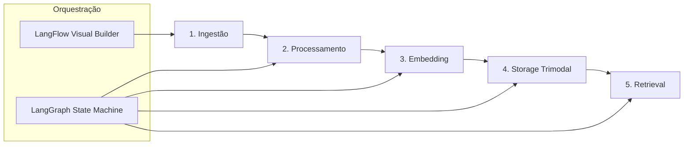

# RAG Pipeline Architecture - SuperCore v2.0
## Orquestração de Pipelines RAG por Oráculo

**Versão**: 1.0.0
**Data**: 2024-12-23
**Status**: Documento Técnico - Arquitetura RAG

---

## ÍNDICE

1. [Visão Geral](#1-visão-geral)
2. [Pipeline RAG Completo](#2-pipeline-rag-completo)
3. [Orquestração com LangFlow](#3-orquestração-com-langflow)
4. [Execução com LangGraph](#4-execução-com-langgraph)
5. [RAG Trimodal](#5-rag-trimodal)
6. [Comparação: LangFlow vs Dagster/Airflow](#6-comparação-langflow-vs-dagsterairflow)
7. [Exemplos Práticos](#7-exemplos-práticos)
8. [Performance e Escalabilidade](#8-performance-e-escalabilidade)

---

## 1. VISÃO GERAL

### 1.1 O que é RAG Pipeline no SuperCore?

**RAG (Retrieval-Augmented Generation)** no SuperCore é um sistema **multi-etapas** que:

1. **Ingere** documentos de múltiplos formatos (30+)
2. **Processa** e enriquece o conteúdo
3. **Embebe** em vetores semânticos
4. **Armazena** em 3 modalidades (SQL + Graph + Vector)
5. **Recupera** conhecimento contextual para LLMs

### 1.2 Pipeline por Oráculo

Cada **Oráculo** tem seu próprio pipeline RAG isolado:

```
Oráculo "Banking Compliance"
├── Documents: Regulações BACEN, Leis, Normas
├── Pipeline RAG: Banking-specific
├── Vector Store: pgvector (banking namespace)
├── Graph Store: NebulaGraph (banking space)
└── SQL Store: PostgreSQL (oracle_id = banking)

Oráculo "Healthcare HIPAA"
├── Documents: HIPAA docs, Medical guidelines
├── Pipeline RAG: Healthcare-specific
├── Vector Store: pgvector (healthcare namespace)
├── Graph Store: NebulaGraph (healthcare space)
└── SQL Store: PostgreSQL (oracle_id = healthcare)
```

**Isolamento Total**: Zero compartilhamento de dados entre Oráculos.

---

## 2. PIPELINE RAG COMPLETO

### 2.1 Arquitetura de 5 Etapas



### 2.2 Etapa 1: Ingestão Multimodal

**Formatos Suportados** (30+):
- **Documentos**: PDF, DOCX, PPTX, TXT, MD, HTML
- **Dados**: CSV, JSON, YAML, XML, Excel
- **Código**: PY, JS, TS, GO, SQL
- **Mídia**: MP4 (transcrição), MP3 (Whisper), imagens (OCR)
- **Web**: URLs (scraping), APIs (fetch)

**Implementação**:
```python
# ingest_pipeline.py
from langchain.document_loaders import (
    PyPDFLoader, UnstructuredWordDocumentLoader,
    CSVLoader, JSONLoader, WebBaseLoader
)

class MultiModalIngestionPipeline:
    """
    Pipeline de ingestão que aceita qualquer formato
    e converte para Document[] uniforme
    """

    def __init__(self, oracle_id: str):
        self.oracle_id = oracle_id
        self.loaders = {
            '.pdf': PyPDFLoader,
            '.docx': UnstructuredWordDocumentLoader,
            '.csv': CSVLoader,
            '.json': JSONLoader,
            # ... 30+ formatos
        }

    async def ingest(self, file_path: str, metadata: dict) -> List[Document]:
        """
        Ingere arquivo e retorna documentos com metadata
        """
        ext = Path(file_path).suffix.lower()
        loader_class = self.loaders.get(ext)

        if not loader_class:
            raise ValueError(f"Unsupported format: {ext}")

        loader = loader_class(file_path)
        docs = loader.load()

        # Enriquece metadata
        for doc in docs:
            doc.metadata.update({
                'oracle_id': self.oracle_id,
                'source_file': file_path,
                'ingested_at': datetime.utcnow().isoformat(),
                **metadata
            })

        return docs
```

**Saída**: `List[Document]` com metadata enriquecido.

---

### 2.3 Etapa 2: Processamento e Chunking

**Operações**:
1. **Chunking Semântico**: Divide em pedaços lógicos (não por tamanho)
2. **NLP**: Extração de entidades (NER), relações
3. **Limpeza**: Remove ruído, normaliza texto
4. **Validação**: Schema validation, quality checks

**Chunking Strategies**:
```python
# chunking.py
from langchain.text_splitter import (
    RecursiveCharacterTextSplitter,  # Padrão
    MarkdownTextSplitter,             # Para .md
    LatexTextSplitter,                # Para papers científicos
    PythonCodeTextSplitter            # Para código
)

class SemanticChunker:
    """
    Chunking inteligente baseado em semântica, não tamanho fixo
    """

    def __init__(self, oracle_id: str):
        self.oracle_id = oracle_id
        self.chunk_size = 1000      # tokens
        self.chunk_overlap = 200    # overlap para contexto

    async def chunk(self, documents: List[Document]) -> List[Document]:
        """
        Divide documentos em chunks semânticos
        """
        chunks = []

        for doc in documents:
            # Detecta tipo de conteúdo
            if self._is_code(doc):
                splitter = PythonCodeTextSplitter(
                    chunk_size=self.chunk_size,
                    chunk_overlap=self.chunk_overlap
                )
            elif self._is_markdown(doc):
                splitter = MarkdownTextSplitter(
                    chunk_size=self.chunk_size,
                    chunk_overlap=self.chunk_overlap
                )
            else:
                splitter = RecursiveCharacterTextSplitter(
                    chunk_size=self.chunk_size,
                    chunk_overlap=self.chunk_overlap,
                    separators=["\n\n", "\n", ". ", " ", ""]
                )

            doc_chunks = splitter.split_documents([doc])

            # Enriquece chunks com posição
            for i, chunk in enumerate(doc_chunks):
                chunk.metadata['chunk_index'] = i
                chunk.metadata['total_chunks'] = len(doc_chunks)

            chunks.extend(doc_chunks)

        return chunks
```

**Saída**: `List[Document]` com chunks semânticos.

---

### 2.4 Etapa 3: Embedding (Vetorização)

**Modelos Suportados**:
- **Multilíngue**: `paraphrase-multilingual-mpnet-base-v2`
- **OpenAI**: `text-embedding-3-large` (1536 dims)
- **Cohere**: `embed-multilingual-v3.0`
- **Local**: Sentence Transformers (offline)

**Implementação**:
```python
# embedding_pipeline.py
from sentence_transformers import SentenceTransformer
from openai import OpenAI

class EmbeddingPipeline:
    """
    Gera embeddings para chunks usando modelo configurado
    """

    def __init__(self, oracle_id: str, model: str = "multilingual"):
        self.oracle_id = oracle_id

        if model == "multilingual":
            self.model = SentenceTransformer(
                'paraphrase-multilingual-mpnet-base-v2'
            )
            self.dims = 768
        elif model == "openai":
            self.client = OpenAI()
            self.model_name = "text-embedding-3-large"
            self.dims = 1536

    async def embed_batch(
        self,
        chunks: List[Document],
        batch_size: int = 32
    ) -> List[Tuple[Document, np.ndarray]]:
        """
        Gera embeddings em batch para performance
        """
        results = []

        for i in range(0, len(chunks), batch_size):
            batch = chunks[i:i+batch_size]
            texts = [chunk.page_content for chunk in batch]

            # Gera embeddings
            if hasattr(self, 'client'):  # OpenAI
                response = self.client.embeddings.create(
                    input=texts,
                    model=self.model_name
                )
                embeddings = [e.embedding for e in response.data]
            else:  # Local model
                embeddings = self.model.encode(
                    texts,
                    batch_size=batch_size,
                    show_progress_bar=True
                )

            # Associa embedding ao chunk
            for chunk, embedding in zip(batch, embeddings):
                results.append((chunk, embedding))

        return results
```

**Saída**: `List[(Document, Vector)]` com embeddings.

---

### 2.5 Etapa 4: Storage Trimodal

**3 Destinos Simultâneos**:

```python
# storage_pipeline.py

class TrimodalStoragePipeline:
    """
    Armazena chunks em 3 modalidades simultaneamente
    """

    def __init__(self, oracle_id: str):
        self.oracle_id = oracle_id
        self.pg_pool = asyncpg.create_pool(...)       # PostgreSQL
        self.nebula_client = NebulaClient(...)        # NebulaGraph
        self.qdrant_client = QdrantClient(...)        # Qdrant (Vector DB)

    async def store_batch(
        self,
        embedded_chunks: List[Tuple[Document, Vector]]
    ):
        """
        Armazena em paralelo nas 3 modalidades
        """
        tasks = [
            self._store_sql(embedded_chunks),      # PostgreSQL
            self._store_graph(embedded_chunks),    # NebulaGraph
            self._store_vector(embedded_chunks)    # Qdrant
        ]

        await asyncio.gather(*tasks)

    async def _store_sql(self, chunks):
        """Modalidade 1: SQL (dados estruturados)"""
        async with self.pg_pool.acquire() as conn:
            for chunk, _ in chunks:
                await conn.execute('''
                    INSERT INTO documents (
                        oracle_id, content, metadata, chunk_index
                    ) VALUES ($1, $2, $3, $4)
                ''',
                self.oracle_id,
                chunk.page_content,
                json.dumps(chunk.metadata),
                chunk.metadata.get('chunk_index')
                )

    async def _store_graph(self, chunks):
        """Modalidade 2: Graph (relacionamentos)"""
        for chunk, _ in chunks:
            # Extrai entidades do chunk
            entities = self._extract_entities(chunk.page_content)

            # Cria nós
            for entity in entities:
                await self.nebula_client.execute(f'''
                    INSERT VERTEX document(name, content, oracle_id)
                    VALUES "{entity.id}":("{entity.name}", "{chunk.page_content}", "{self.oracle_id}")
                ''')

            # Cria edges (relações)
            for e1, e2, relation in self._extract_relations(entities):
                await self.nebula_client.execute(f'''
                    INSERT EDGE {relation}()
                    VALUES "{e1.id}"->"{e2.id}":()
                ''')

    async def _store_vector(self, chunks):
        """Modalidade 3: Vector (busca semântica)"""
        points = [
            {
                "id": str(uuid.uuid4()),
                "vector": embedding.tolist(),
                "payload": {
                    "oracle_id": self.oracle_id,
                    "content": chunk.page_content,
                    "metadata": chunk.metadata
                }
            }
            for chunk, embedding in chunks
        ]

        await self.qdrant_client.upsert(
            collection_name=f"oracle_{self.oracle_id}",
            points=points
        )
```

**Resultado**: Chunk armazenado em 3 databases simultaneamente.

---

### 2.6 Etapa 5: Retrieval (Consulta)

**RAG Trimodal Query**:
```python
# retrieval_pipeline.py

class TrimodalRetriever:
    """
    Consulta conhecimento usando 3 modalidades em paralelo
    """

    async def retrieve(
        self,
        query: str,
        oracle_id: str,
        top_k: int = 5
    ) -> Dict[str, List[Document]]:
        """
        Executa 3 queries em paralelo e combina resultados
        """
        # 1. Gera embedding da query
        query_embedding = await self._embed_query(query)

        # 2. Executa 3 buscas em paralelo
        sql_task = self._sql_search(query, oracle_id, top_k)
        graph_task = self._graph_search(query, oracle_id, top_k)
        vector_task = self._vector_search(query_embedding, oracle_id, top_k)

        sql_results, graph_results, vector_results = await asyncio.gather(
            sql_task, graph_task, vector_task
        )

        return {
            "sql": sql_results,        # Dados estruturados
            "graph": graph_results,    # Relações
            "vector": vector_results   # Similaridade semântica
        }

    async def _vector_search(self, embedding, oracle_id, top_k):
        """Busca semântica em Qdrant"""
        results = await self.qdrant_client.search(
            collection_name=f"oracle_{oracle_id}",
            query_vector=embedding,
            limit=top_k,
            score_threshold=0.7  # Mínimo de similaridade
        )
        return [r.payload for r in results]

    async def _graph_search(self, query, oracle_id, top_k):
        """Navegação em NebulaGraph"""
        entities = self._extract_entities(query)

        if not entities:
            return []

        # Busca relacionamentos
        results = await self.nebula_client.execute(f'''
            MATCH (v:document)-[e]-(v2:document)
            WHERE v.oracle_id == "{oracle_id}"
            AND v.name CONTAINS "{entities[0]}"
            RETURN v, e, v2
            LIMIT {top_k}
        ''')

        return results

    async def _sql_search(self, query, oracle_id, top_k):
        """Busca estruturada em PostgreSQL"""
        async with self.pg_pool.acquire() as conn:
            results = await conn.fetch('''
                SELECT content, metadata
                FROM documents
                WHERE oracle_id = $1
                AND content ILIKE $2
                ORDER BY created_at DESC
                LIMIT $3
            ''', oracle_id, f'%{query}%', top_k)

        return [dict(r) for r in results]
```

**Saída**: Contexto multi-modal para o LLM.

---

## 3. ORQUESTRAÇÃO COM LANGFLOW

### 3.1 LangFlow como Visual Pipeline Builder

**LangFlow** permite criar pipelines RAG **visualmente** (drag-and-drop):

```
┌─────────────────────────────────────────────────────────┐
│            LangFlow Visual Pipeline Editor              │
├─────────────────────────────────────────────────────────┤
│                                                         │
│  [Input: PDF File] ──→ [PDF Loader]                   │
│                           │                             │
│                           ↓                             │
│                    [Text Splitter]                      │
│                     (chunk_size=1000)                   │
│                           │                             │
│                           ↓                             │
│                    [Embedding Model]                    │
│                   (multilingual-mpnet)                  │
│                           │                             │
│                           ↓                             │
│                    [Qdrant Upserter] ←─ collection_name│
│                                                         │
│  [Query: "What are BACEN rules?"]                      │
│                           │                             │
│                           ↓                             │
│                    [Qdrant Retriever]                   │
│                     (top_k=5, threshold=0.7)            │
│                           │                             │
│                           ↓                             │
│                    [LLM: Claude]                        │
│                  (model=claude-3-opus)                  │
│                           │                             │
│                           ↓                             │
│                    [Output: Answer]                     │
└─────────────────────────────────────────────────────────┘
```

### 3.2 Exportar LangFlow para JSON

Workflow visual → JSON persistido no banco:

```json
{
  "workflow_id": "banking-rag-pipeline",
  "oracle_id": "banking-compliance",
  "nodes": [
    {
      "id": "pdf-loader-1",
      "type": "PyPDFLoader",
      "config": {
        "file_path": "{input.file_path}"
      }
    },
    {
      "id": "text-splitter-1",
      "type": "RecursiveCharacterTextSplitter",
      "config": {
        "chunk_size": 1000,
        "chunk_overlap": 200
      }
    },
    {
      "id": "embedder-1",
      "type": "SentenceTransformerEmbeddings",
      "config": {
        "model_name": "paraphrase-multilingual-mpnet-base-v2"
      }
    },
    {
      "id": "qdrant-store-1",
      "type": "QdrantVectorStore",
      "config": {
        "collection_name": "oracle_banking-compliance",
        "url": "http://localhost:6333"
      }
    }
  ],
  "edges": [
    {"from": "pdf-loader-1", "to": "text-splitter-1"},
    {"from": "text-splitter-1", "to": "embedder-1"},
    {"from": "embedder-1", "to": "qdrant-store-1"}
  ]
}
```

**Storage**: Salvo em `workflows` table no PostgreSQL.

---

## 4. EXECUÇÃO COM LANGGRAPH

### 4.1 LangGraph State Machine

LangFlow define o **o quê**, LangGraph **executa** com state management:

```python
# rag_state_machine.py
from langgraph.graph import StateGraph
from typing import TypedDict, List

class RAGPipelineState(TypedDict):
    """Estado compartilhado entre todos os nós do pipeline"""
    oracle_id: str
    file_path: str
    documents: List[Document]
    chunks: List[Document]
    embeddings: List[Tuple[Document, Vector]]
    stored: bool
    errors: List[str]

async def load_documents(state: RAGPipelineState) -> RAGPipelineState:
    """Nó 1: Carregar documentos"""
    ingestion = MultiModalIngestionPipeline(state['oracle_id'])
    state['documents'] = await ingestion.ingest(state['file_path'], {})
    return state

async def chunk_documents(state: RAGPipelineState) -> RAGPipelineState:
    """Nó 2: Chunking semântico"""
    chunker = SemanticChunker(state['oracle_id'])
    state['chunks'] = await chunker.chunk(state['documents'])
    return state

async def embed_chunks(state: RAGPipelineState) -> RAGPipelineState:
    """Nó 3: Gerar embeddings"""
    embedder = EmbeddingPipeline(state['oracle_id'])
    state['embeddings'] = await embedder.embed_batch(state['chunks'])
    return state

async def store_trimodal(state: RAGPipelineState) -> RAGPipelineState:
    """Nó 4: Armazenar em 3 modalidades"""
    storage = TrimodalStoragePipeline(state['oracle_id'])
    await storage.store_batch(state['embeddings'])
    state['stored'] = True
    return state

# Construir state graph
graph = StateGraph(RAGPipelineState)

# Adicionar nós
graph.add_node("load", load_documents)
graph.add_node("chunk", chunk_documents)
graph.add_node("embed", embed_chunks)
graph.add_node("store", store_trimodal)

# Definir fluxo
graph.set_entry_point("load")
graph.add_edge("load", "chunk")
graph.add_edge("chunk", "embed")
graph.add_edge("embed", "store")
graph.set_finish_point("store")

# Compilar
app = graph.compile()

# Executar com checkpoints (persistência)
async def execute_rag_pipeline(oracle_id: str, file_path: str):
    config = {"configurable": {"thread_id": f"{oracle_id}_ingest"}}

    initial_state = RAGPipelineState(
        oracle_id=oracle_id,
        file_path=file_path,
        documents=[],
        chunks=[],
        embeddings=[],
        stored=False,
        errors=[]
    )

    final_state = await app.ainvoke(initial_state, config=config)

    return final_state['stored']
```

### 4.2 Checkpointing e Recovery

Se o pipeline falhar no meio, LangGraph retoma de onde parou:

```python
# Se falhou na etapa "embed", retomar:
final_state = await app.ainvoke(
    {},  # Estado vazio (carrega do checkpoint)
    config={"configurable": {"thread_id": f"{oracle_id}_ingest"}}
)
```

---

## 5. RAG TRIMODAL

### 5.1 Consulta Híbrida

```python
# rag_query.py

async def rag_trimodal_query(
    query: str,
    oracle_id: str
) -> str:
    """
    Executa query RAG trimodal e sintetiza resposta com LLM
    """
    # 1. Recuperar contexto das 3 modalidades
    retriever = TrimodalRetriever()
    context = await retriever.retrieve(query, oracle_id, top_k=5)

    # 2. Formatar contexto para o LLM
    context_text = f"""
    === SQL Context (Structured Data) ===
    {json.dumps(context['sql'], indent=2)}

    === Graph Context (Relationships) ===
    {json.dumps(context['graph'], indent=2)}

    === Vector Context (Semantic Similarity) ===
    {json.dumps(context['vector'], indent=2)}
    """

    # 3. Enviar para LLM
    llm = ChatAnthropic(model="claude-3-opus-20240229")

    messages = [
        SystemMessage(content=f"""
        You are a domain expert for Oracle: {oracle_id}.
        Use the provided context from 3 sources (SQL, Graph, Vector) to answer accurately.
        """),
        HumanMessage(content=f"""
        Context:
        {context_text}

        Question: {query}

        Answer based ONLY on the context provided.
        """)
    ]

    response = await llm.ainvoke(messages)

    return response.content
```

**Exemplo de Uso**:
```python
answer = await rag_trimodal_query(
    query="What are the BACEN rules for credit card limits?",
    oracle_id="banking-compliance"
)

print(answer)
# Output: "According to BACEN Resolution 4.549/2017 (found in SQL context)
# and related to the entity 'Credit Card' (found in Graph context),
# credit limits must not exceed 5x monthly income for retail customers..."
```

---

## 6. COMPARAÇÃO: LANGFLOW VS DAGSTER/AIRFLOW

| Aspecto | LangFlow + LangGraph | Dagster | Airflow |
|---------|---------------------|---------|---------|
| **Foco Principal** | RAG/LLM workflows | Data pipelines | Data pipelines |
| **Visual Builder** | ✅ Drag-and-drop nativo | ❌ Code-first | ⚠️ Limited UI |
| **State Management** | ✅ LangGraph (persistente) | ✅ Asset-based | ⚠️ XCom (limitado) |
| **LLM Integration** | ✅ Nativo (LangChain) | ❌ Manual | ❌ Manual |
| **Recovery/Replay** | ✅ Checkpoints automáticos | ✅ Asset snapshots | ⚠️ Task retry |
| **Metadata Tracking** | ✅ Built-in | ✅ Asset lineage | ✅ DAG metadata |
| **Multi-modal Data** | ✅ Documentos, imagens, vídeos | ⚠️ Código customizado | ⚠️ Código customizado |
| **Embedding Support** | ✅ Nativo | ❌ Manual | ❌ Manual |
| **Vector DB Integration** | ✅ Qdrant, Pinecone, Weaviate | ❌ Manual | ❌ Manual |
| **Graph DB Integration** | ✅ Nebula, Neo4j | ❌ Manual | ❌ Manual |
| **Type Safety** | ✅ TypedDict state | ✅ Asset types | ⚠️ Limited |
| **Debugging** | ✅ LangSmith traces | ✅ Asset views | ⚠️ Logs |
| **Ideal Para** | RAG, Agents, LLM apps | ETL/ELT tradicional | Batch jobs, cron |

### 6.1 Quando Usar Cada Um?

#### ✅ Use LangFlow + LangGraph:
- Pipelines RAG (ingestão → embedding → retrieval)
- Workflows com LLMs (multi-agent, chains)
- Processamento de documentos não estruturados
- Sistemas que precisam de busca semântica
- Aplicações com IA generativa

#### ✅ Use Dagster:
- ETL/ELT tradicionais (SQL → Data Warehouse)
- Data quality monitoring
- Asset-based workflows (dbt models, analytics)
- Strong data lineage requirements
- Pipelines puramente de dados estruturados

#### ✅ Use Airflow:
- Batch jobs agendados (cron-like)
- Pipelines legados (já existentes em Airflow)
- Orquestração de múltiplos sistemas externos
- Casos sem necessidade de LLMs

---

## 7. EXEMPLOS PRÁTICOS

### 7.1 Exemplo 1: Banking Compliance RAG

**Cenário**: Oráculo precisa responder perguntas sobre regulações BACEN.

**Pipeline LangFlow**:
```
[BACEN PDFs] → [PyPDFLoader] → [Chunker (500 tokens)]
    → [OpenAI Embeddings] → [Qdrant Store (oracle_banking)]

[User Query] → [Qdrant Retriever (top_k=3, threshold=0.8)]
    → [Claude LLM] → [Answer]
```

**Execução LangGraph**:
```python
# Ingerir 50 PDFs de regulações BACEN
for pdf_path in bacen_pdfs:
    await execute_rag_pipeline(
        oracle_id="banking-compliance",
        file_path=pdf_path
    )

# Query
answer = await rag_trimodal_query(
    query="Qual o limite de juros para cartão de crédito?",
    oracle_id="banking-compliance"
)
```

**Resultado**:
> "Segundo a Resolução CMN 4.549/2017, a taxa de juros máxima para cartão de crédito rotativo é de 12% ao mês..."

---

### 7.2 Exemplo 2: Healthcare HIPAA RAG

**Cenário**: Oráculo de Healthcare precisa consultar guidelines HIPAA.

**Pipeline LangFlow**:
```
[HIPAA Docs] → [UnstructuredLoader] → [Markdown Splitter]
    → [Cohere Embeddings] → [Qdrant + NebulaGraph]

[Query: "patient data retention"]
    → [Trimodal Retrieval (SQL + Graph + Vector)]
    → [GPT-4] → [Answer with citations]
```

**Graph Enhancement**:
```python
# Após ingestão, criar relações no NebulaGraph
await nebula_client.execute('''
    INSERT VERTEX regulation(name, description)
    VALUES "HIPAA-164.530":("Security Rule", "Administrative safeguards")

    INSERT EDGE implements()
    VALUES "HIPAA-164.530"->"PatientDataRetention":()
''')
```

**Query com Graph**:
```python
context = await retriever.retrieve(
    query="How long must patient data be retained?",
    oracle_id="healthcare-hipaa"
)

# context['graph'] contém:
# - HIPAA-164.530 → implements → PatientDataRetention (6 years)
# - PatientDataRetention → relates_to → MedicalRecords
```

---

### 7.3 Exemplo 3: Code Documentation RAG

**Cenário**: Oráculo indexa codebase inteiro para ajudar desenvolvedores.

**Pipeline LangFlow**:
```
[GitHub Repo] → [Code Loader (Python/TS/Go)]
    → [Code Splitter (by function/class)]
    → [Local Embeddings (no cloud)]
    → [Qdrant Store (oracle_codebase)]
```

**Implementação**:
```python
# Ingestion customizada para código
class CodeIngestionPipeline(MultiModalIngestionPipeline):
    async def ingest_repo(self, repo_path: str):
        docs = []

        for file_path in Path(repo_path).rglob("*.py"):
            # Usar PythonCodeTextSplitter
            loader = PythonCodeTextSplitter(
                chunk_size=500,
                chunk_overlap=50
            )

            with open(file_path) as f:
                code = f.read()

            chunks = loader.split_text(code)

            for chunk in chunks:
                docs.append(Document(
                    page_content=chunk,
                    metadata={
                        'file_path': str(file_path),
                        'language': 'python',
                        'oracle_id': self.oracle_id
                    }
                ))

        return docs
```

**Query**:
```python
answer = await rag_trimodal_query(
    query="How does the authentication system work?",
    oracle_id="codebase-docs"
)

# Resposta com snippets de código relevantes
```

---

## 8. PERFORMANCE E ESCALABILIDADE

### 8.1 Métricas de Performance

| Operação | Latência (p95) | Throughput | Notas |
|----------|----------------|------------|-------|
| **Ingestão (1 PDF)** | 2-5s | 10 docs/min | Depende do tamanho |
| **Chunking (1000 tokens)** | 50-100ms | 1000 chunks/s | CPU-bound |
| **Embedding (batch 32)** | 500ms-2s | 100-500 chunks/s | GPU acelera 10x |
| **Storage (Qdrant)** | 100-200ms | 500 upserts/s | Batch insert |
| **Retrieval (top_k=5)** | 50-100ms | 100 queries/s | Indexado |
| **RAG Query (end-to-end)** | 1-2s | 10-20 queries/s | Inclui LLM |

### 8.2 Otimizações

**1. Batch Processing**:
```python
# Processar 100 documentos em paralelo
async def batch_ingest(oracle_id: str, file_paths: List[str]):
    tasks = [
        execute_rag_pipeline(oracle_id, fp)
        for fp in file_paths
    ]

    results = await asyncio.gather(*tasks, return_exceptions=True)

    # Log failures
    for i, result in enumerate(results):
        if isinstance(result, Exception):
            logger.error(f"Failed to ingest {file_paths[i]}: {result}")
```

**2. GPU Acceleration**:
```python
# Usar GPU para embeddings (10x mais rápido)
embedder = SentenceTransformer(
    'paraphrase-multilingual-mpnet-base-v2',
    device='cuda'  # ou 'mps' para Apple Silicon
)
```

**3. Caching**:
```python
# Cache embeddings de queries frequentes
@lru_cache(maxsize=1000)
def get_query_embedding(query: str) -> np.ndarray:
    return embedder.encode(query)
```

**4. Indexing**:
```sql
-- Index PostgreSQL para queries rápidas
CREATE INDEX idx_documents_oracle_id ON documents(oracle_id);
CREATE INDEX idx_documents_metadata_gin ON documents USING gin(metadata);

-- NebulaGraph indexes
CREATE TAG INDEX idx_document_name ON document(name);
```

### 8.3 Escalabilidade

**Horizontal Scaling**:
- **Qdrant**: Sharding por collection (`oracle_{id}`)
- **PostgreSQL**: Read replicas para queries
- **NebulaGraph**: Graph partitioning
- **LangGraph**: Stateless workers (checkpoints em Redis)

**Vertical Scaling**:
- **GPU para embeddings**: RTX 4090 → 500 embeddings/s
- **NVMe SSDs**: Reduz latência de I/O em 80%
- **128GB RAM**: Carrega modelos grandes em memória

---

## CONCLUSÃO

O pipeline RAG no SuperCore é orquestrado por **LangFlow** (design visual) e **LangGraph** (execução com estado persistente), oferecendo:

✅ **Simplicidade**: Drag-and-drop para criar pipelines
✅ **Robustez**: Checkpoints automáticos, recovery
✅ **Trimodalidade**: SQL + Graph + Vector simultaneamente
✅ **Performance**: <100ms retrieval, batch processing
✅ **Escalabilidade**: Multi-tenant, sharding por Oráculo

**LangFlow + LangGraph** é a stack nativa para RAG no SuperCore. Para ETL tradicional de dados estruturados, considere Dagster/Airflow como complemento externo.

---

**Documentos Relacionados**:
- [stack_supercore_v2.0.md](./stack_supercore_v2.0.md)
- [requisitos_funcionais_v2.0.md](./requisitos_funcionais_v2.0.md)
- [arquitetura_supercore_v2.0.md](./arquitetura_supercore_v2.0.md)
